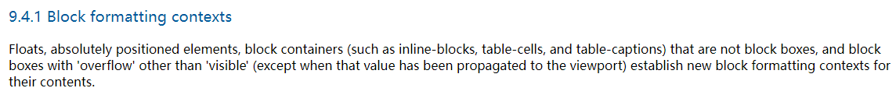
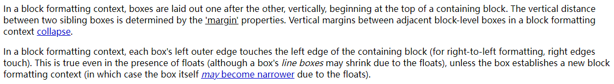
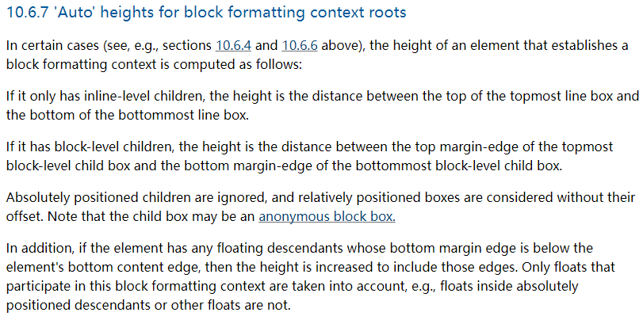

# BFC

## FC

FC 的全称是 Formatting Context

元素在标准流里都是属于一个 FC 的

块级元素的布局属于 BFC，也就是块级盒子都是在 BFC 中布局的

行内级元素的布局属于 IFC，也就是行内级盒子都是在 IFC 中布局的

> Boxes in the normal flow belong to a formatting context, which may be block or inline, but not both simultaneously. **Block-level boxes** participate in a **block formatting context**. **Inline-level boxes** participate in an **inline formatting context**.

## BFC

### 什么是 BFC

- BFC 的全称是 Block Formatting Context

- BFC 是页面的一块渲染区域，并且有一套渲染规则，决定了子元素如何定位，以及与其他元素之间的排列关系
- BFC 是一个独立的布局环境，BFC 中的块级元素会按照一定的规则摆放，不会影响其他 BFC，也不会受外界 BFC 的影响
- 块级元素在标准流中的布局是属于 BFC 的

### 创建 BFC 的条件

- 根元素（html / :root）

- 浮动元素（元素的 float 不为 none）

- 绝对定位元素（元素的 position 为 absolute 或 fixed）

- 行内块元素（元素的 display 为 inline-block）

- 表格单元格（元素的 display 为 table-cell，HTML表格单元格默认为该值）

  表格标题（元素的 display 为table-caption，HTML表格标题默认为该值）

  匿名表格单元格（元素的 display 为table、table-row、table-row-group、table-header-group、table-footer-group，分别是HTML中table、row、tbody、thead、tfoot的默认属性）

- overflow 计算值不为 visible 的元素

- 弹性元素（display 为 flex 或 inline-flex 的元素的直接子元素）

- 网格元素（display 为 grid 或 inline-grid 的元素的直接子元素）

- display 值为 flow-root 的元素

### BFC 的特点

- 块级盒子在 BFC 中在垂直方向上自上而下排布
- 垂直方向的间距由 margin 属性决定
- 在同一个 BFC 中，相邻两个盒子之间的 margin 会折叠
- 在 BFC 中，每个元素的左边缘会紧挨着包含块的左边缘
- BFC 内部不会影响外部元素
- 计算 BFC 的高度时，浮动子元素也会参与计算
- BFC 区域不会与浮动的元素发生重叠

### BFC 的应用场景

- 解决 margin 的折叠问题

  在同一个 BFC 中，相邻两个 box 之间的 margin 会折叠

  所以让相邻的两个 box 属于不同的 BFC 就可以解决折叠问题

- 解决浮动产生的高度塌陷问题

  BFC 解决高度塌陷有两个条件

  1. 浮动元素的父元素触发 BFC，形成独立的块级格式上下文

  2. 浮动元素的父元素的高度为 auto

  BFC 解决高度塌陷的原理是，BFC 的高度是 auto 的情况下，是通过如下方法计算高度的

  1. 如果只有 inline-level 的子元素，高度是行高的顶部和底部的距离
  2. 如果有 block-level 的子元素，高度是最顶层的块级子盒子的上边缘和最底层的块级子盒子的下边缘之间的距离
  3. 如果有绝对定位子元素，将会忽略这些子元素
  4. 如果有浮动子元素，会增加高度以包含这些浮动元素的下边缘
  
  