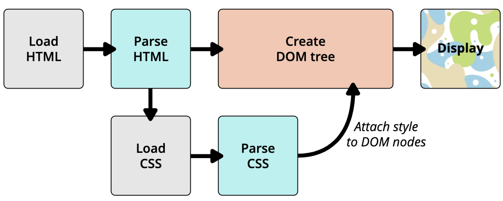

# CSS基础知识

## CSS概念

### CSS定义

CSS（Cascading Style Sheet）表示层叠样式表，用于为网页添加样式

### CSS语言

CSS语言是一种计算机语言，但不算是一种编程语言

### CSS的作用

CSS的出现是为了美化HTML的，并且让结构（HTML）与样式（CSS）分离

- 美化方式一：为HTML添加各种各样的样式，比如颜色、字体、大小、下划线等等。

- 美化方式二：对HTML进行布局，按照某种结构显示。

### CSS语法规则

声明（Declaration）一个单独的CSS规则，用来添加指定的CSS样式：

`声明 = 属性名: 属性值;`

- 属性名（Property name）：要添加的css规则的名称；
- 属性值（Property value）：要添加的css规则的值；

### CSS的使用方法

1. 内联样式（inline style）

   内联样式存在于HTML元素的style属性之中

   `

`

2. 内部样式表（internal style sheey）

   将CSS放在HTML文件`<head>`元素里的`<style>`元素之中

3. 外部样式表（external style sheet）

   将CSS编写在一个独立的文件中，然后通过`<link>`元素引入进来

   `<link rel="stylesheet" href="./css/style.css">`

   此外可以在style元素或者CSS文件中使用`@import`导入其他的元素

   `@imort url(./other.css);`

### CSS注释

- CSS代码也可以添加注释来方便阅读
- 注释的方法 `/* */`

## CSS属性

### 常用属性

- `font-size`：文字大小
- `color`：前景色
- `background-color`：背景色
- `width`：宽度
- `height`：高度

### 相关链接

[官方文档地址（W3C）](https://www.w3.org/TR/?tag=css)

[推荐文档地址（MDN）](https://developer.mozilla.org/zh-CN/docs/Web/CSS/Reference#关键字索引)

[查询CSS属性的可用性](https://caniuse.com/)

## 额外知识补充

### link元素

- link元素是**外部资源链接元素**，规范了**文档与外部资源**的关系
- link元素通常位于head元素中
- link最常用于链接CSS样式表，此外也可以被用来创建站点图标
- link元素常见的属性
  - href：此属性用于指定被链接资源的URL，URL可以是绝对的，也可以是相对的
  - [rel](https://developer.mozilla.org/zh-CN/docs/Web/HTML/Attributes/rel)：指定链接类型
    - `icon`用于站点图标
    - `stylesheet`用于CSS样式表
    - `dns-prefetch`用于告知浏览器为目标资源的来源预先执行 DNS 解析

### CSS表示颜色的方法

[css - color](https://developer.mozilla.org/zh-CN/docs/Web/CSS/color_value)

1. 颜色关键字：颜色关键字是不区分大小写的标识符，它表示一个具体的颜色

2. RGB颜色
   - RGB是一种色彩空间，通过red、green、blue三原色组成了不同的颜色
   - RGB各个原色的取值范围都是0-255
   - RGB颜色的表示方法
     - 十六进制符号：`#RRGGBB[AA]`
     - 十六进制符号：`#RGB[A]`
     - 函数符：`rgb[a](R, G, B[, A])`

3. HSL颜色：

   - 颜色也可以使用 `hsl()` 函数符被定义为色相 - 饱和度 - 亮度（Hue-saturation-lightness）模式。

   - HSL 相比 RGB 的优点是更加直观：你可以估算你想要的颜色，然后微调。它也更易于创建相称的颜色集合。（通过保持相同的色相并改变亮度/暗度和饱和度）。

   - HSL颜色的表示方法：`hsl[a](H, S, L[, A])`

### 浏览器的渲染流程

HTML -> DOM tree + CSS -> Render Tree -> Display

