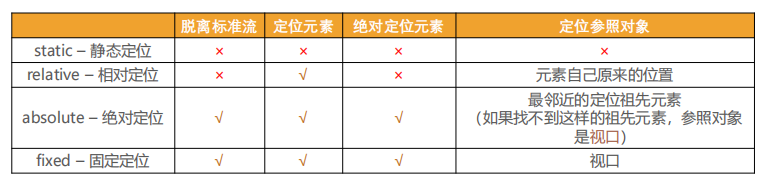
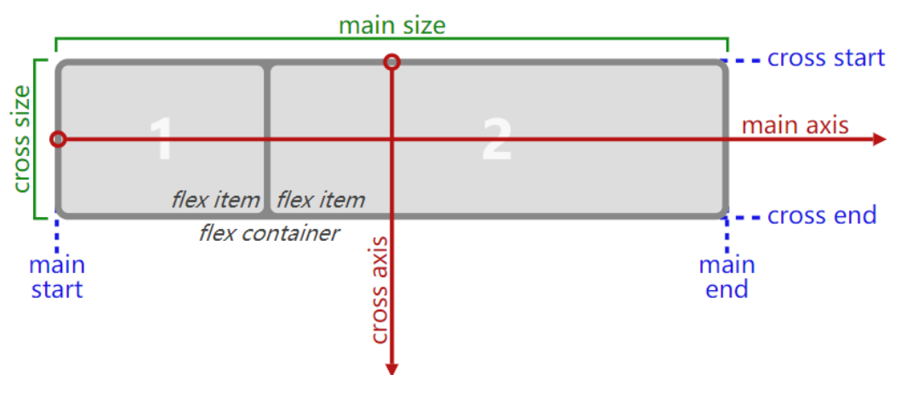
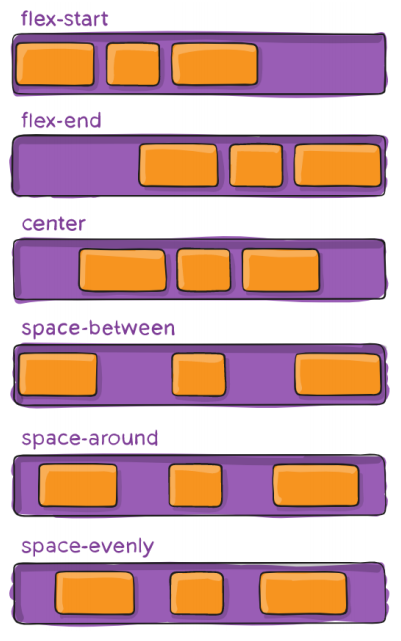
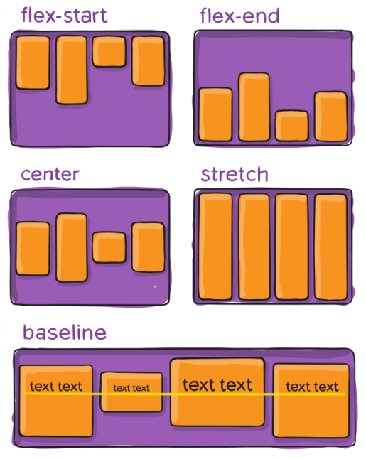
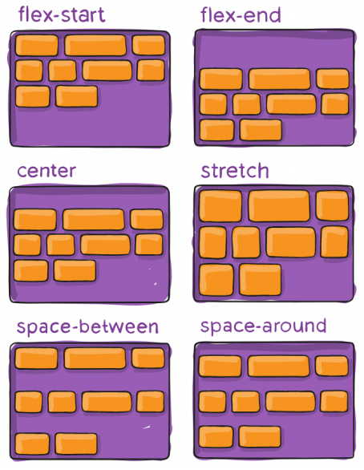

# CSS布局

## 元素定位

### 标准流

默认情况下，元素都是按照**normal flow**进行排布的

- 从左到右、从上到下按顺序排放
- 默认情况下，互相之间不存在层叠现象
- 在标准流中可以使用margin、padding调整元素的位置
  - 缺点1：会影响到标准流中其他元素的位置
  - 缺点2：不便于实现元素的层叠效果

### position

`position`可以使元素跳出标准流单独定位

即允许从正常的文档流布局中取出元素，并使它们具有不同的行为

- 例如放在另一个元素的上面
- 或者保持在浏览器视窗内的同一位置

`position`的取值

- static：决定定位（默认值）

以下四个值可以让元素变为定位元素（positioned element）

- relative：相对定位
- absolute：绝对定位
- fixed：固定定位
- sticky：粘性定位

不同值之间的比较



### 相对定位

`position: relative;`

- 元素按照normal flow布局

- 并可以通过 left、right、top、bottom进行定位

- 定位的参照对象是**元素自身原来在标准流中的位置**

- 应用场景：在不影响其他元素的前提下，对当前元素位置进行微调

### 固定定位

`position: fixed;`

- 元素脱离normal flow布局

- 并可以通过left、right、top、bottom进行定位

- 定位的参照对象是**viewport**（文档的可视区域）

- 应用场景：当画布滚动时，当前元素固定不动

### 绝对定位

`position: absolute;`

- 元素脱离 normal flow 布局

- 并可以通过left、right、top、bottom进行定位

- 定位的参照对象是**最邻近的定位祖先元素**

- 如果找不到这样的祖先元素，参照对象就是viewport

> 子绝父相：
>
> 在大多数情况下，子元素的绝对定位都是相对于父元素进行定位，如果希望子元素相对于父元素进行定位，又不希望父元素脱离标准流，常常通过将父元素设置为相对定位子元素设置为绝对定位来实现

**绝对定位元素**：position值为absolute或fixed的元素

**绝对定位元素的特点**

- 可以随意设置宽高
- 宽高默认由内容决定
- 脱离标准流
- 不再给父元素汇报宽高（父元素的宽高不再考虑该元素）
- 内部还是标准流布局

**对于绝对定位元素来说**

- 定位参照对象的宽度 = left + right + margin-left + margin-right + 绝对定位元素的实际占用宽度
- 定位参照对象的高度 = top + bottom + margin-top + margin-bottom + 绝对定位元素的实际占用高度

可以通过这个公式实现绝对定位元素在定位参照对象中的居中显示

- 将left、top、bottom、right设置为0
- 将margin设置为auto
- 设置绝对定位元素的具体宽高

### 粘性定位

`position: sticky;`

粘性定位可以看作相对定位和固定定位的结合体

- 在滚动到某个阈值点之前为相对定位
- 达到阈值点之后变成固定定位

- sticky是相对于最近的祖先滚动容器的滚动视口（the nearest ancestor scroll container's scrollport)

### z-index

`z-index`属性用于设置定位元素的层叠顺序

- 仅对定位元素有效
- 取值可以是正整数、负整数、0

`z-index`的比较原则

- 如果是兄弟关系
  - `z-index`越大，层叠在越上面
  - `z-index`相等，写在后面的那个元素层叠在上面
- 如果不是兄弟关系
  - 各自从元素自己以及祖先元素中找出最邻近的两个定位元素进行比较
  - 而且这两个定位元素必须有设置z-index的具体数值

## 元素浮动

### float

`float`属性可以指定一个元素沿其容器的左侧或右侧放置，允许文本和内联元素环绕它

- `float`最初只用在一段文本内浮动图像，实现文字环绕的效果

- 但是早期的的CSS标准中并没有提供好的左右布局方案，因此在一段时间里面它成为网页多列布局的最常用工具
- 绝对定位和浮动都会让元素脱离标准流，已达到灵活布局的效果

`float`可以让元素产生浮动效果

- none： 不浮动，默认值
- left：向左浮动
- right：向右浮动

### 浮动规则

1. 元素浮动后会脱离标准流

   - 朝着向左或向右方向移动，直到自己的边界紧贴着**包含块**（一般是父元素）或者其他浮动元素的边界为止

   - 定位元素会层叠在浮动元素上面

2. 如果元素是向左（右）浮动，浮动元素的左（右）边界不能超出包含块的左（右）边界
3. 浮动元素之间不能层叠
   - 如果一个元素浮动，另一个浮动元素已经在那个位置了，后浮动的元素将紧贴着前一个浮动元素
   - 如果水平方向剩余的空间不够显示浮动元素，浮动元素将向下移动，直到有充足的空间为止

4. 浮动元素不能与行内级内容层叠，行内级内容将会被浮动元素推出

   比如：行内级元素、inline-block元素、块级元素的文字内容

5. 行内级元素、inline-block元素浮动后，其顶部将与所在行的顶部对齐

> 换行符会导致行内级元素、inline-block元素之间出现水平间隙
>
> 解决方法：
>
> 1. 删除换行符
> 2. 将父级元素的font-size设置为0，但是需要子元素设置回来
> 3. 使其子元素统一向一个方向浮动
> 4. flex布局

### 浮动案例

多行布局

假如有多个盒子需要按照多行放置，可以用float布局

1. 当盒子之间需要存在水平间距时，设置margin会将一行盒子的最后一个挤下去

   解决方法：

    ```css
    /* 第一种：通过选择选中每一行的最后一个元素，兼容性较差 */
    .item:nth-child(5n) {
      margin-right: 0;
    }
    /* 第二种：给每一行的最后一个元素加一个类，较麻烦 */
    .item.last-item {
      margin-right: 0;
    }
    /* 第三种：margin负值，即在item和item的父元素之间加一层div，并将其margin设置为负值，可以连边都设，也可以只设一边 */
    .box {
      margin-right: -10px;
      /* margin: 0 -5px; */
    }
    .item {
      float: left;
      margin-right: 10px;
      /* margin: 0 5px; */
    }
    ```

2. 当盒子之间需要边框不需要间距时，可能会出现边框重叠

   解决方法：

    ```css
    /* 给每个盒子设置边框，然后将margin设置为负的边框宽度，通过重叠隐藏边框 */
    .item {
      width: 221px;
      height: 168px;
      background: orange;
      color: #fff;
      float: left;
      border: 1px solid #000;
      margin-right: -1px;
      box-sizing: border-box;
    }
    /* 会多出来一个边框的宽度，所以将其中一个盒子的宽度减去边框宽度 */
    .item.first {
      width: 220px;
    }
    ```

### 高度塌陷

由于浮动元素会脱离标准流，父元素计算总高度的时候，不会计算浮动子元素的高度，这会导致父元素的**高度塌陷**问题

解决父元素高度塌陷问题的过程，一般叫做**清除浮动**

清除浮动的目的是让父元素计算总高度的时候，把浮动子元素的高度算进去

清除浮动的方法：

1. 给父元素设置固定高度

   缺点：扩展性不好

2. 在父元素最后增加一个空的块级子元素，并且设置`clear`属性为both

   缺点：会增加很多无意义的空标签，违反结构与样式分离的原则

> clear 属性可以指定一个元素是否必须移动(清除浮动后)到在它之前的浮动元素下面
>
> - left：要求元素的顶部低于之前生成的所有左浮动元素的底部
> - right：要求元素的顶部低于之前生成的所有右浮动元素的底部
> - both：要求元素的顶部低于之前生成的所有浮动元素的底部
> - none：默认值，无特殊要求

3. 给父元素添加一个伪元素

```css
.clear-fix::after {
  content: "";
  display: block;
  clear: both;
  visibility: hidden; /* 浏览器兼容性 */
  height: 0; /* 浏览器兼容性 */
}
.clear-fix {
  *zoom: 1; /* IE6/7兼容性 */
}
```

## flex布局

### flex box

**flex box（弹性盒子）**是一种用于**按行或按列布局元素**的**一维布局方法**

- 元素可以膨胀以填充额外的空间，收缩以适应更小的空间
- 使用弹性盒子来进行布局的方案叫做flex布局

### flex 布局

**flex 布局**是当前使用最多的布局方案

- 移动端完全普及
- PC端也几乎已经完全普及和使用，只有非常少数的网站依然在用浮动来布局
- flex布局可以解决浮动布局和定位布局的一些痛点

**flex 布局模型**



### flex container

- 开启了flex布局的元素

- 设置`display`属性为 flex 或者 inline-flex 可以成为`flex container`

  - flex：`flex container`以 block-level 形式存在
  - inline-flex： `flex container`以 inline-level 形式存在

- 相关属性

  - `flex-direction`：用于设置`main axis`的方向

    - row（默认值）：➡
    - row-reverse：⬅
    - column：⬇
    - column-reverse：⬆

  - `flex-wrap`：决定`flex container`是否多行

    - nowrap（默认值）：单行
    - wrap：多行
    - wrap-reverse：多行（cross start 与 cross end 相反）

  - `flex-flow`：`flex-direction` 和 `flex-wrap` 的简写

    顺序任意，并且都可以省略

  - `justify-content`：决定`flex items`在`main axis`上的对齐方式

    - flex-start（默认值）：与main start对齐

    - flex-end：与main end对齐

    - center：居中对齐

    - space-between

      `flex items`之间的距离相等
      与 main start、main end 两端对齐

    - space-around

      `flex items`之间的距离相等

      与 main start、main end 之间的距离等于`flex items`之间距离的一半

    - space-evenly

      `flex items`之间的距离相等

      与 main start、main end 之间的距离等于`flex items`之间的距离

    

  - `align-items`：决定`flex items`在`cross axis`上的对齐方式

    - normal（默认值）：在弹性布局中，效果和stretch一样
    - stretch：当`flex items`在`cross axis`方向的 size 为 auto 时，会自动拉伸至填充`flex container`
    - flex-start：与 cross start 对齐
    - flex-end：与 cross end 对齐
    - center：居中对齐
    - baseline：与基准线对齐

    

  - `align-content`：决定多行`flex items`在`cross axis`上的对齐方式

    - stretch（默认值）：与 align-items 的 stretch 类似

    - flex-start：与 cross start 对齐

    - flex-end：与 cross end 对齐

    - center：居中对齐

    - space-between：

      `flex items`之间的距离相等

      与 cross start、cross end两端对齐

    - space-around：

      `flex items`之间的距离相等

      与 cross start、cross end 之间的距离等于`flex items`之间距离的一半

    - space-evenly：

      `flex items`之间的距离相等

      与 cross start、cross end 之间的距离等于`flex items`之间的距离

    

### flex item

- `flex container`里面的直接子元素叫做`flex item`

- `flex item`具备**以下特点**

  - `flex item`的布局将受`flex container`属性的设置来进行控制和布局

  - `flex item`不再严格区分块级元素和行内级元素
  - `flex item`默认情况下是包裹内容的, 但是可以设置宽度和高度

- 相关属性

  - `order`：决定 flex items 的排布顺序
  
    - 默认值为0
    - 可以设置任意整数，值越小就越排在前面
  
  - `align-self`：用于覆盖 flex container 设置的 `align-items`
  
    - 默认值为 auto：遵从flex container 设置的 `align-items`
    - stretch、flex-start、flex-end、center、baseline，效果跟 `align-items` 一致
  
  - `flex-grow`：决定 flex items 如何扩展
  
    - 默认值为0
  
    - 可以设置任意非负数字
  
    - 当 flex container在主轴方向上有剩余 size 时 `flex-grow` 才会有效
  
    - 如果所有 flex items 的 `flex-grow` 的总和 sum 超过1
  
      每个 flex item 扩展的 size 为
  
      flex container 的剩余 size * flex-grow / sum
  
    - flex items 扩展后的最终 size 不能超过 max-width或max-height
  
  - `flex-shrink`：决定 flex items 如何收缩
  
    - 默认值为1
  
    - 可以设置任意非负数字
  
    - 当 flex items 在主轴方向上超过了 flex container 的 size时`flex-shrink` 才会有效
  
    - 如果所有 flex items 的 `flex-shrink` 的总和 sum 超过1
  
      每个 flex item 收缩的 size 为
  
      flex items 超出 flex container 的 size * flex-shrink / sum
  
    - flex items 收缩后的最终 size 不能小于 min-width或min-height
  
  - `flex-basis`：用于设置 flex items 在主轴方向上的 base size
  
    - 默认值为 auto
    - 可以设置为具体的宽度数值
    - 决定 flex items 最终 base size 的因素（优先级从高到低）
      - max-width\max-height\min-width\min-height
      - flex-basis
      - width\height
      - 内容本身的 size
  
  - `flex`：简写属性
  
    - 单值
  
      - 若为无单位数则设置 flex-grow
  
      - 若为有效宽度则设置 flex-basis
  
      - 关键字
  
        initial代表 `flex: 0 1 auto` 
  
        auto代表 `flex: 1 1 auto`
  
        none代表 `flex: 0 0 auto`
  
    - 双值
  
      - 第一个值必须为无单位数，且设置 flex-grow
  
      - 第二个值
  
        若为无单位数则设置 flex-shrink
  
        若为有效宽度则设置 flex-basis
  
    - 三值
      - 第一个值必须为无单位数，且设置 flex-grow
      - 第二个值必须为无单位数，且设置 flex-shrink
      - 第三个值必须为有效宽度，且设置 flex-basis

### 常见问题

1. 多行布局中最后一行 justify-content 导致的对齐变形

   解决方法：在多行 flex items 后面加上 列数-2 个 i 元素或者 span 元素，并且将其宽度设置为 flex item 的宽度
