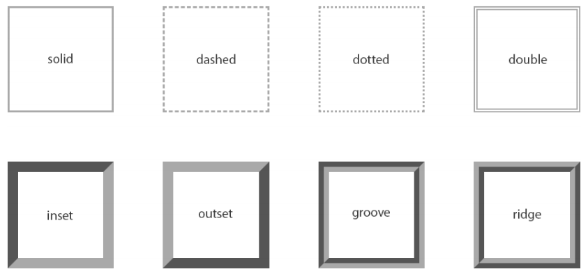
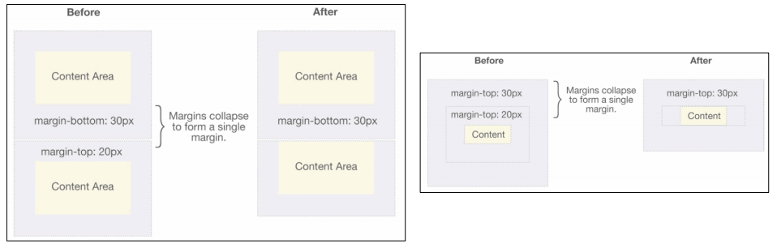
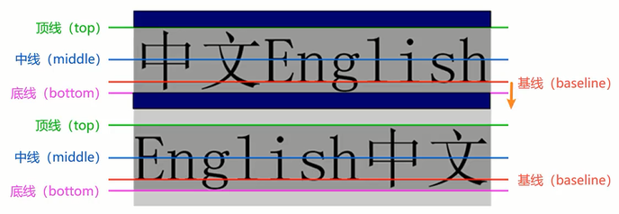
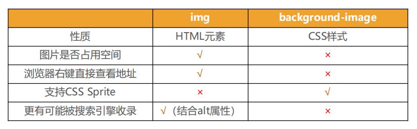

# CSS属性

## 属性特性

### 属性继承⭐

CSS的某些属性具有继承性

- 如果一个属性具备继承性，那么在该元素上设置后，它的后代元素都可以继承这个属性

- 如果后代元素自己也设置了该属性，那么**优先**使用后代元素自己的属性（不管继承过来的属性权重多高）

- 常见的`font-size/font-family/font-weight/line-height/color/text-align`都具有继承性

  可以从MDN文档中查阅每个属性的继承性

- 继承过来的是计算值，而不是设置值

  2em继承到的是计算后的px而不是em 

- 强制继承

  ```css
  .box {
    border: 1px solid purple;
  }
  .box p {
    border: inherit;
  }
  
  ```

### 属性层叠⭐

对于一个元素来说，一个相同的属性可以通过不同的选择器进行多次设置

此时属性会被一层层覆盖到元素上，但是最终只有一层会生效

判断生效属性的方式

1. 根据选择器的权重判断：权重较大的选择器优先生效，根据选择器的权重判断出优先级
2. 根据先后顺序判断：选择器的权重相同时，后设置的生效

选择器的权重

- !important：10000
- 内联样式：1000
- id选择器：100
- 类选择器、属性选择器、伪类：10
- 元素选择器、伪元素：1
- 通配符：0

## 特殊属性

### display⭐

display用于修改元素的显示类型

- block：让元素显示为块级元素

  - 独占一行
  - 可以设置宽高
  - 默认高度由内容决定

- inline：让元素显示为行内级元素

  - 非独占一行
  - 不可以设置宽高
  - 宽度和高度由内容决定

- inline-block：让元素同时具备行内级元素和块级元素的特征

  - 非独占一行
  - 可以设置宽高
  - 默认宽高由内容决定

  > inline-block可以理解为：对外来说，它是一个行内级元素；对内来说，它是一个块级元素

- none：隐藏元素

  > 隐藏元素的方法
  >
  > 1. display设置为none：元素不显示出来，并且也不占据任何空间
  > 2. visibility设置为hidden：元素不可见，但是会占据元素应该占据的空间，设置为visible就会可见
  > 3. 将rgba的a设置为0：将元素前景色或背景色变成透明的，不影响子元素
  > 4. 将opacity设置为0：设置整个元素的透明度，会影响所有的子元素

### cursor

cursor用于设置鼠标指针在元素上面时的显示形式

- auto：浏览器根据上下文决定指针的显示样式，比如根据文本和非文本切换指针样式
- default：由操作系统决定，一般就是一个小箭头
- pointer：一只小手，鼠标指针挪动到链接上面默认就是这个样式
- text：一条竖线，鼠标指针挪动到文本输入框上面默认就是这个样式
- none：没有任何指针显示在元素上面

## 盒子模型

### 盒子模型的组成

HTML中的每一个元素都可以看作一个盒子，盒子可以分为以下几个部分

1. 内容：元素的内容（width/height）
  
2. 内边距：元素和自身内容之间的间距（padding）
  
3. 边框：元素自己的边框（border）
4. 外边距：元素和其他元素之间的间距（margin）

5. 外轮廓和盒子阴影

> 因为盒子有四边，所以 margin/padding/border 都包含 top/right/bottom/left 四个边
>
> 在盒子模型中，内边距和外边距的**使用时机**要考虑其定义
>
> - margin 一般是用来设置兄弟元素之间的间距
> - padding 一般是用来设置父子元素之间的间距
>
> **行内非替换元素的注意事项**
>
> - 以下属性对行内非替换元素不起作用
>
>   width、height、margin-top、margin-bottom
>
> - 以下属性对行内非替换元素的效果比较特殊（有效果但是不占据空间，上下会被撑起来）
>
>   padding-top、padding-bottom、上下方向的border

### width/height

- `width`：设置内容宽度
- `height`：设置内容高度
- `min-width`：最小宽度，无论内容多少，宽度都大于或等于`min-width`
- `max-width`：最大宽度，无论内容多少，宽度都小于或等于`max-width`
- `min-height`：最小高度，无论内容多少，高度都大于或等于`min-height`
- `max-height`：最大高度，无论内容多少，高度都小于或等于`max-height`

> 移动端适配时，可以设置最大宽度和最小宽度

### padding

- `padding`：设置盒子的内边距
  - `padding-top`：上内边距
  - `padding-right`：右内边距
  - `padding-bottom`：下内边距
  - `padding-left`：左内边距
- `padding`设置四个值：上、右、下、左
- `padding`设置三个值：上、右左、下
- `padding`设置两个值：上下、右左
- `padding`设置一个值：上右下左

### border

- `border-width`：边框宽度

  - `border-top-width`

  - `border-right-width`

  - `border-bottom-width`

  - `border-left-width`


- `border-color`：边框颜色

  - `border-top-color`
  
  
    - `border-right-color`
  
  
    - `border-bottom-color`
  
    - `border-left-color`


- `border-style`：边框样式

  - `border-top-style`
  
  
    - `border-right-style`
  
  
    - `border-bottom-style`
  
  
    - `border-left-style`


  - `border-style`的常用样式



- `border`：边框缩写属性

​	`border: border-width border-color border-style;`

​	如果没有设置边框颜色的值，它的默认值是`color`属性的值

​	背景色是包含border的

- `border-radius`：边框圆角
  - `border-top-left-radius`
  - `border-top-right-radius`
  - `border-bottom-right-radius`
  - `border-bottom-left-radius`

  > 如果一个元素是正方形，设置border-radius大于或等于50%时就会变成一个圆。

### margin⭐

- `margin`：设置盒子的外边距
  
  - `margin-top`：上外边距
  - `margin-right`：右外边距
  - `margin-bottom`：下外边距
  - `margin-left`：左外边距
  
- `margin`设置四个值：上、右、下、左

- `margin`设置三个值：上、右左、下

- `margin`设置两个值：上下、右左

- `margin`设置一个值：上右下左

- `margin`的上下传递 
  
  - 如果块级元素的顶部线和父元素的顶部线重叠，那么这个块级元素的**margin-top**会传递给父元素
  - 如果块级元素的底部线和父元素的底部线重叠，并且**父元素的高度是auto**，那么这个块级元素的**margin-bottom**会传递给父元素
  - 如何防止出现传递
    - 改为给父元素设置padding
    - 给父元素设置border
    - 触发BFC：设置overflow为auto
  
- `margin`的上下折叠
  - 垂直方向上相邻的2个margin有可能会合并为一个margin，这种现象叫做折叠（collapse）
  - 水平方向上的margin永远不会折叠
  - 折叠后的margin会去折叠前的较大者
  - 如何防止出现折叠
    - 只设置其中一个元素的margin
  - 折叠的两种情况
    - 两个兄弟块级元素之间上下margin的折叠
    - 父子块级元素之间margin的折叠
  
  

> 块级元素水平居中的方法
>
> 1. 将块级元素的display设置为inline-block，然后在其父元素中设置text-align为center
> 2. 将块级元素的margin设置为 "0 auto"

### outline

outline表示元素的外轮廓，外轮廓不占用元素的空间，默认显示在border的外面

- `outline-width`：外轮廓的宽度
- `outline-style`：外轮廓的样式
- `outline-color`：外轮廓的颜色
- `outline`：outline-width、outline-style、outline-color的简写属性，跟border写法类似

outline很少使用，常常用于去除a元素或input元素的focus轮廓效果

### box-shadow

`box-shadow`属性可以设置一个或多个阴影

- 每个阴影用`<shadow>`表示
- 多个阴影之间用逗号隔开，从前到后叠加

`<shadow>`的常见格式如下

- 当给出两个、三个或四个`<length>`值时
  - 如果只给出两个值，那么这两个值将会被当作 `<offset-x><offset-y>` 来解释
  - 如果给出了第三个值，那么第三个值将会被当作`<blur-radius>`解释
  - 如果给出了第四个值，那么第四个值将会被当作`<spread-radius>`来解释
- 可选，`inset`关键字
- 可选，`<color>`值

[Box Shadow CSS Generator](https://html-css-js.com/css/generator/box-shadow/)

### box-sizing

`box-sizing`用来设置盒子模型中宽高的行为

- `content-box`：padding和border都布置在width/height以外

  元素的实际占用宽度=border+padding+width

  元素的实际占用高度=border+padding+height

  W3C的标准盒子模型是`content-box`

- `border-box`：padding和border都布置在width/height以内

  元素的实际占用宽度=width

  元素的实际占用高度=height

  IE盒子模型（IE8以下）是`border-box`

- box-sizing在生效时有一个前提，即明确的设置了宽度和高度
  
  - 无作用的场景1：没有设置宽度或高度
  
    ```css
    .container {
        position: relative;
        display: flex;
      	width: 300px;
      	height: 300px;
      	background-color: orange;
    }
    .container .box {
        height: 200px;
        background-color: #f00;
        box-sizing: border-box;
        border-right: 30px solid #0f0;
        padding-right: 30px;
    }
    ```
  
  - 无作用的场景2：绝对定位元素没有设置宽高
  
    ```css
    .container .box2 {
        position: absolute;
        /* width: 100px;
        height: 100px;
        margin: auto; */
        left: 0;
        right: 0;
        top: 0;
        bottom: 0;
        background-color: #f00;
        box-sizing: border-box;
        border: 10px solid #0f0;
    }
    ```
  
  - 无作用的场景3：flex布局
  
    ```css
    .container .box3 {
    	width: 100px;
    	background-color: #f00;
    	box-sizing: border-box;
    	border-top: 30px solid #0f0;
    }
    .container .box4 {
    	flex: 1;
    	background-color: purple;
    	box-sizing: border-box;
    	border-top: 30px solid skyblue;
    }
    ```

## 文本属性

### text-decoration⭐

`text-decoration`用于设置文本的装饰线

- `none`：无任何装饰线

  可以用于去除a元素默认的下划线

- `underline`：下划线

- `overline`：上划线

- `line-through`：中划线（删除线）

`color`属性也会改变装饰线的颜色

### text-transform

`text-transform`用于设置文本的大小写转换

- `capitalize`：将每个单词的首字符变为大写
- `uppercase`：将每个单词的所有字符变为大写
- `lowercase`：将每个单词的所有字符变为小写
- `none`：没有任何影响

### text-indent

`text-indent`用于设置第一行内容的缩进

`text-indent: 2em`刚好是缩进两个文字

### text-align⭐

`text-align`用于设置文本的对齐方式

本质是定义**行内内容**（文字、图片）如何相对它的块父元素对齐

- `left`：左对齐

- `right`：右对齐

- `center`：居中对齐

- `justify`：两端对齐

  `text-align: justify;`最后一行是无效的，可以通过`text-align-last: justify;`使最后一行也变成两端对齐

> W3C中的解释：
>
> This shorthand property sets the 'text-align-all' and the 'text-align-last' properties and describes how the **inline-level content of a block** is aligned along the inline axis if the content does not completely fill.

### word/letter-spacing

`word-spacing`、`letter-spacing`分别用于设置**单词、字母**之间的间距

### text-shadow

`text-shadow`的用法类似于`box-shadow`，用于给文字添加阴影效果

相当于没有`<spread-radius>`和`inset`的`box-shadow`

[Text Shadow CSS Generator](https://html-css-js.com/css/generator/text-shadow/)

> **单行显示省略号的实现**
>
> white-space: nowrap;
>
> overflow: hidden;
>
> text-overflow: ellipsis;
>
> **多行显示省略号的实现**
>
> overflow: hidden;
>
> text-overflow: ellipsis;
>
> display: -webkit-box;
>
> -webkit-line-clamp: 3;
>
> -webkit-box-orient: vertical;

## 字体属性

### font-size

`font-size`用于设置文字的大小

- 具体数值+单位：比如100px、2em

  1em=父元素的font-size

- 百分比：基于父元素的`font-size`计算

### font-family

`font-family`用于设置文字的字体名称

- 可以设置一个或者多个文字的字体名称
- 浏览器会选择列表中第一个该计算上有安装的字体
- 或者是通过`@font-face`指定的可以直接下载的字体

### font-weight

`font-weight`用于设置文字的粗细（重量）

- `number`：1|100|200|...|900|1000
- `normal`：400
- `bold`：700
- `lighter`：比从父元素继承来的值更细
- `bolder`：比从父元素继承来的值更粗

strong、b、h1-h6等标签的font-weight默认就是bold

### line-height⭐

`line-height`用于设置文本的行高，行高即一行文字所占据的高度，行高的作用是提高文本的阅读体验

行高的严格定义是：两行文字基线（baseline）之间的间距，基线是与小写字母最底部对齐的线 



行距 = line-height 减 文本的高度

行距是上下等分的，所以通过使`height`的值和`line-height`的值相等可以实现文本的垂直居中，但只能对文本使用

### font⭐

`font`是一个缩写属性

`font: font-style font-variant font-weight font-size/line-height font-family`

规则：

- `font-style`、`font-variant`、`font-weight`可以随意调换顺序，也可以省略

- `/line-height`可以省略，如果不省略必须放在`font-size`后面

  在`font`中`line-height=1.5`是相对于`font-size`的

- `font-size`和`font-family`不可以调换顺序，不可以省略

### fony-style

`font-style`用于设置文字的常规、斜体显示

- `normal`：常规显示
- `italic`：用字体的斜体显示
- `oblique`：文字倾斜显示

### font-variant

`font-variant`用于设置小写字母的显示形式

- `normal`：常规显示
- `small-caps`：将小写字母替换为缩小过的大写字母

## 背景属性

### background-image

`background-image`用于设置元素的背景图片

- 背景图片会盖在`background-color`的上面

- 如果设置了多张背景图片，设置的第一张图片将显示在最上面，其他图片按顺序层叠在下面

- 如果设置了背景图片后，元素没有具体的宽高，背景图片是不会显示出来的

`background-image`和`img`的对比



- `img`是网页内容的重要组成部分，比如广告图片、LOGO图片、文章配图、产品图片
- `background-image`在网页中可有可无，有可以让网页更加美观，无也不影响用户获取完整的网页内容信息

### background-repeat

`background-repeat`用于设置背景图片是否要平铺

- `repeat`：平铺
- `no-repeat`：不平铺
- `repeat-x`：只在水平方向平铺
- `repeat-y`：只在垂直方向平铺

### background-size

`background-size`用于设置背景图片的大小

- `auto`：默认值，以背景图本身大小显示
- `cover`：缩放背景图，以完全覆盖铺满元素，可能背景图片部分看不见
- `contain`：缩放背景图，宽度或者高度铺满元素，但是图片保持宽高比
- `<percentage>`：百分比，相对于背景区（background positioning area）
- `length`：具体的大小，比如100px

### background-position

`background-position`用于设置背景图片在水平、垂直方向上的具体位置

- 只可以设置具体的数值，比如20px 30px
- 水平方向还可以设值：left、center、right
- 垂直方向还可以设值：top、center、bottom
- 如果只设置了一个方向，另一个方向默认为center

### background-attachment

`background-attachment`决定背景图像的位置是在视口内固定，或者随着包含它的区块滚动

- `scroll`：表示背景**相对于元素本身固定**，而不是随着它的内容滚动
- `local`：表示背景**相对于元素的内容固定**，如果一个元素拥有滚动机制，背景将会随着元素的内容滚动
- `fixed`：表示背景**相对于视口固定**，即使一个元素拥有滚动机制，背景也不会随着元素的内容滚动

### background

`background`是以下一系列背景相关属性的简写属性

`background-clip`、`background-color`、`background-image`、`background-origin`、`background-position`、`background-repeat`、`background-size`，和 `background-attachment`

`background` 属性被指定多个背景层时，使用逗号分隔每个背景层

每一层的语法如下：

- 在每一层中，下列的值可以出现0次或1次：
  - `<attachment>`
  - `<bg-image>`
  - `<position>`
  - `<bg-size>`
  - `<repeat-style>`

- `<bg-size>`只能紧跟着`<position>`出现，以`/`分割，如`center/80%`
- `<box>`可能出现0次、1次或2次。如果出现1次，它同时设定`background-origin`和`background-clip`。如果出现2次，第一次的出现设置`background-origin`，第二次的出现设置`background-clip`
- `<background-color>`只能被包含在最后一层
