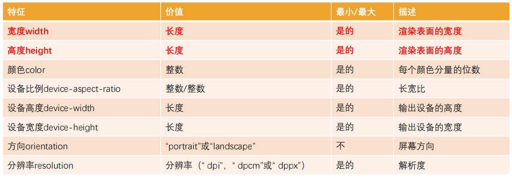
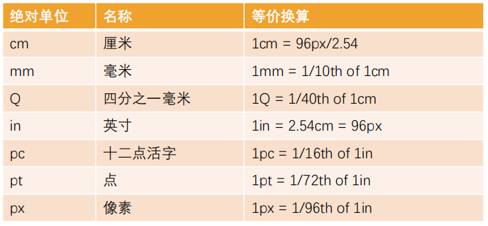
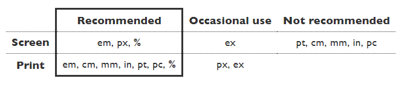
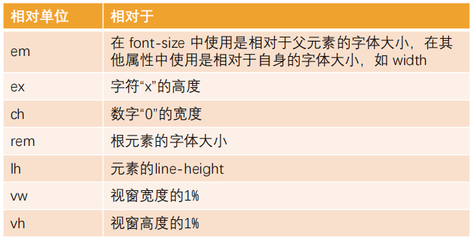
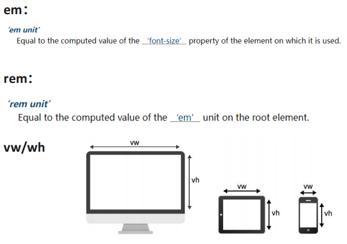
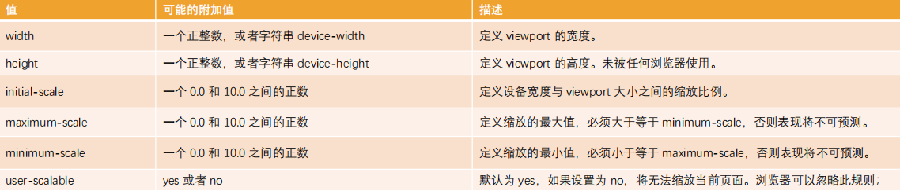

# 额外知识补充

## link元素

- link元素是**外部资源链接元素**，规范了**文档与外部资源**的关系
- link元素通常位于head元素中
- link最常用于链接CSS样式表，此外也可以被用来创建站点图标
- link元素常见的属性
  - href：此属性用于指定被链接资源的URL，URL可以是绝对的，也可以是相对的
  - [rel](https://developer.mozilla.org/zh-CN/docs/Web/HTML/Attributes/rel)：指定链接类型
    - `icon`用于站点图标
    - `stylesheet`用于CSS样式表
    - `dns-prefetch`用于告知浏览器为目标资源的来源预先执行 DNS 解析

## CSS表示颜色的方法

[css - color](https://developer.mozilla.org/zh-CN/docs/Web/CSS/color_value)

1. 颜色关键字：颜色关键字是不区分大小写的标识符，它表示一个具体的颜色

2. RGB颜色
   - RGB是一种色彩空间，通过red、green、blue三原色组成了不同的颜色
   - RGB各个原色的取值范围都是0-255
   - RGB颜色的表示方法
     - 十六进制符号：`#RRGGBB[AA]`
     - 十六进制符号：`#RGB[A]`
     - 函数符：`rgb[a](R, G, B[, A])`

3. HSL颜色：

   - 颜色也可以使用 `hsl()` 函数符被定义为色相 - 饱和度 - 亮度（Hue-saturation-lightness）模式。

   - HSL 相比 RGB 的优点是更加直观：你可以估算你想要的颜色，然后微调。它也更易于创建相称的颜色集合。（通过保持相同的色相并改变亮度/暗度和饱和度）。

   - HSL颜色的表示方法：`hsl[a](H, S, L[, A])`

## 浏览器的渲染流程

HTML -> DOM tree + CSS -> Render Tree -> Display


## CSS样式不生效的原因

有时候编写的CSS样式不生效，有可能是因为

- 选择器的优先级太低
- 选择器没选中对应的元素
- CSS属性的适用形式不对
  - 元素不支持此CSS属性，比如span默认是不支持宽度和高度的
  - 浏览器不支持此CSS属性，比如旧版本的浏览器不支持一些CSS3的某些属性
  - 被同类型的CSS属性覆盖，比如font覆盖font-size

建议充分利用浏览器的开发者工具进行调试（增加、修改样式）和Debug

## 用边框实现形状

border主要是用来给盒子增加边框的
但是在开发过程中我们也可以利用边框的特性来实现一些形状

[The shape of CSS](https://css-tricks.com/the-shapes-of-css/#top-of-site)

## Web字体

- 使用Web Fonts的原因

  font-family可以用来设置字体

  fony-family提供一个或多个字体种类名称，浏览器会在列表中搜寻

  直到找到它所运行的系统上可用的字体

  对于传统的web开发人员来说，字体的选择是有限的，即Web-safe字体

  这种默认可选的字体并不能进行一些定制化的需求

  这种情况就可以使用Web Fonts

- 使用Web Fonts的方法

  在部署静态资源时，将字体文件一起部署到静态服务器中

  用户在浏览网页时就会从服务器下载引入的字体文件

  浏览器会根据使用的字体在下载的字体文件中查找、解析和使用相应的字体

  在浏览器中就会通过对应的字体显示内容

- @font-face可以用于加载一个自定义的字体

  ```css
  @font-face {
    font-family: "myfont";
    src: url(./fonts/myfont.ttf);
  }
  body {
    font-family: "myfont"
  }
  ```

- Web Fonts的兼容性

  为了浏览器的兼容性问题，我们需要有对应的其他格式的字体

  - OpenType/TrueType字体：拓展名是.ttf或.otf

    建立在TrueType字体之上

  - Embedded OpenType字体：拓展名是.eot

    OpenType字体的压缩版

  - SVG字体：拓展名是.svg或.svgz

  - WOFF表示Web Open Font Format web开放字体：

    拓展名是 .woff，建立在TrueType字体之上

  web fonts兼容性写法

  ```css
  /* src用于指定资源路径，format用于帮助浏览器快速识别字体的格式*/
  @font-face {
    font-family: "myfont";
    src: url("./fonts/myfont.eot");
    src: url("./fonts/myfont.eot?iefix") format("embedded-opentype"),
         url("./fonts/myfont.woff") format("woff"),
         url("./fonts/myfont.ttf") format("truetype"),
         url("./fonts/myfont.svg#uxfonteditor") format("svg");
    font-style: normal;
    font-weight: normal;
  }
  ```

## 字体图标

字体图标就是将字体设计成图标的样子

好处是

- 放大不会失真
- 可以任意切换颜色
- 用到很多个图标时，文件较小

字体图标的下载

- 在iconfont中下载并拷贝到项目中

字体图标的使用

1. 通过link引入iconfont.css文件
2. 使用字体图标

## CSS Sprite

CSS Sprite是一种CSS图像合成技术

- 首先将各种小图片合并到一张图片上
- 然后利用CSS的背景定位来显示对应的图片部分

使用CSS Sprite的好处

- 减少网页的http请求数量，加快网页响应速度，减轻服务器压力
- 减小图片总大小
- 解决了图片命名的困扰，只需要针对一张集合的图片命名

Sprite图片制作

- Photoshop
- [sprite-generator](https://www.toptal.com/developers/css/sprite-generator)

**精灵图的使用**

- 精灵图的原理是通过只显示精灵图的很小一部分来展示原图片

- 通常通过背景来实现

  1. 设置对应元素的宽度和高度
  2. 设置精灵图作为背景图片
  3. 调整背景图片的位置来展示

- 获取精灵图的位置

  [spritecow](http://www.spritecow.com/)

## 元素的水平垂直居中

### 水平居中

1. 行内级元素：设置父元素的 `text-align: center;`

2. 块级元素：设置当前块级元素（有宽度）的 `margin: 0 auto;`

3. 绝对定位：元素有宽度时

   设置 `left: 0; right: 0; margin: 0 auto;`

4. flex布局

   设置 `justify-content: center;`

### 垂直居中

1. 绝对定位：元素有高度时

   设置 `top: 0; bottom: 0; margin: auto 0;`

   弊端：

   - 必须使用定位（脱离标准流）
   - 必须给元素设置高度

2. flex布局

   设置 `align-items: center;`

   弊端：

   - 当前flex布局中所有元素都会被垂直居中
   - 兼容性略差（可忽略）

3. top/translate

   设置 `position: relative; top: 50%; translateY(-50%);`

   不能用 `margin-top: 50%;` 因为 `margin-top` 的百分比是相对于父元素的宽度的

## 属性编写顺序

1. 先确定盒子布局

   - position: absolute
   - float: left/right
   - display: flex

2. 盒子的特性和可见性

   - display: block/inline-block/inline/none
   - visibility
   - opacity

3. 盒子模型

   - width/height
   - box-sizing
   - margin/padding/border

   - box-shadow

4. 盒子内部的文字
   - font
   - text

5. 盒子的背景
   - background

6. 其他
   - transform
   - transition
   - overflow
   - white-space
   - cursor

## CSS中的函数

CSS中有很多函数可以帮助我们更加灵活的编写样式的值

比如 rgb, rgba, translate, rotate, scale

几个非常好用的 CSS函数

- var：使用CSS定义的变量
- calc：计算CSS值，通常用于计算元素的大小和位置
- blur：毛玻璃（高斯模糊）效果
- gradient：颜色渐变函数

### var

自定义属性

- 属性名需要以两个减号`--`开始
- 属性值则可以是任何有效的CSS值

`var()`函数可以用于使用自定义属性

定义的自定义属性只有后代元素可以使用

所以推荐将自定义属性定义在html中，也可以使用`:root`选择器

### calc

`calc()`函数允许在声明CSS属性时执行一些计算

- 计算支持加减乘除的运算
- +和-运算符的两边必须要有空白字符

- 通常用来设置一些元素的尺寸或者位置

### blur

`blur()`函数将高斯模糊应用于图片或者元素

- `blur(radius)`
- radius是模糊的半径，用于定义高斯函数的偏差值，偏差值越大，图片越模糊

通常会和两个属性一起使用

- filter：将模糊或颜色偏移等图形效果应用于元素

  ```css
  filter: blur(10px);
  ```

- backdrop-filter：为元素后面的区域添加模糊或者其他效果

  ```css
  background-color: rgab(0, 0, 0, 0.5);
  backdrop-filter: blur(10px);
  ```

### gradient

`<gradient>`是CSS的`<image>`数据类型的子类型，用于表现两种或多种颜色的过渡转变

- CSS的`<image>`数据类型描述的是2D图形
- 用于background-image、list-style-image、border-image、content等属性
- `<image>`常见的方式是通过url来引入一个图片资源
- 也可以通过CSS的`<gradient>`函数来设置颜色的渐变

`<gradient>`常见的函数实现有以下几种

- linear-gradient()：线性渐变
- radial-gradient()：径向渐变
- repeating-linear-gradient()：重复线性渐变
- repeating-radial-gradient()：重复径向渐变

**线性渐变的使用**

```css
/* 默认从上到下 */
background-image: linear-gradient(blue, red);
/* 从左到右 */
background-image: linear-gradient(to right, blue, red);
/* 从左下角到右上角 */
background-image: linear-gradient(to right top, blue, red);
/* 也可以设置渐变线的方向角 */
/* 0deg = to top */
background-image: linear-gradient(45deg, blue, red);
/* 控制渐变的进度 */
background-image: linear-gradient(to right, blue, red 10%, purple 40px, orange);
```

**径向渐变的使用**

```css
/* 从中心往外扩散 */
background-image: radial-gradient(blue, red);
/* 更改中心点 */
background-image: radial-gradient(at 0% 50%, blue, red);
```

## 浏览器前缀

有些CSS属性前面带有

`-o-, -xv-, -ms-, mso-, -moz-, -webkit-`

官方术语叫做 vendor-specific extensions

浏览器前缀的作用：CSS属性刚开始并没有成为标准，浏览器为了防止后续会修改名字给新的属性添加了浏览器前缀

上述前缀叫做浏览器私有前缀，只有对应的浏览器才能解析使用

- `-o-, -xv-`：Opera等
- `-ms-, mso-`：IE等
- `-moz-`：Firefox等
- `-webkit-`：Safari、Chrome等

模块化打包工具会自动添加浏览器前缀

## 媒体查询

**什么是媒体查询**

- 媒体查询是一种提供给开发者针对不同设备需求进行定制化开发的接口
- 可以根据设备的类型（比如屏幕设备、打印机设备）或者特定的特性（比如屏幕的宽度）来修改你的页面

**媒体查询的使用方式**

1. 和 @import 结合使用

   ```css
   <style>
   @import url(./css/mini-screen.css) (max-width: 600px);
   </style>
   ```

2. 使用media属性为 `<style>, <link>, <source>` 和其他HTML元素指定特定的媒体类型

   ```css
   <link rel="stylesheet" media="(max-width: 600px)" href="./css/mini-screen.css">
   ```

3. 通过 @media 使用（常用方式）

   ```css
   @media (max-width: 600px) {
       body {
           background-color: blue;
       }
   }
   ```

4. 使用 `Window.matchMedia()` 和 `MediaQueryList.addListener()` 方法来测试和监控媒体状态

**媒体类型**

在使用媒体查询时，必须指定要使用的媒体类型

媒体类型是可选的，并且会隐式地应用 all 类型

- all：适用于所有设备
- print：适用于在打印预览模式下，在屏幕上查看的分页材料和文档
- screen：主要用于屏幕
- speech：主要用于语音合成器

**媒体特性**

媒体特性描述了浏览器、输出设备或者预览环境的具体特征

- 通常会将媒体特性描述为一个表达式
- 媒体特性表达式必须用括号括起来



**媒体查询的逻辑操作符**

媒体查询的表达式最终会获得一个 Boolean 值

如果为真就会生效，如果为假就不会生效

如果有多个条件，我们就可以通过逻辑操作符联合复杂的媒体查询

- and：and 操作符用于将多个媒体查询规则组合成单条媒体查询
- not：not运算符用于否定媒体查询，如果不满足这个条件则返回true，否则返回false
- only：only运算符仅在整个查询匹配时才用于应用样式
- ,（逗号）：逗号用于将多个媒体查询合并为一个规则，等价于or

**媒体查询用于移动端适配的案例**

```css
@media screen and (min-width: 320px) {
    body { font-size: 16px; }
}
@media screen and (min-width: 375px) {
    body { font-size: 18px; }
}
@media screen and (min-width: 414px) {
    body { font-size: 20px; }
}
@media screen and (min-width: 480px) {
    body { font-size: 22px; }
}
```

## CSS常见单位

在CSS中我们经常使用px来表示一个长度或者大小

CSS中还有很多长度单位

整体可以分为

- 绝对长度单位（Absolute length units）
- 相对长度单位（Relative length units）

**绝对长度单位**

- 与其他任何东西都没有关系，通常被认为总是相同的大小
- 大多数绝对长度单位在用于打印更有用
- 经常使用的只有 px（像素）





**相对长度单位**

- 相对长度单位一般相对于其他一些东西
- 比如父元素的字体大小，或者视图端口的大小
- 使用相对单位的好处时，可以通过仔细的规划，使文本或者其他元素的大小与页面上的其他内容相对应





## 像素

**什么是像素**

像素=px=pixel

- 像素是影响显示的基本单位
- pix=picture el=element

**像素的分类**

- 设备像素，即物理像素
  - 设备像素指的是显示器上的真实像素
  - 设备像素为显示器屏幕的固有属性，不会改变
  - 设备分辨率对应的是设备像素
- 设备独立像素，即逻辑像素
  - 逻辑像素指的是操作系统抽象的像素
  - 显示分辨率对应的是逻辑像素
- CSS像素
  - CSS中使用的像素在默认情况下等同于逻辑像素
  - JS中的`screen.width`和`screen.height`可以获取到电脑的显示分辨率

**DPR和PPI**

DPR（device pixel ratio）

- 在Retina屏幕中，一个逻辑像素在长度上对应两个物理像素，这个比例即为设备像素比
- 当前屏幕的DPR可以通过`window.devicePixelRatio`获取

PPI（Pixels Per Inch）

- 每英寸上的物理像素
- 通常用来表示一个打印图像或者显示器上像素的密度
- 1英寸=2.54厘米=96px(大概数值/逻辑像素)

## 移动端适配

移动端开发目前主要包括三类：

1. 原生APP开发：IOS、Android、ReactNative、uniapp、Flutter等
2. 小程序开发：原生小程序、uniapp、Taro等
3. Web页面：移动端的Web页面，可以使用浏览器或者webview浏览

目前移动端设备较多，所以我们需要对其进行一些适配

- 自适应：根据不同的设备屏幕大小来自动调整尺寸、大小
- 响应式：会随着屏幕的实时变动而自动调整，是一种自适应

### viewport

在一个浏览器中我们可以看到的区域就是视口（viewport）

- fixed就是相对于视口来进行定位的
- 在PC端的页面中，不需要对视口进行区分，因为我们的布局视口和视觉视口是同一个

但是在移动端，不太一样，布局视口和视觉视口是不太一样的

- 移动端的网页窗口往往比较小，我们可能会希望一个大的网页在移动端可以完整的显示
- 所以在默认情况下，移动端的布局视口是大于视觉视口的

**移动端的视口分为三种情况**

- 布局视口

  默认情况下，一个 PC 端的网页在移动端会怎么显示呢

  1. 按照宽度为 980px 来布局一个页面的盒子和内容
  2. 为了可以完整地显示在页面中，对整个页面进行缩小

  布局视口就是相对于 980px 的这个视口

  布局视口的默认宽度是 980px

- 视觉视口

  如果按照布局视口显示内容，右侧有一部分区域就会无法显示

  所以手机端浏览器会默认对页面进行缩放以显示到用户的可见区域中

  显示在可见区域的这个视口，就是视觉视口

- 理想视口

  默认情况下的布局视口并不适合用于布局

  我们可以设置布局视口的宽度和缩放比例

  以满足在一个移动端窗口的正常布局

  设置方式是 meta 中的 viewport
  
  

### 适配方案

移动端的屏幕尺寸通常是非常繁多的，很多时候我们希望在不同的屏幕尺寸上显示不同的大小

- 方案一：百分比设置

  因为不同属性的百分比值，相对的可能是不同参照物，所以百分比很难统一

  所以百分比在移动端适配中的使用是很少的

- 方案二：rem 单位 + 动态设置 html 的 font-size
- 方案三：vw 单位
- 方案四：flex 的弹性布局

**适配方案 - rem 单位 + 动态设置 html 的 font-size**

- rem 单位是相对于 html 元素的 font-size 来设置的
- 动态地设置 html 元素的 font-size 就可以在不同的屏幕下有不同的尺寸

所以这种方案只需要考虑两个问题

问题一：针对不同的屏幕，设置html不同的font-size

1. 媒体查询

   可以通过媒体查询来设置不同尺寸范围内的屏幕下 html 的 font-size

   缺点是

   - 需要针对不同的屏幕编写大量的媒体查询，很难维护
   - 如果动态改变尺寸，不会实时的进行更新，因为媒体查询只能针对范围进行修改

2. 通过 js 实现

   通过 js 可以实现改变屏幕尺寸的同时更改 html 的 font-size

   - 根据 html 的宽度计算出 font-size 的大小，并且设置到 html 上
   - 实时监听页面的变化，每次变化都重新设置 html 的 font-size 大小

   ```js
   const htmlEl = document.documentElement
   function setRemUnit() {
       const htmlWidth = htmlEl.clientWidth
       const htmlFontSize = htmlWidth / 10
       htmlEl.style.fontSize = htmlFontSize + "px"
   }
   setRemUnit()
   window.addEventListener("resize", setRemUnit)
   ```

3. lib-flexible 库

   事实上，lib-flexible 库做的事情是相同的，你也可以直接引入它

问题二：将原来要设置的尺寸，转化成rem单位

1. 手动换算

   原来要设置的像素数 / font-size = rem 单位

   1rem 等同于设计稿的 1/10

2. less/scss 函数

   ```less
   .pxToRem(@px) {
       result: (@px / @htmlFontSize) * 1rem
   }
   
   .box {
   	width: .pxToRem(100)[result];
   	height: .pxToRem(18)[result];
   }
   ```

3. postcss-pxtorem

   通过 webpack 工具自动转换

4. vscode 插件

**适配方案 - vw**

rem 事实上是一种过渡的方案，它利用的也是 vw 的思想

先将 1rem 等同于设计稿的 1/10，再利用 1rem 计算相对于整个屏幕的尺寸大小

1vw 相当于屏幕的 1/100，相对于 rem 更有优势

**vw 相对于 rem 的优势**

1. 不需要去计算html的font-size大小，也不需要给html设置font-size
2. 不会因为设置html的font-size大小，而必须给body再设置一个font-size，防止继承
3. 因为不依赖font-size的尺寸，所以不用担心某些原因html的font-size尺寸被篡改，页面尺寸混乱
4. vw相比于rem更加语义化，1vw刚好是1/100的viewport的大小
5. 可以具备rem之前所有的优点

vw 的使用只需要将尺寸换算成 vw 即可

**vw 的单位换算**

1. 手动换算

   原来要设置的像素数 / 设计稿的 1/100 = vw单位

2. less/scss 函数

   ```less
   @vwUnit: 3.75;
   .pxToVw(@px) {
       result: (@px / @vwUnit) * 1vw
   }
   
   .box {
       width: .pxToVw(100)[result];
       height: .pxToVw(100)[result]；
   }
   ```

3. postcss-px-to-viewport-8-plugin

   也可以借助 webpack 的工具来完成自动的转化

4. vscode 插件
