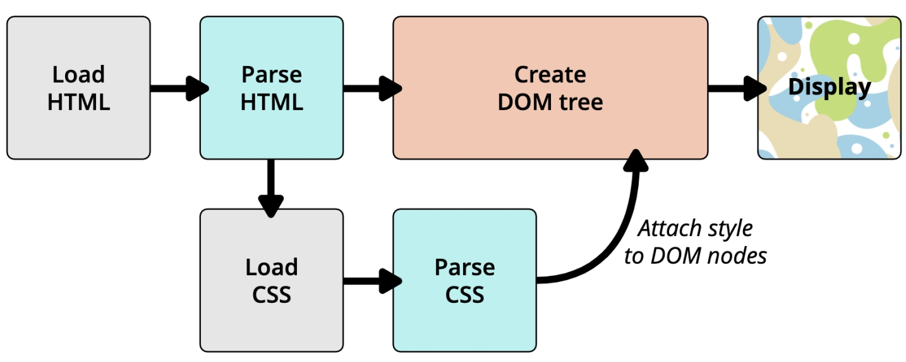

# 额外知识补充

## link元素

- link元素是**外部资源链接元素**，规范了**文档与外部资源**的关系
- link元素通常位于head元素中
- link最常用于链接CSS样式表，此外也可以被用来创建站点图标
- link元素常见的属性
  - href：此属性用于指定被链接资源的URL，URL可以是绝对的，也可以是相对的
  - [rel](https://developer.mozilla.org/zh-CN/docs/Web/HTML/Attributes/rel)：指定链接类型
    - `icon`用于站点图标
    - `stylesheet`用于CSS样式表
    - `dns-prefetch`用于告知浏览器为目标资源的来源预先执行 DNS 解析

## CSS表示颜色的方法

[css - color](https://developer.mozilla.org/zh-CN/docs/Web/CSS/color_value)

1. 颜色关键字：颜色关键字是不区分大小写的标识符，它表示一个具体的颜色

2. RGB颜色
   - RGB是一种色彩空间，通过red、green、blue三原色组成了不同的颜色
   - RGB各个原色的取值范围都是0-255
   - RGB颜色的表示方法
     - 十六进制符号：`#RRGGBB[AA]`
     - 十六进制符号：`#RGB[A]`
     - 函数符：`rgb[a](R, G, B[, A])`

3. HSL颜色：

   - 颜色也可以使用 `hsl()` 函数符被定义为色相 - 饱和度 - 亮度（Hue-saturation-lightness）模式。

   - HSL 相比 RGB 的优点是更加直观：你可以估算你想要的颜色，然后微调。它也更易于创建相称的颜色集合。（通过保持相同的色相并改变亮度/暗度和饱和度）。

   - HSL颜色的表示方法：`hsl[a](H, S, L[, A])`

## 浏览器的渲染流程

HTML -> DOM tree + CSS -> Render Tree -> Display



## CSS样式不生效的技巧

有时候编写的CSS样式不生效，有可能是因为

- 选择器的优先级太低
- 选择器没选中对应的元素
- CSS属性的适用形式不对
  - 元素不支持此CSS属性，比如span默认是不支持宽度和高度的
  - 浏览器不支持此CSS属性，比如旧版本的浏览器不支持一些CSS3的某些属性
  - 被同类型的CSS属性覆盖，比如font覆盖font-size

建议充分利用浏览器的开发者工具进行调试（增加、修改样式）和Debug

## 用边框实现形状

border主要是用来给盒子增加边框的
但是在开发过程中我们也可以利用边框的特性来实现一些形状

[The shape of CSS](https://css-tricks.com/the-shapes-of-css/#top-of-site)

## Web字体

- 使用Web Fonts的原因

  font-family可以用来设置字体

  fony-family提供一个或多个字体种类名称，浏览器会在列表中搜寻

  直到找到它所运行的系统上可用的字体

  对于传统的web开发人员来说，字体的选择是有限的，即Web-safe字体

  这种默认可选的字体并不能进行一些定制化的需求

  这种情况就可以使用Web Fonts

- 使用Web Fonts的方法

  在部署静态资源时，将字体文件一起部署到静态服务器中

  用户在浏览网页时就会从服务器下载引入的字体文件

  浏览器会根据使用的字体在下载的字体文件中查找、解析和使用相应的字体

  在浏览器中就会通过对应的字体显示内容

- @font-face可以用于加载一个自定义的字体

  ```css
  @font-face {
    font-family: "myfont";
    src: url(./fonts/myfont.ttf);
  }
  body {
    font-family: "myfont"
  }
  ```

- Web Fonts的兼容性

  为了浏览器的兼容性问题，我们需要有对应的其他格式的字体

  - OpenType/TrueType字体：拓展名是.ttf或.otf

    建立在TrueType字体之上

  - Embedded OpenType字体：拓展名是.eot

    OpenType字体的压缩版

  - SVG字体：拓展名是.svg或.svgz

  - WOFF表示Web Open Font Format web开放字体：

    拓展名是 .woff，建立在TrueType字体之上

  web fonts兼容性写法

  ```css
  /* src用于指定资源路径，format用于帮助浏览器快速识别字体的格式*/
  @font-face {
    font-family: "myfont";
    src: url("./fonts/myfont.eot");
    src: url("./fonts/myfont.eot?iefix") format("embedded-opentype"),
         url("./fonts/myfont.woff") format("woff"),
         url("./fonts/myfont.ttf") format("truetype"),
         url("./fonts/myfont.svg#uxfonteditor") format("svg");
    font-style: normal;
    font-weight: normal;
  }
  ```

## 字体图标

字体图标就是将字体设计成图标的样子

好处是

- 放大不会失真
- 可以任意切换颜色
- 用到很多个图标时，文件较小

字体图标的下载

- 在iconfont中下载并拷贝到项目中

字体图标的使用

1. 通过link引入iconfont.css文件
2. 使用字体图标

## CSS Sprite

CSS Sprite是一种CSS图像合成技术

- 首先将各种小图片合并到一张图片上
- 然后利用CSS的背景定位来显示对应的图片部分

使用CSS Sprite的好处

- 减少网页的http请求数量，加快网页响应速度，减轻服务器压力
- 减小图片总大小
- 解决了图片命名的困扰，只需要针对一张集合的图片命名

Sprite图片制作

- Photoshop
- [sprite-generator](https://www.toptal.com/developers/css/sprite-generator)

精灵图的使用

- 精灵图的原理是通过只显示精灵图的很小一部分来展示原图片

- 通常通过背景来实现

  1. 设置对应元素的宽度和高度
  2. 设置精灵图作为背景图片
  3. 调整背景图片的位置来展示

- 获取精灵图的位置

  [spritecow](http://www.spritecow.com/)
