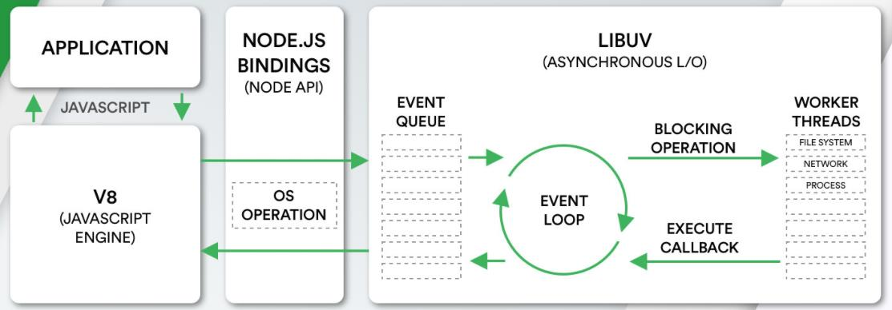

# 认识 Node

## Node 是什么

**Node.js**

- Node.js 是一个基于 V8 引擎的 JavaScript 运行时环境

- Node.js 可以通过嵌入的 V8 引擎执行 JS 代码
- 也可以进行一些额外的操作，比如文件系统读写、网络 IO 、加密、压缩解压文件等操作

**Node.js 的架构**

- JS 代码会经过 V8 引擎，再通过 Bindings，将任务放到 Libuv 的事件循环中
- Libuv 是使用 C 语言编写的库，提供了事件循环、文件系统读写、网络IO、线程池等内容

**Node 的特点**

- 异步I/O，也叫做非阻塞 I/0

  当线程遇到 I/O 操作时，不会以阻塞方式等待 I/O 操作完成或数据返回

  而只是将 I/O 请求转发给操作系统，继续执行下一条指令

- 事件驱动

  事件驱动以事件为中心，Node.js 将每一个任务都当成事件来处理

  Node.js 在执行过程中会维护一个事件队列，需执行的每个任务都会加入事件队列并提供一个包含处理结果的回调函数

  在事件驱动模型中，会生成一个事件循环线程来监听事件，不断地检查是否有未处理的事件

- 单进程、单线程

  Node.js 在主线程中维护一个事件队列，当接收到请求后，就将该请求作为一个事件放入该队列中，然后继续接收其他请求

  但 Node.js 内部是通过线程池来完成非阻塞 I/O 操作的，也就是说 Node.js 的单线程是指对 JavaScript 层面的任务处理是单线程的，而 Node.js 本身是一个多线程平台

- 轻量、可伸缩

- 跨平台

**Node.js 的应用场景**

1. 目前前端开发的大部分库都是以 node 包的形式用 npm、yarn、pnpm 等工具进行管理
2. 使用 Node.js 作为web服务器开发、中间件、代理服务器
3. 借助 Node.js 完成前后端渲染的同构应用
4. 使用 Node.js 编写脚本工具
5. 使用 Electron 来开发桌面应用程序

**Node 版本管理工具**

- n
- nvm
- nvm-windows

## Node 的使用

**Node 传入参数**

在命令行中执行 `node test.js` 可以载入和执行相应的 js 文件

也可以在命令行中传入参数 `node test.js num1=10 num2=20 30`

传入的参数可以通过 `process.argv` 获取

`process` 是一个内置对象，也包含一些其他信息（比如版本、操作系统等）

**Node 的输出**

`console` 可以在命令行中输出内容

- `console.log()`：输出内容
- `console.clear()`：清空控制台
- `console.trace()`：打印函数的调用栈

只输入 node 命令可以进入 Node 的 REPL 环境

- REPL 是 Read-Eval-Print Loop的简称，翻译为 “读取-求值-输出” 循环
- REPL 是一个简单的、交互式的编程环境，类似于浏览器的控制台

## 全局对象

Node 中提供了一些全局对象，包含

- 特殊的全局对象

  实际上是模块中的变量，每个模块都有（不能在命令行交互中使用）

  - `__dirname`：包含当前文件的所在路径
  - `__filename`：包含当前文件的所在路径和文件名称
  - exports module require()

- 常见的全局对象
  - `process` 对象：提供了Node进程中相关的信息
  - `console` 对象：提供了简单的调试控制台
  - 定时器函数
    - `setTimeout(callback, delay[, ...args])`：在 delay 毫秒后执行一次 callback
    - `setInterval(callback, delay[, ...args])`：每 delay 毫秒重复执行一次 callback
    - `setImmediate(callback[, ...args])`：callbackI / O事件后的回调的“立即”执行
    - `process.nextTick(callback[, ...args])`：添加到下一次tick队列中

- global 对象

  全局对象中包含 process 对象、console对象和定时器函数等

  新的标准中是 globalThis 对象

  在浏览器中执行的 JavaScript 代码，如果我们在全局中通过 var 定义一个属性，默认会被添加到 window 对象上
  
  但是在 node 中，我们通过 var 定义一个变量，它只是在当前模块中定义一个变量，不会放到全局中

## path 模块

path 是一个用于处理路径和文件的内置模块

由于不同操作系统的文件路径分割符不同

可以使用 path 模块来屏蔽它们之间的差异

path 模块常见 API

- 获取路径信息

  - `dirname`：获取文件的父文件夹

  - `basename`：获取文件名

  - `extname`：获取文件扩展名

- 拼接路径：`path.join(...paths)`

- 拼接绝对路径：`path.resolve(...paths)`

  path.resolve() 方法会把一个路径或路径片段的序列解析为一个绝对路径

  - 给定的路径的序列是从右往左被处理的，后面每个 path 被依次解析，直到构造完成一个绝对路径

  - 如果在处理完所有给定 path 的段之后，还没有生成绝对路径，则使用当前工作目录
  - 生成的路径会被规范化并删除尾部斜杠，零长度 path 段被忽略
  - 如果没有 path 传递段，path.resolve() 将返回当前工作目录的绝对路径
