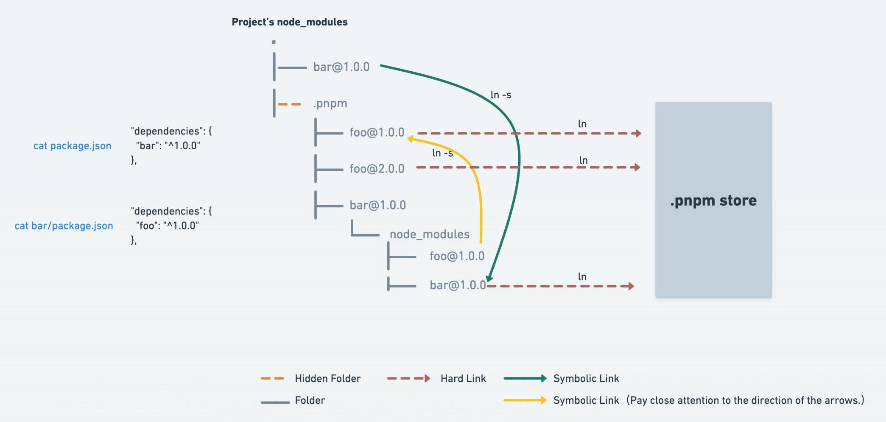

# 认识 Node

## Node 是什么

Node.js 是一个基于 V8 JavaScript 引擎的 JavaScript 运行时环境

- Node.js 可以通过嵌入的 V8 引擎执行 JS 代码
- 也可以进行一些额外的操作，比如文件系统读写、网络 IO 、加密、压缩解压文件等操作

Node.js 的架构

- JS 代码会经过 V8 引擎，再通过 Bindings，将任务放到 Libuv 的事件循环中
- libuv 是使用 C 语言编写的库，提供了事件循环、文件系统读写、网络IO、线程池等内容


Node 的特点

- 异步I/O，也叫做非阻塞 I/0

  当线程遇到 I/O 操作时，不会以阻塞方式等待 I/O 操作完成或数据返回

  而只是将 I/O 请求转发给操作系统，继续执行下一条指令

- 事件驱动

  事件驱动以事件为中心，Node.js 将每一个任务都当成事件来处理

  Node.js 在执行过程中会维护一个事件队列，需执行的每个任务都会加入事件队列并提供一个包含处理结果的回调函数

  在事件驱动模型中，会生成一个事件循环线程来监听事件，不断地检查是否有未处理的事件

- 单进程、单线程

  Node.js 在主线程中维护一个事件队列，当接收到请求后，就将该请求作为一个事件放入该队列中，然后继续接收其他请求

  但 Node.js 内部是通过线程池来完成非阻塞 I/O 操作的，也就是说 Node.js 的单线程是指对 JavaScript 层面的任务处理是单线程的，而 Node.js 本身是一个多线程平台

- 轻量、可伸缩

- 跨平台

Node.js 的应用场景

1. 目前大部分库都是以 node 包的形式用 npm、yarn、pnpm 等工具进行管理
2. 使用 Node.js 作为web服务器开发、中间件、代理服务器
3. 借助 Node.js 完成前后端渲染的同构应用
4. 使用 Node.js 编写脚本工具
5. 使用 Electron 来开发桌面应用程序

Node 版本管理工具：

- n
- nvm
- nvm-windows

## node 的使用

在命令行中执行 `node test.js` 可以载入和执行相应的 js 文件

也可以在命令行中传入参数 `node test.js num1=10 num2=20 30`

传入的参数可以通过 `process.argv` 获取

`process` 是一个内置对象，也包含一些其他信息

`console` 可以在命令行中输出内容

- `console.log()`：输出内容
- `console.clear()`：清空控制台
- `console.trace()`：打印函数的调用栈

只输入 node 命令可以进入 Node 的 REPL 环境（类似于浏览器的控制台）

## 全局对象

Node 中提供了一些全局对象，包含

- 特殊的全局对象：实际上是模块中的变量，每个模块都有

  不能在命令行交互中使用

  - `__dirname`：包含当前文件的所在路径
  - `__filename`：包含当前文件的所在路径和文件名称
  - exports module require()

- 常见的全局对象
  - process
  - console
  - 定时器函数
    - setTimeout
    - setInterval
    - setImmediate
    - process.nextTick 

- global 对象

  新的标准中是 globalThis 对象

  在浏览器中执行的 JavaScript 代码，如果我们在全局中通过 var 定义一个属性，默认会被添加到 window 对象上

  但是在 node 中，我们通过 var 定义一个变量，它只是在当前模块中定义一个变量，不会放到全局中

## path 模块

path 是一个用于处理路径和文件的内置模块

由于不同操作系统的文件路径分割符不同

可以使用 path 模块来屏蔽它们之间的差异

常见 API

- 获取路径信息

  - `dirname`：获取文件的父文件夹

  - `basename`：获取文件名

  - `extname`：获取文件扩展名

- 拼接路径：`path.join(...paths)`

- 拼接绝对路径：`path.resolve(...paths)`

  path.resolve() 方法会把一个路径或路径片段的序列解析为一个绝对路径

  - 给定的路径的序列是从右往左被处理的，后面每个 path 被依次解析，直到构造完成一个绝对路径

  - 如果在处理完所有给定 path 的段之后，还没有生成绝对路径，则使用当前工作目录
  - 生成的路径会被规范化并删除尾部斜杠，零长度 path 段被忽略
  - 如果没有 path 传递段，path.resolve() 将返回当前工作目录的绝对路径

# 模块化开发

## 概念

**模块化**就是将程序划分成一个个小的结构

- 每个结构的逻辑代码和作用域是独立的，定义变量不会影响到其他结构
- 一个结构可以将自己希望暴露的变量、函数、对象等导出给其他结构使用
- 也可以在一个结构中导入其他结构暴露的变量、函数、对象等

**模块化开发**：按照模块化的方式开发程序的过程

**模块化规范**：模块化开发的代码规范

- 核心功能是：模块本身可以导出暴露的属性，模块又可以导入自己需要的属性
- 代表性规范：CommonJS、AMD、CMD
- ES6 中 JS 推出新的模块化方案：ES Module

早期没有模块化的解决方案：立即函数调用表达式（IIFE）

```js
const module = (function() {
   let name = "me"
   let age = 18
   let _sex = "male"
   
   return {
       name,
       age
   }
})()

console.log(module.name)
```

## CommonJS

CommonJS 是一种具有代表性的模块化开发规范

- Node 是 CommonJS 在服务器端一个具有代表性的实现；

- Browserify 是 CommonJS 在浏览器中的一种实现；

- webpack 打包工具具备对 CommonJS 的支持和转换；

Node.js 中对 CommonJS 进行了支持和实现

- 每一个 js 文件都是一个单独的模块
- 这个模块中包括CommonJS规范的核心变量：exports、module.exports、require
  - exports 和 module.exports 负责对模块中的内容进行导出
  - require 函数可以帮助我们导入其他模块（自定义模块、系统模块、第三方库模块）中的内容
- 我们可以使用这些变量来方便的进行模块化开发

### exports

exports 对象中添加的属性会导出

```js
// 导出 bar.js
exports.name = name
exports.age = age
```

### require

require 是一个函数，可以帮助我们引入一个文件（模块）中导出的对象

```js
// 在另外一个文件中导入
const bar = require('./bar') // .js 可以省略

const { name, age } = require('./bar') // 配合解构使用
```

导入的对象等于 bar.js 中的 exports 对象

require 通过查找找到了这个 exports 对象，并赋值给 bar

require 的本质是引用赋值

**require(X) 的查找规则**

1. `X` 是 Node 核心模块，如 path、http

   直接返回核心模块，并且停止查找

2.  `X` 是以 `./` 或 `../` 或 `/` 根目录开头的路径

   第一步：查找路径对应的文件

   - 如果有文件后缀，按照后缀名的格式查找相应的文件
   - 如果没有后缀，按照如下顺序查找相应的文件
     - 直接查找 X
     - 查找 X.js 文件
     - 查找 X.json 文件
     - 查找 X.node 文件

   第二步：将路径作为一个目录

   - 按照如下顺序查找目录下的 index 文件
     - 查找 X/index.js 文件
     - 查找 X/index.json 文件
     - 查找 X/index.node 文件

   最后：如果没有找到就报错（not found）

3. `X` 既不是核心模块，也不是路径

   在当前目录的 node_modules 查找

   没有就去上级目录的 node_modules 查找

   直到根目录的 node_modules 都没有找到就报错（not found）

### module.exports

每个模块都对应一个 module，module 是 Module 类的实例

真正用于实现导出的其实是 module 上的 exports 属性

而 module.exports 保存的是 exports 对象的引用

所以 module.exports = exports = bar

开发中更常见的写法是直接使用 module.exports 导出

此时 module.exports 不再保存 exports 的引用，修改 exports 就没有意义了

```js
module.exports = {
    name,
    age
}
```

### 模块的加载过程

1. 模块在被第一次引入时，模块中的 js 代码会被运行一次

2. 模块被多次引入时，会缓存，最终只加载（运行）一次

   module.loaded 在加载后会变为 true

3. 循环引入的加载顺序是根据深度优先算法确定的

### 缺点

CommonJS 加载模块是同步的

同步加载就意味着只有等到对应的模块加载完毕，当前模块中的内容才能被运行

所以 CommonJS 通常不用于浏览器

但 webpack 可以实现对 CommonJS 代码的转换

早期为了在浏览器中使用模块化，通常会使用 AMD 或者 CMD

但目前已经很少使用，主要原因有

- 现代的浏览器已经支持 ES Module
- 借助于 webpack 等工具可以实现对 CommonJS 或者 ES Module 代码的转换

## AMD 和 CMD

AMD：Asynchronous Module Definition

- 采用异步加载模块
- 常用的库有 require.js 和 curl.js

CMD：Common Module Definition

- 也采用异步加载模块，但是吸收了 CommonJS 的优点
- 常用的库有 sea.js

## ES Module

### ES Module 的介绍

ES Module 和 CommonJS 的区别

- 关键字不同：使用了 import 和 export 关键字
- 底层原理不同：采用编译期的静态分析，并且也加入了动态引用的方式

在 ES Module 中

- export 负责将模块内的内容导出
- import 负责从其他模块导入内容

采用 ES Module 将自动采用严格模式

### ES Module 的使用

1. 开启 ES Module

   ```html
   <script src="main.js" type="module"></script>
   <script src="./modules/foo.js" type="module"></script>
   ```

2. 导出：使用 export 关键字将一个模块中的变量、函数、类等导出

   将需要导出的标识符放到 `export` 后面的 `{}` 中

   `export { identifier1, identifier2, identifier3 }`

   导出时可以用 as 给标识符起一个别名

   ```js
   // export const name = "me" 可以在定义的时候直接导出
   export { 
       name,
       age,
       home as address
   }
   ```

   默认导出 default export

   - 默认导出时可以不指定名字

   - 默认导出在导入时不需要使用 `{}`，并且可以自己来指定名字
   - 一个模块只有一个默认导出

   ```js
   function foo() {
       
   }
   
   export default foo
   
   export default function() {
       
   }
   
   // 导入时
   import bar from "./foo.js"
   ```

3. 导入：使用 import 关键字从另外一个模块中导入内容

   `import { identifiers } from "module"`

   导入时也可以用 as 给标识符起别名

   ```js
   import { name as friendName, age, address } from "./foo.js"
   ```

   导入时可以导入整个模块，也可以给整个模块起别名

   ```js
   // import * from "./foo.js"
   import * as foo from "./foo.js"
   console.log(foo.name)
   ```

4. 注意事项

   - 在浏览器中直接使用 ES Module 时必须加上文件后缀名

   - 在打开使用 ES Module 的 html 时，必须开启一个服务来打开

     因为本地加载文件会遇到 CORS 错误

   - export 可以和 import 结合使用

     `export { sum as barSum } from "./bar.js"`

     等价于先导入再导出

     常用于将所有导出的内容封装到一个文件中

     方便指定统一的接口规范，便于阅读
   
     `export * from "./bar.js"`
   
   - `import.meta` 可以获取模块的元数据对象，包含一些模块的信息（ES11）

### 动态加载

import 不可以在逻辑代码中加载模块，只能在模块顶部使用

- 因为 ES Module 在被 JS 引擎解析时，就必须知道它的依赖关系
- 导入声明只允许在模块顶层使用

`import()` 函数可以用于动态加载，返回一个 Promise 对象，可以通过 then 来获取结果

```js
if (flag) {
    import("./foo.js").then(res => {
        console.log(res.name, res.age)
    })
}
```

### 解析流程

[ES modules: A cartoon deep-dive](https://hacks.mozilla.org/2018/03/es-modules-a-cartoon-deep-dive/)

ES Module的解析过程可以划分为三个阶段

1. 构建（Construction），根据地址查找 js 文件，并且下载，将其解析成模块记录（Module Record）
2. 实例化（Instantiation），对模块记录进行实例化，并且分配内存空间，解析模块的导入和导出语句，把模块指向对应的内存地址
3. 运行（Evaluation），运行代码，计算值，并且将值填充到内存地址中


# 包管理工具

## 代码共享方案

1. 放在自己的网站上

2. 放在 Github 上

3. 使用包管理工具将代码发布到特定的位置

   通过包管理工具来安装、升级和删除代码包

## npm

### 认识npm

npm 是 node 自带的一种包管理工具

即 Node Package Manager

每一个项目都有一个 npm 对应的配置文件 package.json

- 其中记录了项目的名称、项目版本号和项目描述
- 也包含项目依赖的其他库的信息和依赖库的版本号

package.json 的创建方式

- 手动从零创建项目 `npm init -y`：-y 会使用默认信息
- 通过脚手架创建项目，脚手架会自动生成 package.json

package.json 中的常见属性

- `name`：项目的名称

- `version`：项目的版本号

- `description`：描述信息

- `author`：作者相关信息

- `license`：开源协议

- `private`：当前的项目是否是私有（true 为私有项目不能发布）

- `main`：程序入口

- `scripts`：配置的脚本命令

- `dependencies`：指定无论开发环境还是生成环境都需要依赖的包

- `devDependencies`：指定只有开发环境需要的包

  比如：webpack babel 等

  `npm install xxx --save-dev` 安装的包

- `peerDependencies`：

  还有一种项目依赖关系是对等依赖，也就是依赖中的一个包必须是以另外一个宿主包为前提的

  比如 element-plus 是依赖于 vue3 的，ant design 是依赖于 react、react-dom

- `engines`：用于指定 Node 和 NPM 的版本号

- `browserslist`：用于配置打包后的 JavaScript 浏览器的兼容情况

### 依赖的版本管理

npm 的包遵循 semver 版本规范

semver版本规范是X.Y.Z：

- X：主版本号（major）：当你做了不兼容的 API 修改（可能不兼容之前的版本）；

- Y：次版本号（minor）：当你做了向下兼容的功能性新增（新功能增加，但是兼容之前的版本）；

- Z：修订号（patch）：当你做了向下兼容的问题修正（没有新功能，修复了之前版本的bug）；

`^` 和 `~` 的区别

- x.y.z：表示一个明确的版本号
- ^x.y.z：表示 x 是保持不变的，y 和 z 永远安装最新的版本
- ~x.y.z：表示 x 和 y 是保持不变的，z 永远安装最新的版本

### npm 常用命令

- `npm install`：根据 package.json 中的依赖安装

- `npm install package -g`：安装全局依赖
- `npm install package`：安装生产时依赖
- `npm install package --save-dev / -D`：安装开发时依赖

- `npm uninstall package`
- `npm uninstall package --save-dev / -D`
- `npm run cmd`：执行 scripts 中配置的脚本命令
- `npm rebuild`
- `npm cache clean`

## 其他工具

- yarn

- cnpm：更换 npm 镜像源

- npx：用于调用项目内部安装的模块

  npx 的执行原理

  - 去 `node_modules/.bin` 路径检查 npx 后的命令是否存在，找到之后执行；

  - 找不到，就去环境变量 `$PATH` 里面，检查 npx 后的命令是否存在，找到之后执行;

  - 还是找不到，自动下载一个临时的依赖包最新版本在一个临时目录，然后再运行命令，运行完之后删除，不污染全局环境。

  > 如果全局和项目中都安装了 yarn
  >
  > 在终端执行 yarn --version 会显示全局的版本
  >
  > 因为在当前目录找不到 yarn 会去全局找并且执行命令
  >
  > 要使用项目中的 yarn 有三种方法
  >
  > 1. 在终端命令中使用详细路径
  >
  >    ./node_modules/.bin/yarn --version
  >
  > 2. 使用 scripts
  >
  >    "scripts": {
  >
  >    ​	"yarn": "yarn--version"
  >
  >    }
  >
  >    然后 npm run yarn
  >
  > 3. 使用 npx
  >
  >    npx yarn --version

- [pnpm](https://pnpm.io/zh/)：performant npm

  对多个项目重复引用的依赖包建立硬链接节约硬盘空间

  采用非扁平的 node_modules 目录（硬链接和软链接结合）

  

  常用命令

  - `pnpm install`

  - `pnpm add package`

  - `pnpm remove package`

  - `pmpm cmd`

    执行 scripts 中的脚本命令

  - `pnpm store path`

    获取当前活跃的 store 目录
  
  - `pnpm store prune`
  
    从 store 中删除当前未被引用的包来释放 store 的空间
