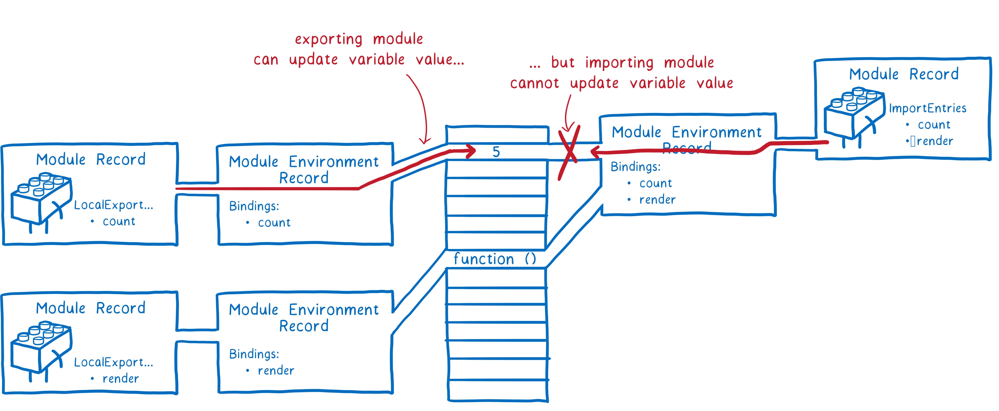

# 模块化开发

## 概念

**模块化**就是将程序划分成一个个小的结构

- 每个结构的逻辑代码和作用域是独立的，定义变量不会影响到其他结构
- 一个结构可以将自己希望暴露的变量、函数、对象等导出给其他结构使用
- 也可以在一个结构中导入其他结构暴露的变量、函数、对象等

**模块化开发**：按照模块化的方式开发程序的过程

**模块化规范**：模块化开发的代码规范

- 核心功能是：模块本身可以导出暴露的属性，模块又可以导入自己需要的属性
- 代表性规范：CommonJS、AMD、CMD
- ES6 中 JS 推出新的模块化方案：ES Module

早期没有模块化的解决方案：立即函数调用表达式（IIFE）

```js
const module = (function() {
   let name = "me"
   let age = 18
   let _sex = "male"
   
   return {
       name,
       age
   }
})()

console.log(module.name)
```

## CommonJS

CommonJS 是一种具有代表性的模块化开发规范

- Node 是 CommonJS 在服务器端一个具有代表性的实现；

- Browserify 是 CommonJS 在浏览器中的一种实现；

- webpack 打包工具具备对 CommonJS 的支持和转换；

Node.js 中对 CommonJS 进行了支持和实现

- 每一个 js 文件都是一个单独的模块
- 这个模块中包括 CommonJS 规范的核心变量：exports、module.exports、require
  - exports 和 module.exports 负责对模块中的内容进行导出
  - require 函数可以帮助我们导入其他模块（自定义模块、系统模块、第三方库模块）中的内容
  - 我们可以使用这些变量来进行模块化开发

### exports

exports 是一个用于导出的对象

其中添加的属性会被导出

```js
// 导出 bar.js
exports.name = name
exports.age = age
```

### require

require 是一个函数，可以帮助我们引入一个文件（模块）中导出的对象

```js
// 在另外一个文件中导入
const bar = require('./bar') // .js 可以省略

const { name, age } = require('./bar') // 配合解构使用
```

导入的对象等于 bar.js 中的 exports 对象

require 通过查找找到了这个 exports 对象，并赋值给 bar

require 的本质是**引用赋值**

**require(X) 的查找规则**

1. `X` 是 Node 核心模块，如 path、http

   直接返回核心模块，并且停止查找

2.  `X` 是以 `./` 或 `../` 或 `/` 根目录开头的路径

    第一步：查找路径对应的文件

    - 如果有后缀名，按照后缀名的格式查找相应的文件
    - 如果没有后缀名，会按照如下顺序查找相应的文件
      - 直接查找 X 文件
      - 查找 X.js 文件
      - 查找 X.json 文件
      - 查找 X.node 文件

    第二步：没有找到文件，将 X 作为一个目录

    - 按照如下顺序查找目录下的 index 文件
      - 查找 X/index.js 文件
      - 查找 X/index.json 文件
      - 查找 X/index.node 文件

    最后：如果没有找到就报错 not found

3. `X` 既不是核心模块，也不是路径

   在当前目录的 node_modules 查找

   没有就去上级目录的 node_modules 查找

   直到根目录的 node_modules 都没有找到就报错 not found

### module.exports

每个模块都对应一个 module 对象，module 对象 是 Module 类的实例对象

真正用于实现导出的其实是 module 对象上的 exports 属性

而 module.exports 保存的是 exports 对象的引用

所以 module.exports = exports = bar

开发中更常见的写法是直接使用 module.exports 导出

此时 module.exports 不再保存 exports 的引用，修改 exports 就没有意义了

```js
module.exports = {
    name,
    age
}
```

### 模块的加载过程

1. 模块在被第一次引入时，模块中的 js 代码会被运行一次

2. 模块被多次引入时，会缓存，最终只加载（运行）一次

   module.loaded 在加载后会变为 true

3. 循环引入的加载顺序是根据深度优先算法确定的

### 缺点

CommonJS 加载模块是同步的

同步加载就意味着只有等到对应的模块加载完毕，当前模块中的内容才能被运行

所以 CommonJS 通常不用于浏览器

但 webpack 可以将 CommonJS 代码转换成浏览器可以执行的代码

早期为了在浏览器中使用模块化，通常会使用 AMD 或者 CMD

但目前已经很少使用，主要原因有

- 现代的浏览器已经支持 ES Module
- 借助于 webpack 等工具可以实现对 CommonJS 或者 ES Module 代码的转换

## AMD 和 CMD

AMD：Asynchronous Module Definition

- 采用异步加载模块
- 常用的库有 require.js 和 curl.js

CMD：Common Module Definition

- 也采用异步加载模块，但是吸收了 CommonJS 的优点
- 常用的库有 sea.js

## ES Module

### ES Module 的介绍

ES Module 和 CommonJS 的区别

- 关键字不同：使用了 import 和 export 关键字
- 底层原理不同：采用编译期的静态分析，并且也加入了动态引用的方式

在 ES Module 中

- export 负责将模块内的内容导出
- import 负责从其他模块导入内容

采用 ES Module 将自动采用严格模式

### ES Module 的使用

1. 开启 ES Module

   ```html
   <script src="main.js" type="module"></script>
   <script src="./modules/foo.js" type="module"></script>
   ```

2. 导出：export 关键字负责将一个模块中的变量、函数、类等导出

   - 在语句声明的前面直接加上 export 关键字可以直接导出声明的变量

   - 也可以将需要导出的多个标识符放到 `export` 后面的 `{}` 中

     `export { identifier1, identifier2, identifier3 }`

   - 导出时可以用 as 给标识符起一个别名

   ```js
   // export const name = "me" 可以在定义的时候直接导出
   export { 
       name,
       age,
       home as address
   }
   ```

   默认导出 default export

   - 默认导出时可以不指定名字

   - 默认导出在导入时不需要使用 `{}`，并且可以自己来指定名字
   - 一个模块只能有一个默认导出

   ```js
   function foo() {
       
   }
   
   export default foo
   
   export default function() {
       
   }
   
   // 导入时
   import bar from "./foo.js"
   ```

3. 导入：import 关键字负责从另外一个模块中导入内容

   - 导入方式是 `import { 标识符列表 } from "模块"`

   - 导入时也可以用 as 给标识符起别名

   ```js
   import { name as friendName, age, address } from "./foo.js"
   ```

   - 可以通过 `import * as`导入整个模块

   ```js
   import * as foo from "./foo.js"
   console.log(foo.name)
   ```

4. 注意事项

   - 在浏览器中直接使用 ES Module 时必须加上文件后缀名

   - 在打开使用 ES Module 的 html 时，必须开启一个服务来打开

     因为本地加载文件会遇到 CORS 错误

   - export 可以和 import 结合使用

     `export { sum as barSum } from "./bar.js"`

     等价于先导入再导出

     常用于将所有导出的内容封装到一个文件中

     方便指定统一的接口规范，便于阅读

     `export * from "./bar.js"`

   - `import.meta` 是一个给 JavaScript 模块暴露特定上下文的元数据属性的对象

     它包含了这个模块的信息，比如 URL（ES11 特性）

### 动态加载

import 关键字不可以在逻辑代码中加载模块，只能在模块顶部使用

- 因为 ES Module 在被 JS 引擎解析时，就必须知道它的依赖关系
- 导入声明只允许在模块顶层使用

`import()` 函数可以用于动态加载

- `import()` 会返回一个 Promise 对象
- 可以通过 then 来获取结果

```js
if (flag) {
    import("./foo.js").then(res => {
        console.log(res.name, res.age)
    })
}
```

### 解析流程

[ES modules: A cartoon deep-dive](https://hacks.mozilla.org/2018/03/es-modules-a-cartoon-deep-dive/)

ES Module的解析过程可以划分为三个阶段

1. 构建（Construction），根据地址查找 js 文件，并且下载，将其解析成模块记录（Module Record）
2. 实例化（Instantiation），对模块记录进行实例化，并且分配内存空间，解析模块的导入和导出语句，把模块指向对应的内存地址
3. 运行（Evaluation），运行代码，计算值，并且将值填充到内存地址中


实例化阶段


实例化阶段和求值阶段

