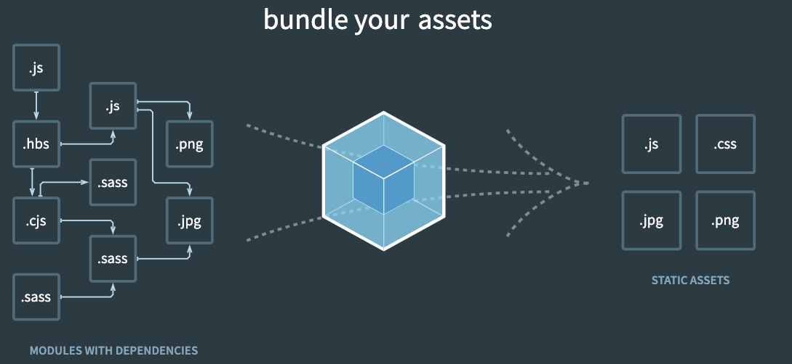
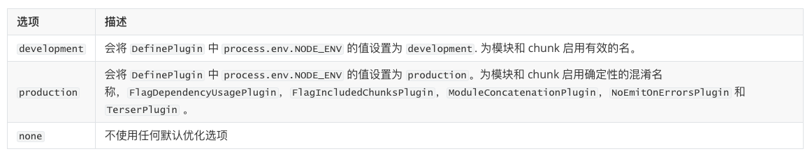

# webpack

## 认识 webpack

[webpack](https://webpack.js.org/) is a static module bundler for modern JavaScript applications

- bundler：webpack 是一个打包工具
- static：最终将代码打包成静态资源（用于部署到静态服务器）
- module：webpack 默认支持各种模块化开发，ES Module、CommonJS、AMD 等
- modern：现代前端开发面临各种各样的问题，催生了 webpack 的出现和发展
  - 需要模块化开发
  - 需要使用高级特性加快开发效率和安全性
  - 必须对代码进行压缩合并或者其他相关的优化
  - 等等



## 使用 webpack

### 打包

在目录下直接执行 webpack 命令会将当前目录的项目默认打包到 dist 文件夹内

默认打包的入口为当前目录下的 `src/index.js`

默认打包的出口为 `dist/main.js`

如果 `src/index.js` 不存在就会报错

也可以手动指定入口和出口

`webpack --entry ./src/main.js --output-path ./build`

手动指定文件名

`webpack --output-filename bundle.js`

### 配置文件

可以在项目根目录下创建一个 webpack.config.js

将入口、出口、文件路径、文件名和一些其他复杂的配置放进去

```js
const path = require('path')

module.exports = {
    mode: "devlopment",
    entry: "./src/main.js",
    output: {
        filename: "bundle.js",
        path: path.resolve(__dirname, "./build"), // 必须使用绝对路径
        assetsModuleFilename: "img/[name].[hash:6][ext]"
    }
}
```

mode 可以通过 process.env.NODE_ENV 获取

- 默认值为 production

- 可选值 none | development | production



在 package.json 中配置命令

```js
"scripts": {
    "build": "webpack --config webpack.config.js"
}
```

然后就可以执行 `npm run build` 进行打包

### 打包过程

webpack 是如何对项目进行打包的

1. 根据命令或者配置文件找到入口文件

2. 从入口开始，会生成一个依赖关系图，这个依赖关系图会包含应用程序中所需的所有模块

   比如 js文件、css文件、图片、字体等

3. 然后遍历图结构，打包一个个模块

   根据文件的不同使用不同的 loader 来解析

## loaders

### loader 配置

webpack 默认只能解析 js 文件

其他类型的文件需要使用对应的 loader 来解析

loader 可以在配置文件 webpack.config.js 中的 module.rules 中配置

- module.rules 对应一个 loader 规则数组

- rule 是一个规则对象，包含以下属性

  - test：用于对 resource（资源）进行匹配，通常会设置成正则表达式

  - use：对应一个 UseEntry 的数组

    每个 UseEntry 包含以下属性

    - loader：字符串
    - options：可选属性，值是一个字符串或者对象，会被传入到 loader 中
    - query：目前已经使用options来替代

    不需要 options 时可以用字符串代替 UseEntry

    `use: ['style-loader']` 是 `use: [{ loader: 'style-loader'}]` 的简写

  - loader

    只有一个 loader 可以不写 use

    `loader: 'sytle-loader'` 是 `use: ['style-loader']` 的简写

配置案例

```js
module: {
    rules: [
        {
            test: /\.css$/,
            use: [
                // loader 的执行顺序是从右到左（从下到上）
                // 所以 style-loader 需要写到前面
                { loader: 'style-loader' },
                { loader: 'css-loader' }
            ]
        },
        {
            test: /\.less$/,
            use: [
                { loader: 'style-loader' },
                { loader: 'css-loader' },
                { loader: 'less-loader' }
            ]
        }
    ]
}
```

常用 loader

- css-loader：解析 css 文件
- style-loader：插入样式

- less-loader：自动转换 less 到 css

### PostCSS

PostCSS 是一个通过 JavaScript 来转换样式的工具

这个工具可以帮助我们进行一些 CSS 的转换和适配

比如自动添加浏览器前缀、CSS 样式的重置

postcss 可以通过 webpack 的 postcss-loader 使用

postcss-loader 在 webpack.config.js 中的配置

```js
use: [
    {
        loader: "postcss-loader",
        options: {
            postcssOptions: {
                plugins: [
                    "autoprefixer"
                ]
            }
        }
    }
]
```

也可以单独使用 postcss.config.js

```js
module.exports = {
    plugins: [
        "autoprefixer"
    ]
}
```

autoprefixer 是 postcss 的一个插件

也可以直接使用 postcss-preset-env 相当于一个预设环境

它也会自动添加浏览器前缀，还包含一些其他功能

比如将一些 CSS 新特性转换成大多数浏览器认识的 CSS

### 资源模块类型

webpack5 之前加载资源需要使用一些 loader

在 webpack5 之后，可以直接使用资源模块类型，替代对应的 loader

资源模块类型的 4 种模块类型

- `asset/resource`：发送一个单独的文件并导出 URL

  之前通过使用 file-loader 实现

  将图片打包，通过图片 url 访问图片

  缺点是使用多少次就会有多少次网络请求

- `asset/inline`：导出一个资源的 data URI

  之前通过使用 url-loader 实现

  将图片进行 base64 的编码，直接使用编码后的图片源码访问图片

  缺点是 js 文件会变大，导致 js 文件的下载时间变长，从而使得 js 代码的下载、解析和执行的时间变长

- `asset/source`：导出资源的源代码

  之前通过使用 raw-loader 实现

- `asset`：在导出一个 data URI 和发送一个单独的文件之间自动选择

  之前通过使用 url-loader，并且配置资源体积限制实现

  - 小的图片使用 `asset/inline` 进行 base64 编码，通过源码访问图片
  - 大的图片使用 `asset/resource` 直接对图片打包，使用 url 地址请求图片

加载图片的案例

```js
{
    test: /\.(png|svg|jpg|jpeg|gif)$/i,
    type: "asset/resource",
    generator: {
        filename: "img/[name].[hash:6][ext]"
    }
}
```

文件路径名可以使用 generator.filename 设置

也可以在 output.assetsModuleFilename 中设置

- [ext]：处理文件的扩展名
- [name]：处理文件的名称
- [hash]：文件的内容，使用 MD4 的散列函数处理，生成的一个 128 位的 hash 值（32个十六进制）

`type: "asset"` 的使用案例

```js
{
    test: /\.(png|svg|jpg|jpeg|gif)$/i,
    type: "asset",
    generator: {
        filename: "img/[name].[hash:6][ext]"
    },
    parser: {
        dataUrlCondition: {
            maxSize: 100 * 1024
        }
    }
}
```

### babel

babel 是一个 JS 语法转换工具，包括语法转换、源代码转换等

主要用于将 ES6 及以后的代码转换为 ES6 之前的代码以兼容旧浏览器

babel 的独立使用

```shell
npm install @babel/cli @babel/core -D
npx babel src --out-dir dist
```

安装插件

```shell
npm install @babel/plugin-transform-arrow-functions -D
npx babel src --out-dir dist --plugins=@babel/plugin-transform-arrow-functions

npm install @babel/plugin-transform-block-scoping -D
npx babel src --out-dir dist --plugins=@babel/plugin-transform-block-scoping,@babel/plugin-transform-arrow-functions
```

需要安装的插件过多可以直接使用 preset-env

```shell
npm install @babel/preset-env -D
npx babel src --out-dir dist --presets=@babel/preset-env
```

babel-loader 的使用

```shell
npm install babel-loader -D
npm install @babel/preset-env -D
```

配置 webpack 规则

babel 在 webpack 中使用也需要配置插件，同样也提供了包含多个插件的预设

```js
module: {
    rules: [
        {
            test: /\.m?js$/,
            use: [
                {
                    loader: "babel-loader",
                    options: {
                        presets: [
                            "@babel/preset-env"
                        ]
                    }
                }   
            ]
        }
    ]
}
```

### vue-loader

安装

```js
npm install vue-loader -D
npm install @vue/compiler-sfc -D // 对 template 解析的工具
```

配置

```js
const { VueLoaderPlugin } = require("vue-loader/dist/index")

module: {
    rules: [
        {
            test: /\.vue$/,
            loader: "vue-loader"
        }
    ]
},
plugins: [
    new VueLoaderPlugin()
]
```

## resolve

resolve 用于设置模块如何被解析

resolve 可以帮助 webpack 从每个 require/import 语句中，找到需要引入的模块代码

### extensions

webpack 可以解析的路径

- 绝对路径

  获得绝对路径就不再解析

- 相对路径：`当前目录路径 + 导入路径`

  在这种情况下，使用 import 或 require 的资源文件所处的目录，被认为是上下文目录

  在 import/require 中给定的相对路径，会拼接此上下文路径，来生成模块的绝对路径

- 模块路径

  在 resolve.modules 中指定的所有目录检索模块

  默认值是 `['node_modules']`，所以默认会从 node_modules 中查找文件

  可以通过设置别名的方式来替换初始模块路径

### mainFiles 

文件和文件夹的确定

- 文件
  - 如果有扩展名，则直接打包文件
  - 没有扩展名，将使用 resolve.extensions 选项作为文件扩展名解析

- 文件夹

  会在文件夹中根据 resolve.mainFiles 配置选项中指定的文件顺序查找文件

  resolve.mainFiles 的默认值是 `['index']`

  拼接 index 以后再根据 resolve.extensions 来解析扩展名

### alias

resolve.alias 可以给某些常见的路径起一个别名

```js
resolve: {
    mainFiles: ["index", "main"]
    extensions: [".js", "json", ".vue", ".jsx", ".ts", ".tsx"],
    alias: {
        "@": path.resolve(__dirname, "./src"),
        utils: path.resolve(__dirname, "./src/utils")
    }
}
```

## plugin

>Loader 和 Plugin 的差异
>
>- Loader 是用于特定的模块类型进行转换
>- Plugin 可以用于执行更加广泛的任务，比如打包优化、资源管理、环境变量注入等

### CleanWebpackPlugin

每次重新打包时自动删除以前打包的文件夹

```shell
npm install clean-webpack-plugin -D
```

webpack 配置

```js
const { CleanWebpackPlugin } = require("clean-webpack-plugin")

module.exports = {
    plugins: [
        new CleanWebpackPlugin()
    ]
}
```

被 `output.clean: true` 替换

### HtmlWebpackPlugin

对 HTML 进行打包处理

```shell
npm install html-webpack-plugin -D
```

webpack 配置

```js
const HtmlWebpackPlugin = require("html-webpack-plugin")

module.exports = {
    plugins: [
        new CleanWebpackPlugin({
            title: "webpack-pratice",
            template: "./public/index.html"
        })
    ]
}
```

打包的 HTML 文件默认情况下是根据 ejs 的一个模板来生成的

template 可以自定义模板

模板中可以使用 `<%= 变量 %>` 填充数据

比如 `<%= htmlWebpackPlugin.options.title %>`  `<%= BASE_URL %>` 

### DefinePlugin

允许在编译时创建配置的全局常量，是一个webpack内置的插件

```js
const { DefinePlugin } = require("webpack")
module.exports = {
    plugins: [
        new DefinePlugin({
            BASE_URL: "'./'"
        })
    ]
}
```

## webpack-dev-server

### 使用

webpack-dev-server 可以搭建本地服务器，当文件发生变化时，自动的完成编译和展示

webpack-dev-server 在编译之后不会写入到任何输出文件，而是将 bundle 文件保留在内存中

1. 安装

    ```shell
    npm install webpack-dev-server -D
    ```

2. 修改配置

   ```js
   module.exports = {
       devServer: {
           hot: true,
           host: "0.0.0.0", // 默认是 localhost 127.0.0.1
           port: 8888, // 默认 8080
           open: true, // 是否自动打开浏览器
           compress: true // 是否为静态文件开启 gzip compression
       } 
   }
   ```
   

3. 添加脚本

   ```js
   "scripts": {
       "serve": "webpack serve --config webpack.config.js",
       "build": "webpack --config webpack.config.js"
   }
   ```

### HMR

HMR 的全称是Hot Module Replacement，模块热替换

指在应用程序运行过程中，替换、添加、删除模块，而无需重新刷新整个页面

HMR 通过如下方式提高开发速度

- 不重新加载整个页面，这样可以保留某些应用程序的状态不丢失
- 只更新需要变化的内容，节省开发的时间
- 修改了 css、js 源代码，会立即在浏览器更新

默认情况下，webpack-dev-server 已经支持并开启HMR

但是需要手动指定进行 HMR 的模块

```js
if (module.hot) {
    module.hot.accept("./util.js", () => {
        console.log("util is updated")
    })
}
```

## webpack-merge

日常中会把公共配置，开发配置和生产配置分开

- webpack.comm.config.js

- webpack.dev.config.js

- webpack.prod.config.js

配置的合并

```js
const { merge } = require("webpack-merge")
const commonConfig = require("./webpack.comm.config")

// webpack.dev.config.js
module.exports = merge(commonConfig, {
    mode: "development"
})

// webpack.prod.config.js
module.exports = merge(commonConfig, {
    mode: "production"
})
```

