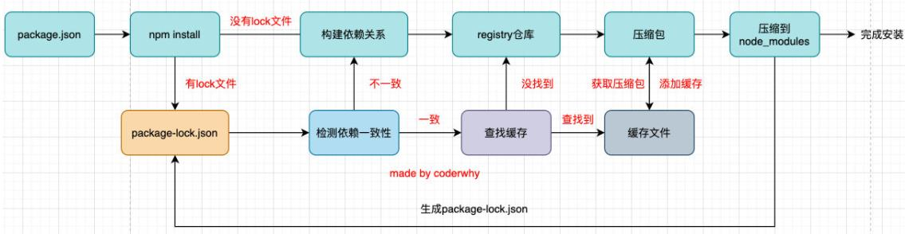
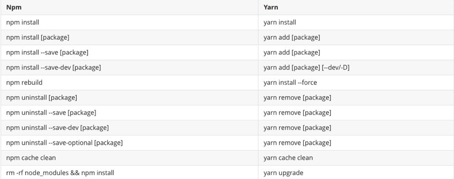
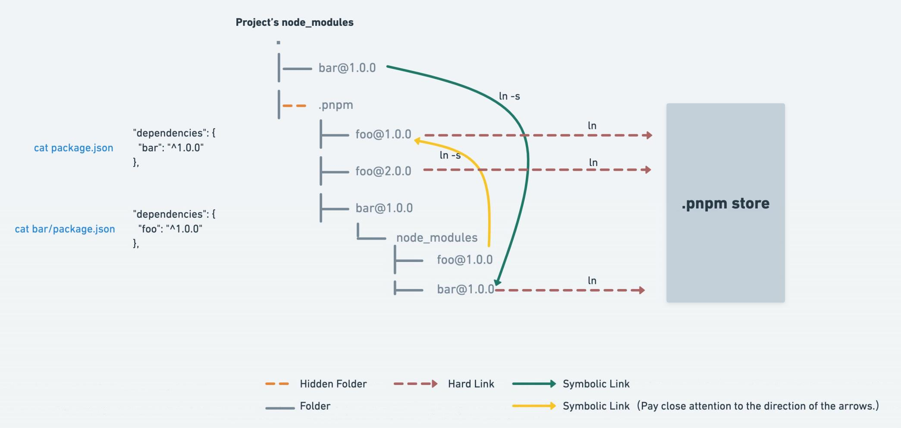

# 包管理工具 pm

## 代码共享方案

1. 放在自己的网站上

2. 放在 Github 上

3. 使用包管理工具将代码发布到特定的位置

   通过包管理工具来安装、升级和删除代码包

## npm

### 认识npm

npm 是 node 自带的一种包管理工具

即 Node Package Manager

每一个项目都有一个 npm 对应的配置文件 package.json

- 其中记录了项目的名称、项目版本号和项目描述
- 也包含项目依赖的其他库的信息和依赖库的版本号

package.json 的创建方式

- 手动从零创建项目 `npm init -y`：-y 会使用默认信息
- 通过脚手架创建项目，脚手架会自动生成 package.json

package.json 中的常见属性

- `name`：项目的名称

- `version`：项目的版本号

- `description`：描述信息

- `author`：作者相关信息

- `license`：开源协议

- `private`：当前的项目是否是私有（true 为私有项目不能发布）

- `main`：程序入口

- `scripts`：配置的脚本命令

- `dependencies`：指定无论开发环境还是生成环境都需要依赖的包

- `devDependencies`：指定只有开发环境需要的包

  比如：webpack babel 等

  `npm install xxx --save-dev` 安装的包

- `peerDependencies`：

  还有一种项目依赖关系是对等依赖，也就是依赖中的一个包必须是以另外一个宿主包为前提的

  比如 element-plus 是依赖于 vue3 的，ant design 是依赖于 react、react-dom

- `engines`：用于指定 Node 和 NPM 的版本号

- `browserslist`：用于配置打包后的 JavaScript 浏览器的兼容情况

### 版本规范

npm 的包遵循 semver 版本规范

semver版本规范是X.Y.Z：

- X：主版本号（major）：当你做了不兼容的 API 修改（可能不兼容之前的版本）；

- Y：次版本号（minor）：当你做了向下兼容的功能性新增（新功能增加，但是兼容之前的版本）；

- Z：修订号（patch）：当你做了向下兼容的问题修正（没有新功能，修复了之前版本的bug）；

`^` 和 `~` 的区别

- x.y.z：表示一个明确的版本号
- ^x.y.z：表示 x 是保持不变的，y 和 z 永远安装最新的版本
- ~x.y.z：表示 x 和 y 是保持不变的，z 永远安装最新的版本

### npm 常用命令

- `npm install`：根据 package.json 中的依赖安装

- `npm install package -g`：安装全局依赖
- `npm install package`：安装局部生产时依赖
- `npm install package --save-dev / -D`：安装开发时依赖

- `npm uninstall package`
- `npm uninstall package --save-dev / -D`
- `npm run cmd`：执行 scripts 中配置的脚本命令
- `npm rebuild`
- `npm cache clean`

### npm install 原理



### npx

npx 是 npm5.2 之后自带的一个命令

npx 的作用是调用项目内部安装的某个模块的指令

npx 的执行原理

- 去 `node_modules/.bin` 路径检查 npx 后的命令是否存在，找到之后执行；

- 找不到，就去环境变量 `$PATH` 里面，检查 npx 后的命令是否存在，找到之后执行;

- 还是找不到，自动下载一个临时的依赖包最新版本在一个临时目录

  然后再运行命令，运行完之后删除，不污染全局环境。

如果全局和项目中都安装了 yarn

在终端执行 yarn --version 会显示全局的版本

因为在当前目录找不到 yarn 会去全局找并且执行命令

要使用项目中局部安装的 yarn 有三种方法

1. 在终端命令中使用详细路径

   `./node_modules/.bin/yarn --version`

2. 修改 package.json 中的 scripts

   ```js
   "scripts": {
   	"yarn": "yarn--version"
   }
   ```

   然后 `npm run yarn`

3. 使用 npx

   `npx yarn --version`

### npm 发布包

- `npm login`：登录
- `npm publish`：发布到 npm registry
  - 发布之前要修改 package.json
  - 更新的时候要修改版本号然后重新发布
- `npm unpublish`：删除发布的包
- `npm deprecate`：让发布的包过期

## 其他工具

### yarn



### cnpm

更换 npm 镜像源

- 查看镜像

  `npm config get registry`

- 设置镜像

  `npm config set registry https://registry.npm.taobao.org`

cnpm 的使用

`npm install -g cnpm --registry=https://registry.npm.taobao.org`

`cnpm config get registry`

> 如果全局和项目中都安装了 yarn
>
> 在终端执行 yarn --version 会显示全局的版本
>
> 因为在当前目录找不到 yarn 会去全局找并且执行命令
>
> 要使用项目中的 yarn 有三种方法
>
> 1. 在终端命令中使用详细路径
>
>    ./node_modules/.bin/yarn --version
>
> 2. 使用 scripts
>
>    "scripts": {
>
>    ​	"yarn": "yarn--version"
>
>    }
>
>    然后 npm run yarn
>
> 3. 使用 npx
>
>    npx yarn --version

### pnpm

[pnpm](https://pnpm.io/zh/) (performant npm)

pnpm 会对多个项目重复引用的依赖包建立硬链接节约硬盘空间

并采用非扁平的 node_modules 目录（硬链接和软链接结合）



常用命令

- `pnpm install`

- `pnpm add package`

- `pnpm remove package`

- `pmpm cmd`

  执行 scripts 中的脚本命令

- `pnpm store path`

  获取当前活跃的 store 目录

- `pnpm store prune`

  从 store 中删除当前未被引用的包来释放 store 的空间