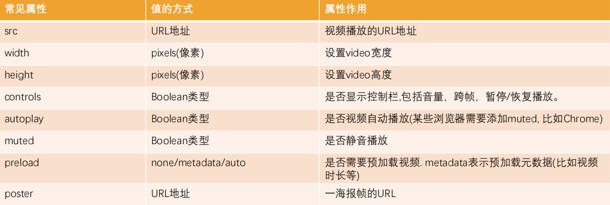

# HTML5 新增知识

## 语义化元素

过多的使用 div 元素，通过 id 和 class 来区分元素有一定的弊端

- 对于浏览器来说，这些元素不够语义化
- 对于搜索引擎来说，这样不利于 SEO 的优化

HTML5 中新增了一些语义化的元素

- `<main>`：文档主内容

- `<header>`：头部元素
- `<nav>`：导航元素
- `<section>`：定义文档某个区域的元素
- `<article>`：内容元素
- `<aside>`：侧边栏元素
- `<footer>`：尾部元素

**语义化的优点**

1. 提高代码的阅读性和可维护性
2. 有利于 SEO，搜索引擎会根据标签确定上下文和各个关键字的搜索权重
3. 易于用户阅读，样式丢失的时候能让页面呈现清晰的结构
4. 方便其他设备解析，可以准确识别元素的用途

## 媒体元素

HTML5 新增了对媒体类型的支持

- 音频：`<audio>`
- 视频：`<video>`

Video 和 Audio 的使用方式

- 直接通过元素使用
- 通过 JS 中的 API 对其进行控制

### Video

- `<video>` 元素用于在 HTML 或者 XHTML 文档中嵌入媒体播放器，用于支持文档内的视频播放
- `<video>` 的常见属性

    

- 支持的视频格式

  [Media container formats (file types)](https://developer.mozilla.org/en-US/docs/Web/Media/Formats/Containers)

- 兼容性写法

  在 `<video>` 元素中间的内容，是针对浏览器不支持此元素时候的降级处理

  - `<source>` 可以指定更多视频格式的源
  - 通过 p/div 等元素指定在浏览器不支持 `<video>` 元素的情况下显示的内容

  ```html
  <video src="../video.mp4" controls autoplay muted>
      <source src="../video.ogg">
      <source src="../video.webm">
      <p>你的浏览器不支持HTML5的video元素，请更换浏览器查看！</p>
  </video>
  ```

### Audio

- `<audio>` 元素用于在文档中嵌入音频内容，和 `<video>` 元素的用法非常类似
- `<audio>` 的常见属性

    

- 支持的音频格式

​	[Web audio codec guide](https://developer.mozilla.org/en-US/docs/Web/Media/Formats/Audio_codecs)

- 兼容性写法

  在 `<audio>` 元素中间的内容，是针对浏览器不支持此元素时候的降级处理

  ```html
  <audio src="../video.mp4" controls autoplay muted>
      <source src="../video.ogg">
      <p>你的浏览器不支持HTML5的audio元素，请更换浏览器查看！</p>
  </audio>
  ```

## input元素的扩展内容

HTML5 对 input 元素也进行了扩展

- 新增属性
  - placeholder：占位符
  - multiple：多选符
  - autofocus：自动聚焦
- 新增类型
  - date
  - time
  - number
  - range
  - tel
  - color
  - email
  - 等等

## 全局属性 data-*

HTML5 中新增了一种全局属性的格式 `data-*`，用于自定义数据属性

- data 设置的属性可以在 JavaScript 的 DOM 操作中通过 `dataset` 轻松获取到
- 通常用于 HTML 和 JavaScript 数据之间的传递

```html
<div class="box" title="abc" data-name="why" data-age="18">
    box
</div>
<script>
    const box = document.querySelector(".box")
    console.log(box.dataset)
</script>
```

