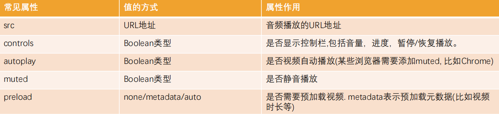

# HTML5 新增知识

[HTML5](https://www.runoob.com/html/html5-intro.html)

- [新元素](https://www.runoob.com/html/html5-new-element.html)
- 语义元素
- 媒体元素
- 表单扩展
- Canvas 和 SVG
- MathML
- 新增 API
  - 拖放
  - 地理定位
  - Web Workers
  - SSE
  - WebSocket
  - WebStorage
  - Web SQL
  - 应用程序缓存

## 语义化元素

过多的使用 div 元素，通过 id 和 class 来区分元素有一定的弊端

- 对于浏览器来说，这些元素不够语义化
- 对于搜索引擎来说，这样不利于 SEO 的优化

HTML5 中新增了一些语义化的元素

- `<main>`：文档主内容

- `<header>`：头部元素
- `<nav>`：导航元素
- `<section>`：定义文档某个区域的元素
- `<article>`：内容元素
- `<aside>`：侧边栏元素
- `<footer>`：尾部元素
- `<figure>`：规定独立的流内容（图像、图表、照片、代码等等）
- `<figcaption>`：定义 `<figure>` 元素的标题

元素的语义化即用正确的元素做正确的事情

语义化的好处

1. 提高代码的阅读性和可维护性，减少开发的沟通成本
2. 有利于 SEO，搜索引擎会根据标签确定上下文和各个关键字的搜索权重
3. 易于用户阅读，样式丢失的时候能让页面呈现清晰的结构
4. 方便其他设备解析，可以准确识别元素的用途

## 媒体元素

HTML5 新增了对媒体类型的支持

- 音频：`<audio>`
- 视频：`<video>`

Video 和 Audio 的使用方式

- 直接通过元素使用
- 通过 JS 中的 API 对其进行控制

**Video**

- `<video>` 元素用于在 HTML 或者 XHTML 文档中嵌入媒体播放器，用于支持文档内的视频播放
- `<video>` 的常见属性

    

- 支持的视频格式

  [Media container formats (file types)](https://developer.mozilla.org/en-US/docs/Web/Media/Formats/Containers)

- 兼容性写法

  在 `<video>` 元素中间的内容，是针对浏览器不支持此元素时候的降级处理

  - `<source>` 可以指定更多视频格式的源
  - 通过 p/div 等元素指定在浏览器不支持 `<video>` 元素的情况下显示的内容

  ```html
  <video src="../video.mp4" controls autoplay muted>
      <source src="../video.ogg">
      <source src="../video.webm">
      <p>你的浏览器不支持HTML5的video元素，请更换浏览器查看！</p>
  </video>
  ```

**Audio**

- `<audio>` 元素用于在文档中嵌入音频内容，和 `<video>` 元素的用法非常类似
- `<audio>` 的常见属性

    

- 支持的音频格式

​	[Web audio codec guide](https://developer.mozilla.org/en-US/docs/Web/Media/Formats/Audio_codecs)

- 兼容性写法

  在 `<audio>` 元素中间的内容，是针对浏览器不支持此元素时候的降级处理

  ```html
  <audio src="../video.mp4" controls autoplay muted>
      <source src="../video.ogg">
      <p>你的浏览器不支持HTML5的audio元素，请更换浏览器查看！</p>
  </audio>
  ```

## 表单扩展

### 新的表单元素

- datalist 元素：规定输入域的选项列表

  ```html
  <input list="browsers">
  <datalist id="browsers">
    <option value="Internet Explorer"></option>
    <option value="Firefox"></option>
    <option value="Chrome"></option>
    <option value="Opera"></option>
    <option value="Safari"></option>
  </datalist>
  
  ```

- output 元素：用于不同类型的输出
- keygen 元素：规定用于表单的密钥对生成器字段

### 新的表单属性

form 的新增属性

- autocomplete
- novalidate

input 的新增属性

- autofocus
- required
- placeholder
- placeholder
- autocomplete
- list
- pattern
- min、max、step
- ...

### 新的输入类型

- color：选取颜色
- date：选择日期
- datetime：选择一个日期（UTC 时间）
- datetime-local：选择一个日期和时间 (无时区)
- time：选择一个时间
- month：月份
- week：选择周和年
- number：输入数字
- range：滑动选择数字
- search：输入搜索内容
- tel：输入电话
- email：输入 email
- url：输入 url

## 全局属性

HTML5 中新增了一种全局属性的格式 `data-*`，用于自定义数据属性

- data 设置的属性可以在 JavaScript 的 DOM 操作中通过 `dataset` 轻松获取到
- 通常用于 HTML 和 JavaScript 数据之间的传递

```html
<div class="box" title="abc" data-name="why" data-age="18">
    box
</div>
<script>
    const box = document.querySelector(".box")
    console.log(box.dataset)
</script>
```

## WebStorage

WebStorage 主要提供了一种机制，可以让浏览器提供一种比 cookie 更直观的 key、value 存储方式

- localStorage：本地存储，提供的是一种永久性的存储方法，在关闭掉网页重新打开时，存储的内容依然保留
- sessionStorage：会话存储，提供的是本次会话的存储，在关闭掉会话时，存储的内容会被清除

> localStorage 和 sessionStorage 的区别
>
> - 关闭网页后重新打开，localStorage会保留，而sessionStorage会被删除
> - 在页面内实现跳转，localStorage会保留，sessionStorage也会保留
> - 在页面外实现跳转（打开新的网页），localStorage会保留，sessionStorage不会被保留

**Storage常见的方法和属性**

- 属性

  - `Storage.length`：只读属性

    返回一个整数，表示存储在Storage对象中的数据项数量

- 方法

  - `Storage.key(index)`：该方法接受一个数值 n 作为参数，返回存储中的第 n 个 key 名称

  - `Storage.getItem(key)`：该方法接受一个 key 作为参数，并且返回 key 对应的 value

  - `Storage.setItem(key, value)`：该方法接受一个 key 和 value，并且将会把 key 和 value 添加到存储中

    如果 key 存在，则更新其对应的值

  - ` Storage.removeItem(key)`：该方法接受一个 key 作为参数，并把该 key 从存储中删除

  - `Storage.clear()`：该方法的作用是清空存储中的所有 key
