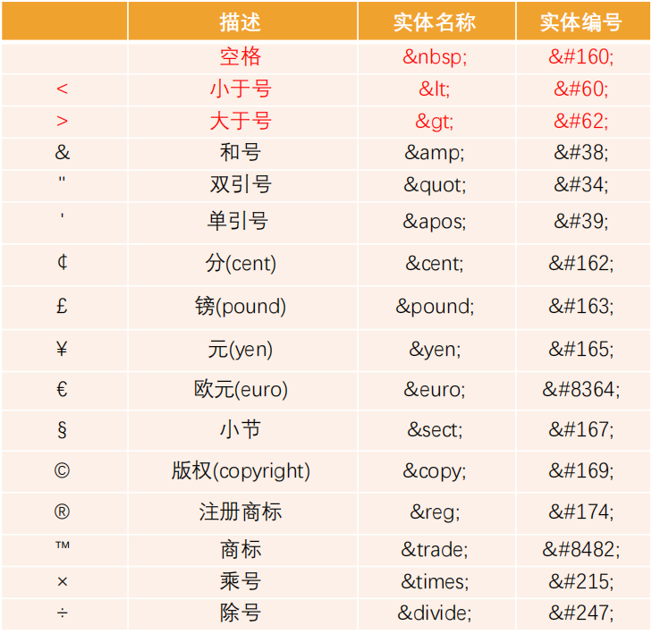
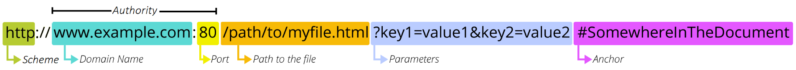
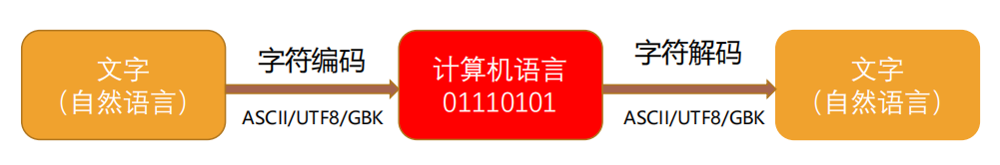

# 额外知识补充

## 字符实体

- HTML 字符实体是一段以 `&` 开头以 `;` 结尾的文本

- 常常用于显示保留字符（会被解析为HTML代码）和不可见字符（换行符和空格符）

- 也可以用字符实体代替其他难以用标准键盘键入的字符

- 常见的字符实体

  

## URL

- [URL](https://developer.mozilla.org/zh-CN/docs/Learn/Common_questions/Web_mechanics/What_is_a_URL) 是统一资源定位符（Uniform Resource Locator）
  - 通俗地讲：URL 就是一个给定的独特资源在 Web 上的地址
  - 理论上每个有效的 URL 都指向一个唯一的资源
  - 这个资源可以是一个 HTML 页面，一个 CSS 文档，一幅图像，等等
  - URL 的标准格式：`[协议类型]://[服务器地址]:[端口号]/[文件路径][文件名]?[查询]#[片段ID]`

- URI 是统一资源标识符（Uniform Resource Identifier）

  - 用于标识 Web 技术使用的逻辑和物理资源
  - URI 在某一个规则下能把一个资源独一无二的识别出来
  - URL 是 URI 的子集

## 元素的语义化

- 元素的语义化即用正确的元素做正确的事情
- 理论上所有的 HTML 元素都能实现相同的事情
- 语义化的好处
  - 提升代码的阅读性和可维护性
  - 较少开发的沟通成本
  - 帮助语音合成工具正确识别网页元素的用途，以便做出正确的反应
  - 有利于 SEO（search engine optimization）

## SEO

- [SEO](https://developer.mozilla.org/zh-CN/docs/Glossary/SEO)（search engine optimization）即搜索引擎优化

- SEO 就是通过了解搜索引擎的运作规则来调整网站，以及提高网站在有关搜索引擎内排名的方式

- Google 搜索引擎的工作流程主要分为三个阶段：

  **抓取**：Google 会使用名为“抓取工具”的自动程序搜索网络，以查找新网页或更新后的网页。Google 会将这些网页的地址（即网址）存储在一个大型列表中，以便日后查看。我们会通过许多不同的方法查找网页，但主要方法是跟踪我们已知的网页中的链接。

  **编入索引**：Google 会访问它通过抓取得知的网页，并会尝试分析每个网页的主题。Google 会分析网页中的内容、图片和视频文件，尝试了解网页的主题。这些信息存储在 Google 索引中，而 Google 索引是一个存储在海量计算机中的巨大数据库。

  **呈现搜索结果**：当用户在 Google 上进行搜索时，Google 会尝试确定最优质的搜索结果。“最佳“结果取决于许多因素，包括用户的位置、语言、设备（桌面设备或手机）以及先前用过的搜索查询。例如，在用户搜索“自行车维修店”后，Google 向巴黎用户显示的答案与向香港用户显示的答案有所不同。支付费用不能提高网页在 Google 搜索结果中的排名，网页排名是完全依靠算法完成的。

## 字符编码

计算机只可以直接存储和处理二进制数字

所以为了在计算机上表示、存储和处理字符

就必须将这些字符转换为二进制数字

字符编码就是一套统一的、标准的转换规则

字符编码的发展历史：[详解字符编码 - 简书 (jianshu.com)](https://www.jianshu.com/p/899e749be47c)

## Emmet 语法

Emmet 可以提高开发效率

通过输入缩写自动生成相应代码

[Cheat Sheet (emmet.io)](https://docs.emmet.io/cheat-sheet/)

