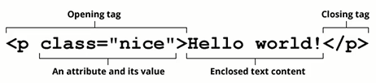

# HTML基础知识

## 网页和网站

1. 什么是网页

   - 网页的专业术语叫**Web Page**
   - 打开浏览器查看到的页面
   - 网页的内容可以非常丰富，包括文字、链接、图片、音乐、视频等等

2. 网站是由多个网页组成的

3. 网页的显示过程

   - 用户角度

     1. 在浏览器输入一个网站
     2. 浏览器会找到对应的服务器地址，请求静态资源
     3. 服务器返回静态资源给浏览器
     4. 浏览器对静态资源进行解析和展示

   - 前端工程师角度

     1. 开发项目（HTML/CSS/JavaScript/Vue/React）
     2. 打包、部署项目到服务器里面

    > 服务器本质上是一台具备以下特点的主机 
    >
    > - 二十四小时不关机（稳定运行）
    > - 没有显示器 
    > - 一般装的是Linux操作系统（centos）

4. 网页的组成部分

   - HTML：网页的内容结构（骨架）
   - CSS：网页的视觉体验（外表）
   - JS：网页的交互处理（灵魂）

## 浏览器

1. 浏览器的作用是**渲染网页**
2. 浏览器最核心的部分是渲染引擎，一般也称为**浏览器内核**
   - 负责解析网页语法，并渲染网页
3. 常见的浏览器内核
   - Trident：IE、360安全、搜狗、百度、UC；
   - Gecko：Firefox
   - Presto → Blink：Opera
   - Webkit：Safari、360极速、搜狗、移动端浏览器
   - Webkit → Blink：Google Chrome、Edge
4. 不同的浏览器内核有不同的解析、渲染规则，所以同一网页在不同内核的浏览器中的渲染效果也可能不同

## HTML语言

1. HTML定义

   HTML全称为Hyper Text Markup Language，即**超文本标记语言**，是一种用于创建网页的标记语言

2. 什么是标记语言

   - 由无数个标记（标签、tag）组成

   - 对某些内容进行特殊的标记，以供其他解释器识别处理

     比如h2标记的文本会被识别为标题以加粗和放大显示文本

   - 由标签和内容组成的部分称为元素

3. 什么是超文本

   - 不仅仅可以插入普通的文本，还可以插入图片、音频、视频等内容
   - 还可以表示超链接，从一个网页跳转到另一个网页

## HTML结构

1. HTML文件的特点是他们都具有共同的结构

  > HTML文件的拓展名是.htm和.html
  >
  > 因历史遗留问题，Win95\Win98系统的文件拓展名不能超过3字符，所以使用.htm

2. HTML本质上是由一系列的**HTML元素**构成的

3. 完整的HTML结构

   - 文档声明：HTML最上方的一段文本`<!DOCTYPE html>`就是它的文档类型声明，用于声明文档类型
     - 告诉浏览器当前页面是HTML5页面
     - 让浏览器用HTML5的标准去解析识别内容
     - 必须放在HTML文档的最前面，不能省略，省略会出现兼容问题
   - html元素
     - head元素
     - body元素

## HTML注释

1. 什么是注释

   `<!-- 注释内容 --> `

   注释是帮助开发者理解代码的一段代码说明，浏览器并不会把注释显示给用户看

2. 注释的意义

   - 帮助我们理清代码思路，方便以后查阅
   - 减少合作开发的沟通成本
   - 方便别人使用和学习
   - 临时注释代码，方便调试

## HTML元素

### 元素的概念

1. 什么是元素

   

   - 元素是网页的一部分
   - 一个元素可以包含一个数据项，一个文本，或者一张照片，亦或是什么也不包含。

2. [HTML中的元素](https://developer.mozilla.org/zh-CN/docs/Web/HTML/Element)

3. 元素的组成部分：

   `<p>"content"</p>`

   - 开始标签（Opening tag）：`<p>`
   - 结束标签（Closing tag）：`</p>`
   - 内容（Content）：`"content"`

4. 元素可以分为双标签元素和单标签元素

   - 大部分元素都是双标签的

     `html, body, head, h2, p, a`

   - 也有一些元素是单标签的

     `br, img, hr, meta, input`

5. HTML元素不区分大小写， 但是**推荐小写**

### 元素的属性

`<p class="ele-con">"content"</p>`

1. 属性包含元素的额外信息，这些信息不会出现在实际的内容中

2. 属性主要由属性的名称和属性值组成

   `class="ele-con"`

   `href="http://www.baidu.com"`

3. 属性与属性之间要用空格分隔开

4. 元素属性的分类

   - [全局属性](https://developer.mozilla.org/zh-CN/docs/Web/HTML/Global_attributes)
     - id：定义元素的唯一表示符
     - class：一个以空格分隔的元素的类名列表
     - style：给元素添加内联样式
     - title：包含表示与其所属元素相关信息的文本，这些信息通常可以作为提示呈现给用户，但不是必须的
   - 特有属性
     - meta元素的charset属性
     - img元素的src属性
     - a元素的href属性

### 元素的嵌套

1. 某些元素的内容除了可以是文本之外，还可以是其他元素，这样就形成了**元素的嵌套**。
2. 元素之间的关系
   - 父子关系
   - 兄弟关系
   - 后代关系

### 元素的类型

HTML在设计元素时根据元素理论上需要占据的空间将元素分为以下几种

1. 块级元素：独占父元素的一行

   可以设置宽度和高度

2. 行内级元素：多个行内级元素可以在父元素的同一行显示

   - 行内替换元素：可以设置宽高（如img元素、input元素）
   - 行内非替换元素：不可以设置宽高，宽高是由内容决定（如a元素）


### 元素编写的注意事项

- 块级元素和inline-block元素
  - 一般情况下，可以包含其他任何 元素
  - 特殊情况，p元素不能包含其他块级元素
- 行内级元素
  - 一般情况，只能包含行内级元素

### HTML结构中的常见元素

1. html元素

   - html元素表示一个HTML文档的根元素（顶级元素）

   - 所有其他元素都是此元素的后代

   - W3C标准建议为html元素增加一个lang属性，作用是

     `lang=en` `lang=zh-CN`

     - 帮助语音合成工具确定要使用的发音
     - 帮助翻译工具确定要使用的翻译规则

2. head元素

   - 用于规定文档相关的配置信息（也称为元数据），包括文档的标题，引用的文档样式和脚本等

     元数据就是描述数据的数据，可以理解成对整个页面的配置

   - title元素

     `<title>网页的标题</title>`

     用于设置网页的标题

   - meta元素

     meta元素表示那些不能由其他 HTML 元相关（meta-related）元素表示的元数据信息

     - charset：用于设置网页的字符编码

     - http-equiv：编译指令

     - name：提供文档级别的元数据

       [标准元数据名称](https://developer.mozilla.org/zh-CN/docs/Web/HTML/Element/meta/name)

     > `<meta charset="utf-8">`用于设置网页的字符编码
     >
     > 让浏览器更精准地显示每一个文字
     >
     > 不设置或者设置错误会导致乱码
     >
     > 一般使用utf-8编码

   - link元素

     `<link href="example.css" rel="stylesheet">`

     用于链接外部资源，如网站图标、CSS样式表

3. body元素

   - 用于呈现网页的具体内容和结构

### HTML内容中的常见元素

1. h元素（heading）

   - 用于设置一些比较重要的文字作为标题
   - h1-h6呈现了六个不同级别的标题
   - h元素通常和SEO优化有关系

2. p元素（paragraph）

   - 用于表示文本的一个段落
   - p元素多个段落之间会有一定的间距

3. img元素（image）

   - 用于将一份图像嵌入文档

   - img是一个可替换元素（replaced element）

   - img的两个常见属性

     - src：必须属性

       表示图片的文件路径

     - alt：非必须属性

       作用一：当图片加载不成功时显示这段文本

       作用二：屏幕阅读器会将这些描述读给需要使用阅读器的使用者听，让他们知道图像的含义

     - 某些其他属性目前已经不再使用，比如width、height、border

   - img的图片路径

     - 网络图片：src可以是一张网络图片的URL地址

     - 本地图片：src也可以是本地图片的路径

       > 本地图片的路径有两种方式：
       >
       > 一、绝对（absolute）路径：从电脑根目录开始查找直到找到这个资源
       >
       > 二、相对（relative）路径：图片相对于当前文件的路径

   - [img支持的图像格式](https://developer.mozilla.org/zh-CN/docs/Web/Media/Formats/Image_types)

4. a元素（anchor）

   - 用于定义超链接，以打开新的URL

   - a元素的两个常见属性

     - href：Hypertext Reference的简称
       - 指定要打开的URL地址
       - 也可以是一个本地地址
     - target：指定在何处显示链接的资源
       - `_self`：默认值，在当前窗口打开URL
       - `_blank`：在一个新的窗口打开URL
       - `_parent`：在父窗口打开URL
       - `_top`：在顶层窗口打开URL

   - a元素也可以作为锚点链接，用于跳转到网页中的具体位置

     - 先在要跳转的元素上定义一个id属性

       `id="title"`

     - 定义a元素，并且a元素的href指向对应的id

       `<a href="#title">jump to title</a>`

   - a元素和img元素的结合使用

     ```HTML
     <a href="xxx.com" target="_blank">
       
     </a>
     ```
   
   - a元素和其他URL的结合
       - 下载文件
   
           `href="http://xxx/xxx.zip"`
       - 指向其他协议地址如`mailto`
   
           `href="mailto:myemail@qq.com"`
   
5. iframe元素

    - 用于在一个HTML文档中嵌入其他HTML文档

      `<iframe src="http://www.taobao.com" frameborder="0"></iframe>`

    - frameborder属性用于规定是否显示边框

      - 1：显示
      - 0：不显示

    - iframe元素和a元素的结合

      a元素target的其他值与iframe有关

      - `_parent`：在父窗口打开URL
      - `_top`：在顶层窗口打开URL


6. div元素（division）和span元素

   - div和span的出现主要是用于编写HTML的结构
   
   
   - div和span都是“纯粹的”容器，也可以把他们理解为用来包裹内容的“盒子”
   
   - div用于把网页分割为多个独立的部分
   
     多个div元素包裹的内容会在不同的行显示，一般作为其他元素的父容器，把其他元素包住，代表一个整体
   
   - span用于区分特殊文本和普通文字，比如用来显示一些关键字
   
     多个span元素包裹的内容会在同一行显示，默认情况下，跟普通文本几乎没差别
   


7. 不常用元素

    - strong：加粗，强调内容
    
    - i：内容倾斜
    
    - code：显示代码
    - br：换行

## 高级元素

### 列表元素

很多数据在网页中都是以列表的形式存在的

**列表的两种实现方式**

1. 使用div来实现，样式和布局更加自由
2. 使用列表元素来实现，更符合元素语义化

**常用的列表元素**

- ol：有序列表

  直接子元素只能是li

  - li：列表项

- ul：无序列表

  直接子元素只能是li

  - li：列表项

- dl：定义列表

  直接子元素只能是dt、dd

  一个dt后面一般紧跟着一个或者多个dd

  - dt：定义项
  - dd：定义描述

### 表格元素

在网页中，对于某些内容的展示使用表格元素更为合适和方便

**常用的表格元素**

- table：表格
- tr：表格中的行
- td：行中的单元格

表格有很多相关的属性可以设置表格的样式，但是已经不推荐使用了

**border-collapse**是用来决定表格的边框是分开还是合并的CSS属性

```css
table {
  border-collapse: collapse;
}
```

**表格的其他元素**

- 表格的表头thead
- 表格的主体tbody
- 表格的页脚tfoot
- 表格的标题caption
- 表格的表头单元格th

**单元格合并**

- 跨列合并colspan

  在最左边的单元格写上colspan属性，并且省略掉合并的td

- 跨行合并rowspan

  在最上边的单元格写上rowspan属性，并且省略掉后面tr中的td

### 表单元素

表单元素是和用户交互的重要方式之一，在很多网站都需要使用表单

**常见的表单元素**

- form：表单
- input：输入框
- textarea：多行文本框
- select、option：下拉选择框
- button：按钮
- label：表单元素的标题

**form的常见属性**

form通常作为表单元素的父元素，可以将整个表单作为一个整体来进行操作

比如对整个表单重置或者提交整个表单的数据

- action：用于设置提交表单数据的请求URL
- method：用于设置请求的方法（get和post），默认为get
- target：用于设置在什么地方打开URL
  - _blank 新开页面
  - _self 当前页面跳转
  - _parent 当前父级页面跳转
  - _top 当前顶层页面跳转

**[input](https://developer.mozilla.org/zh-CN/docs/Web/HTML/Element/Input)元素的常见属性**

- type：input的类型

  `text/password/radio/checkbox/button/reset/submit/file`

- readonly：只读

- disabled：禁用

- checked：默认被选中

  只有在type为radio和checkbox时可用

- autofocus：当页面加载时自动聚焦

- name：名字

  在提交数据给服务器时，可用于区分数据类型

  name是后台接收数据时使用的键值对中的键(key) 

  会随着表单的提交而一起提交，是表单中不可或缺的元素

  一个form表单中该元素的名称对应不同类型的input

- value：取值

  后台接收数据时使用的键值对中的值(value)

  value可以有默认值

> 布尔属性
>
> 常见的布尔属性有：disabled、checked、readonly、multiple、autofoucs、selected
>
> 布尔属性可以没有属性值，写上属性名就代表使用这个属性

**表单按钮**

- 普通按钮：type=button

  使用value属性设置按钮文字

- 重置按钮：type=reset

  重置它所属表单的所有表单元素（包括input、textarea、select）

- 提交按钮：type=submit

  提交它所属form的表单数据给服务器（包括input、textarea、select）

```html
<input type="button" value="普通按钮">
<input type="reset" value="重置按钮">
<input type="submit" value="提交按钮">
也可以通过button来实现
<button type="button">普通按钮</button>
<button type="reset">重置按钮</button>
<button type="submit">提交按钮</button>
```

**input和label的关系**

- label元素一般与input配合使用，用来表示input的标题

- label可以跟某个input绑定

  点击label就可以激活对应的input变成选中状态

  label的for属性和input的id属性相等时绑定

```html
<div>
  <label for="username">用户：</label>
  <input id="username" type="text" name="username">
</div>
```

**radio的使用**

- 使用label可以实现点击文字选中单选框
- name值相同的radio才具备单选功能

```html
<div>
  性别：
  <label for="male">
    男 <input id="male" type="radio" name="sex" value="male">
  </label>
  <label for="female">
    女 <input id="female" type="radio" name="sex" value="female">
  </label>
</div>
```

**checkbox的使用**

- 属于同一种类型的checkbox，name值要保持一致

```html
<div>
  爱好：
  <label for="basketball">
    <input id="basketball" type="checkbox" name="hobby" value="basketball">篮球
  </label>
  <label for="football">
    <input id="football" type="checkbox" name="hobby" value="football">足球
  </label>
  <label for="reading">
    <input id="reading" type="checkbox" name="hobby" value="reading">读书
  </label>
</div>
```

**textarea的使用**

- 常用属性
  - cols：列数
  - rows：行数
- 缩放的CSS设置
  - 禁止缩放：`resize: none;`
  - 水平缩放：`resize: horizontal;`
  - 垂直缩放：`resize: vertical;`
  - 水平垂直缩放：`resize: both;`

**select和option的使用**

- options是select的子元素，一个option代表一个选项
- select的常用属性
  - multiple：可多选
  - size：显示多少项
- options的常用属性
  - selected：默认被选中
