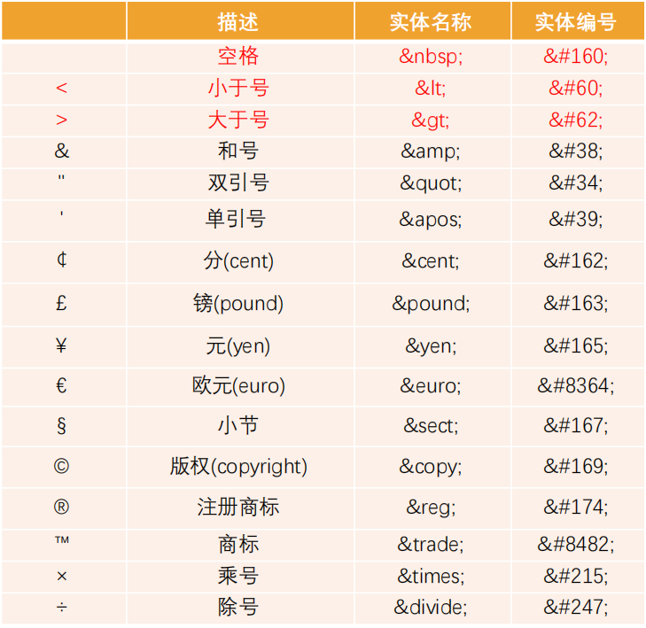
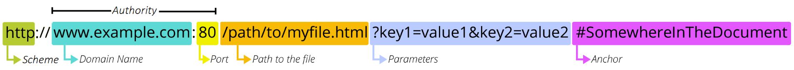

# HTML基础知识

## 网页和网站

1. 什么是网页

   - 网页的专业术语叫**Web Page**
   - 打开浏览器查看到的页面
   - 网页的内容可以非常丰富，包括文字、链接、图片、音乐、视频等等

2. 网站是由多个网页组成的

3. 网页的显示过程

   - 用户角度

     1. 在浏览器输入一个网站
     2. 浏览器会找到对应的服务器地址，请求静态资源
     3. 服务器返回静态资源给浏览器
     4. 浏览器对静态资源进行解析和展示

   - 前端工程师角度

     1. 开发项目（HTML/CSS/JavaScript/Vue/React）
     2. 打包、部署项目到服务器里面

     > 服务器本质上是一台具备以下特点的主机 
     >
     > - 二十四小时不关机（稳定运行）
     > - 没有显示器 
     > - 一般装的是Linux操作系统（centos）

4. 网页的组成部分

   - HTML：网页的内容结构（骨架）
   - CSS：网页的视觉体验（外表）
   - JS：网页的交互处理（灵魂）

## 浏览器

1. 浏览器的作用是渲染网页
2. 浏览器最核心的部分是渲染引擎，一般也称为**浏览器内核**
   - 负责解析网页语法，并渲染网页
3. 常见的浏览器内核
   - Trident：IE、360安全、搜狗、百度、UC；
   - Gecko：Firefox
   - Presto → Blink：Opera
   - Webkit：Safari、360极速、搜狗、移动端浏览器
   - Webkit → Blink：Google Chrome、Edge
4. 不同的浏览器内核有不同的解析、渲染规则，所以同一网页在不同内核的浏览器中的渲染效果也可能不同。

## HTML语言

1. HTML定义

   HTML全称为Hyper Text Markup Language，即**超文本标记语言**，是一种用于创建网页的标记语言

2. 标记语言

   - 由无数个标记（标签、tag）组成

   - 对某些内容进行特殊的标记，以供其他解释器识别处理

     比如h2标记的文本会被识别为标题以加粗和放大显示文本

   - 由标签和内容组成的部分称为元素

3. 什么是超文本

   - 不仅仅可以插入普通的文本，还可以插入图片、音频、视频等内容
   - 还可以表示超链接，从一个网页跳转到另一个网页

## HTML结构

1. HTML文件的特点是他们都具有共同的结构

   > HTML文件的拓展名是.htm和.html。
   >
   > 因历史遗留问题，Win95\Win98系统的文件拓展名不能超过3字符，所以使用.htm。

2. HTML本质上是由一系列的**HTML元素**构成的

3. 完整的HTML结构

   - 文档声明：HTML最上方的一段文本`<!DOCTYPE html>`就是它的文档类型声明，用于声明文档类型
     - 告诉浏览器当前页面是HTML5页面
     - 让浏览器用HTML5的标准去解析识别内容
     - 必须放在HTML文档的最前面，不能省略，省略会出现兼容问题
   - html元素
     - head元素
     - body元素

## HTML注释

1. 什么是注释

   `<!-- 注释内容 --> `

   注释是帮助开发者理解代码的一段代码说明，浏览器并不会把注释显示给用户看

2. 注释的意义

   - 帮助我们理清代码思路，方便以后查阅
   - 减少合作开发的沟通成本
   - 方便别人使用和学习
   - 临时注释代码，方便调试

## HTML元素

### 元素的概念

1. 什么是元素

   

   - 元素是网页的一部分
   - 一个元素可以包含一个数据项，一个文本，或者一张照片，亦或是什么也不包含。

2. [HTML中的元素](https://developer.mozilla.org/zh-CN/docs/Web/HTML/Element)

3. 元素的组成部分：

   `<p>"content"</p>`

   - 开始标签（Opening tag） `<p>`
   - 结束标签（Closing tag） `</p>`
   - 内容（Content） `"content"`

4. 元素可以分为双标签元素和单标签元素

   - 大部分元素都是双标签的

     `html, body, head, h2, p, a`

   - 也有一些元素是单标签的

     `br, img, hr, meta, input`

5. HTML元素不区分大小写， 但是**推荐小写**

### 元素的属性

`<p class="ele-con">"content"</p>`

1. 属性包含元素的额外信息，这些信息不会出现在实际的内容中

2. 属性主要由属性的名称和属性值组成

   `class="ele-con"`

   `href="http://www.baidu.com"`

3. 属性与属性之间要用空格分隔开

4. 元素属性的分类

   - [全局属性](https://developer.mozilla.org/zh-CN/docs/Web/HTML/Global_attributes)
     - id：定义元素的唯一表示符
     - class：一个以空格分隔的元素的类名列表
     - style：给元素添加内联样式
     - title：包含表示与其所属元素相关信息的文本，这些信息通常可以作为提示呈现给用户，但不是必须的
   - 特有属性
     - meta元素的charset属性
     - img元素的src属性
     - a元素的href属性

### 元素的嵌套

1. 某些元素的内容除了可以是文本之外，还可以是其他元素，这样就形成了**元素的嵌套**。
2. 元素之间的关系
   - 父子关系
   - 兄弟关系
   - 后代关系

### HTML结构的元素

1. html元素

   - html元素表示一个HTML文档的根元素（顶级元素）

   - 所有其他元素都是此元素的后代

   - W3C标准建议为html元素增加一个lang属性，作用是

     `lang=en` `lang=zh-CN`

     - 帮助语音合成工具确定要使用的发音
     - 帮助翻译工具确定要使用的翻译规则

2. head元素

   - 用于规定文档相关的配置信息（也称为元数据），包括文档的标题，引用的文档样式和脚本等

     元数据就是描述数据的数据，可以理解成对整个页面的配置

   - title元素

     `<title>网页的标题</title>`

     用于设置网页地标题

   - meta元素

     `<meta charset="utf-8">`

     用于设置网页的字符编码，让浏览器更精准地显示每一个文字，不设置或者设置错误会导致乱码

     一般使用utf-8编码

   - link元素

     `<link href="example.css" rel="stylesheet">`

     用于链接外部资源，如网站图标、CSS样式表

3. body元素

   - 用于呈现网页的具体内容和结构

### 内容中常见的元素

1. h元素（heading）

   - 用于设置一些比较重要的文字作为标题
   - h1-h6呈现了六个不同级别的标题
   - h元素通常和SEO优化有关系

2. p元素（paragraph）

   - 用于表示文本的一个段落
   - p元素多个段落之间会有一定的间距

3. img元素（image）

   - 用于将一份图像嵌入文档

   - img是一个可替换元素（replaced element）

   - img的两个常见属性

     - src：必须属性

       表示图片的文件路径

     - alt：非必须属性

       作用一：当图片加载不成功时显示这段文本

       作用二：屏幕阅读器会将这些描述读给需要使用阅读器的使用者听，让他们知道图像的含义

     某些其他属性目前已经不再使用，比如width、height、border

   - img的图片路径

     - 网络图片：src可以是一张网络图片的URL地址

     - 本地图片：src也可以是本地图片的路径

       > 本地图片的路径有两种方式：
       >
       > 一、绝对（absolute）路径：从电脑根目录开始查找直到找到这个资源
       >
       > 二、相对（relative）路径：图片相对于当前文件的路径

   - [img支持的图像格式](https://developer.mozilla.org/zh-CN/docs/Web/Media/Formats/Image_types)

4. a元素（anchor）

   - 用于定义超链接，以打开新的URL

   - a元素的两个常见属性

     - href：Hypertext Reference的简称
       - 指定要打开的URL地址
       - 也可以是一个本地地址
     - target：指定在何处显示链接的资源
       - `_self`：默认值，在当前窗口打开URL
       - `_blank`：在一个新的窗口打开URL
       - `_parent`：在父窗口打开URL
       - `_top`：在顶层窗口打开URL

   - a元素也可以作为锚点链接，用于跳转到网页中的具体位置

     - 先在要跳转的元素上定义一个id属性

       `id="title"`

     - 定义a元素，并且a元素的href指向对应的id

       `<a href="#title">jump to title</a>`

   - a元素和img元素的结合使用

     ```HTML
     <a href="xxx.com" target="_blank">
       
     </a>
     ```
   
   - a元素和其他URL的结合
       - 下载文件
   
           `href="http://xxx/xxx.zip"`
       - 指向其他协议地址如`mailto`
   
           `href="mailto:myemail@qq.com"`
   
5. iframe元素

    - 用于在一个HTML文档中嵌入其他HTML文档

      `<iframe src="http://www.taobao.com" frameborder="0"></iframe>`

    - frameborder属性用于规定是否显示边框

      - 1：显示
      - 0：不显示

    - iframe元素和a元素的结合

      a元素target的其他值与iframe有关

      - `_parent`：在父窗口打开URL
      - `_top`：在顶层窗口打开URL


6. div元素（division）和span元素

   - div和span的出现主要是用于编写HTML的结构
   
   
   - div和span都是“纯粹的”容器，也可以把他们理解为用来包裹内容的“盒子”
   
   - div用于把网页分割为多个独立的部分
   
     多个div元素包裹的内容会在不同的行显示，一般作为其他元素的父容器，把其他元素包住，代表一个整体
   
   - span用于区分特殊文本和普通文字，比如用来显示一些关键字
   
     多个span元素包裹的内容会在同一行显示，默认情况下，跟普通文本几乎没差别
   


7. 不常用元素

  - strong：加粗，强调内容
  - i：内容倾斜
  - code：显示代码
  - br：换行

## 补充知识

### 字符实体

- HTML字符实体是一段以`&`开头以`;`结尾的文本

- 常常用于显示保留字符（会被解析为HTML代码）和不可见字符（换行符和空格符）

- 也可以用字符实体代替其他难以用标准键盘键入的字符

- 常见的字符实体

  

### URL

- [URL](https://developer.mozilla.org/zh-CN/docs/Learn/Common_questions/Web_mechanics/What_is_a_URL)是统一资源定位符（Uniform Resource Locator）

- 通俗点讲：URL就是一个给定的独特策源在Web上的地址

  - 理论上讲，每个有效的URL都指向一个唯一的资源
  - 这个资源可以是一个HTML页面，一个CSS文档，一幅图像，等等

- URL的标准格式：`[协议类型]://[服务器地址]:[端口号]/[文件路径][文件名]?[查询]#[片段ID]`

  

- URI是统一资源标识符（Uniform Resource Identifier）

  - 用于标识Web技术使用的逻辑和物理资源
  - URI在某一个规则下能把一个资源独一无二的识别出来
  - URL是URI的子集

### 元素的语义化

- 元素的语义化即用正确的元素做正确的事情
- 理论上所有的HTML元素都能实现相同的事情
- 好处
  - 提升代码的阅读性和可维护性
  - 较少开发的沟通成本
  - 帮助语音合成工具正确识别网页元素的用途，以便做出正确的反应
  - 有利于SEO（search engine optimization）
  - ......

### SEO

- [SEO](https://developer.mozilla.org/zh-CN/docs/Glossary/SEO)（search engine optimization）即搜索引擎优化

- SEO就是通过了解搜索引擎的运作规则来调整网站，以及提高网站在有关搜索引擎内排名的方式

- Google 搜索引擎的工作流程主要分为三个阶段：

  **抓取**：Google 会使用名为“抓取工具”的自动程序搜索网络，以查找新网页或更新后的网页。Google 会将这些网页的地址（即网址）存储在一个大型列表中，以便日后查看。我们会通过许多不同的方法查找网页，但主要方法是跟踪我们已知的网页中的链接。

  **编入索引**：Google 会访问它通过抓取得知的网页，并会尝试分析每个网页的主题。Google 会分析网页中的内容、图片和视频文件，尝试了解网页的主题。这些信息存储在 Google 索引中，而 Google 索引是一个存储在海量计算机中的巨大数据库。

  **呈现搜索结果**：当用户在 Google 上进行搜索时，Google 会尝试确定最优质的搜索结果。“最佳”结果取决于许多因素，包括用户的位置、语言、设备（桌面设备或手机）以及先前用过的搜索查询。例如，在用户搜索“自行车维修店”后，Google 向巴黎用户显示的答案与向香港用户显示的答案有所不同。支付费用不能提高网页在 Google 搜索结果中的排名，网页排名是完全依靠算法完成的。

### 字符编码

计算机只可以直接存储和处理二进制数字

所以为了在计算机上表示、存储和处理字符，就必须将这些字符转换为二进制数字

字符编码就是一套统一的、标准的转换规则


字符编码的发展历史：[详解字符编码 - 简书 (jianshu.com)](https://www.jianshu.com/p/899e749be47c)