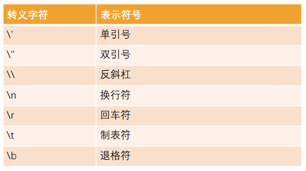
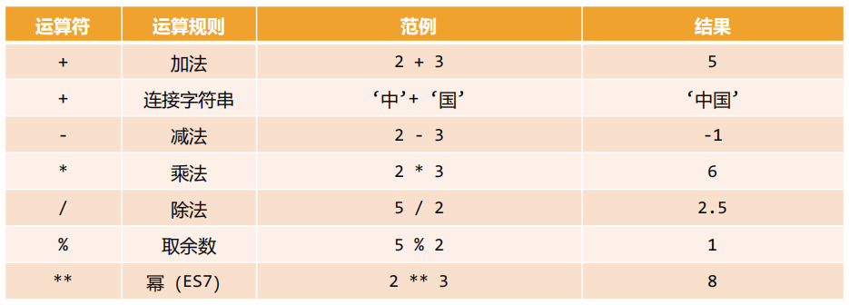
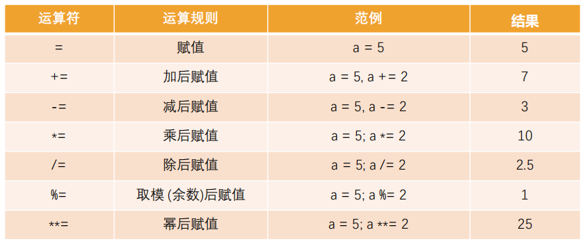

# 认识 JavaScript

## 计算机语言和编程语言

HTML 是标记语言，CSS 是样式语言，它们都是计算机语言

JavaScript 也是计算机语言，但更精确的说法是 JavaScript 是一种编程语言。

- 计算机语言：指用于人与计算机之间通讯的语言，是人与计算机之间传递信息的介质，但是其概念比通用的编程语言要更广泛。例如，HTML 是标记语言，也是计算机语言，但并不是编程语言
- 编程语言：是用来定义计算机程序的形式语言。它是一种被标准化的交流技巧，用来向计算机发出指令，一种能够让程序员准确地定义计算机所需要使用数据的计算机语言，并精确地定义在不同情况下所应当采取的行动。

编程语言的特点

- 数据和数据结构
- 指令及流程控制
- 引用机制和重用机制
- 设计哲学

编程语言的发展历史

- 机器语言
- 汇编语言
- 高级语言

## JavaScript 的定义

- JS 是一种高级的、解释型的编程语言
- JS 是一门基于原型、头等函数的语言，是一门多范式的语言，它支持**面向对象**程序设计、**指令式编程**以及**函数式编程**。
- 通俗的讲，JS是一门高级编程语言，是前端开发的重要组成部分

## JavaScript 的组成

1. ECMAScript：JavaScript 的标准，定义了语言规范，描述了该语言的语法和基本对象
2. DOM 操作：用于操作文档的 API
3. BOM 操作：用于操作浏览器的 API

## JavaScript 的运行

JavaScript 的运行依赖于浏览器的 **JavaScript 引擎**

- 高级的编程语言都是需要转成最终的机器指令来执行的
- JS 是解释型语言，而 JS 引擎是 JS 语言的运行解释器
- JavaScript 引擎可以将 JavaScript 代码翻译成 CPU 指令来执行

**常见的 JavaScript 引擎**

- SpiderMonkey：由 JS 作者开发的第一款 JS 引擎
- Chakra：微软开发
- JavaScriptCore：Webkit 中的 JS 引擎，Apple 开发
- V8：Google 开发的强大 JS 引擎
- JSCore：腾讯开发的用于小程序的 JS 引擎

**浏览器内核和 JS 引擎的关系**

以 WebKit 为例，WebKit 由两部分组成

- WebCore：负责 HTML 解析、布局、渲染等等相关的工作
- JavaScriptCore：解析、执行 JavaScript 代码

# JavaScript 基本语法

## 编写方式

1. 写在 HTML 代码行内

   `<a herf="#" onclick="alert('hello')"></a>`

2. 写在 script 元素里

   `<script></script>`

3. 写在独立的 js 文件里

   `<script type="text/javascript" src="hello.js"></script>`

## noscript

`<noscript>` 元素用于给不支持 JS 的浏览器提供替代内容

当出现以下情况时，浏览器将显示包含在 `<noscript>` 中的内容

- 浏览器不支持脚本
- 浏览器对脚本的支持被关闭

## 注意事项

1. script 元素不能写成单标签元素

   在引用外部 JS 文件时，script 元素中不可以写 JS 代码，并且 script 元素不能写成单标签元素

2. script 元素的 type 属性可以省略

3. 加载顺序

   script 元素作为 HTML 文档内容的一部分，默认遵循 HTML 文档的加载顺序，即自上而下的加载顺序

   所以推荐将 JS 代码的编写位置放在 body 子元素的最后一行

4. JS 代码严格区分大小写

## 交互方式

常见的 JavaScript 交互方式

- `alert()`：接受一个参数，在浏览器弹窗中查看
- `console.log()`：接受多个参数，在浏览器控制台查看
- `document.write()`：接受多个字符串，在浏览器页面查看
- `prompt()`：接受一个参数，在浏览器接受用户输入并返回

## 语句和分号

语句是向浏览器发出的指令，通常表达一个操作或者行为

- 语句即 Statements
- 每一行 JS 代码都是一个语句，用于告知浏览器一条执行的命令

通常每条语句的后面我们都会添加一个分号，表示语句的结束

- 分号即 semicolon
- 当存在换行符的时候，大多数情况下可以省略分号
- JS 将换行符理解成隐式的分号，也被称之为自动插入分号

## 注释

1. 单行注释 `//`

2. 多行注释 `/*  */`

3. 文档注释

   VSCode 中需要在单独的 JS 文件中编写才有效

   ```js
   /**
    * 打招呼
    * @param {string} name 姓名
    * @param {number} age 年龄
    */
   function sayHello(name, age) {
       
   }
   ```

注意：JS 不支持注释的嵌套

## 变量

### 变量是什么

- 变量是一个用于存放数据的容器
- 变量的特性是它存放的数据是可以改变的

### 变量的定义

1. 声明变量

   通过变量关键字 var 声明一个变量

2. 给变量赋值

   使用 = 号给变量进行赋值

注意：声明和赋值可以写在一起，也可以分开写

同时声明多个变量

```js
// 多行写法
var name, age, height
name = "bob"
age = 18
height = 1.8
// 单行写法
var name = "bob", age = 18, height = 1.8
```

### 变量的命名规范

必须遵守的规范

1. 第一个字符必须是一个字母、下划线或一个美元符号
2. 其他字符可以是字母、下划线、美元符号或数字
3. 不能使用[关键字](https://developer.mozilla.org/zh-CN/docs/Web/JavaScript/Reference/Lexical_grammar#关键字)或者保留关键字来命名

4. 变量严格区分大小写

建议遵守的规范

1. 变量名包含多个单词时建议使用驼峰标识（小驼峰）
2. 赋值的 = 号两边都加上空格
3. 变量名应该见名知意

### 变量的注意事项

1. 如果一个变量未声明就直接使用会报错

   全局变量不会

2. 如果一个变量有声明，但是没有赋值，那么默认值就是 undefined

3. 如果不使用 var 也可以声明变量，但是不推荐（事实上会被添加到 window 对象上）


## 数据类型

JS 中的值都具有**特定的类型**

- 将特定类型的值赋值给一个变量，那么这个变量就具备了特定的类型
- JavaScript 是动态类型的编程语言（一个变量可以在前一刻是一个字符串，下一个就存储一个数字）

JS 中有**八种基本的数据类型**（7种原始类型和1种复杂类型）

- Number
- String
- Boolean
- Undefined
- Null
- Object
- Bigint
- Symbol

**typeof 操作符**

typeof 操作符可以用于确定变量的数据类型

对一个值使用 typeof 操作符会返回下列字符串之一

- `number`：表示值为数值
- `string`：表示值为字符串
- `boolean`：表示值为布尔值
- `undefined`：表示值未定义
- `object`：表示值为对象（而不是函数）或 null
- `function`：表示值为函数
- `bigint`：表示值为大整数
- `symbol`：表示值为符号

### Number

- Number 类型代表整数和浮点数

- 数字可以通过运算符进行加减乘除等多种运算

- 除了常规的数字，特殊数值（Infinity/NaN）也属于 Number 类型

- JS 中不同进制的数字有不同的表示方法
  - 不带前缀的数字为十进制
  - `0x` 前缀的数字为十六进制
  - `0o` 前缀的数字为八进制
  - `0b` 前缀的数字为二进制

- JS 中数字的表示范围
  - 最小正数值：`Number.MIN_VALUE`，小于这个值的数字为被转换为 0
  - 最大正数值：`Number.MAX_VALUE`

- 判断一个变量是否为数字 `isNaN()`

### String

- String 类型代表字符串，常用于表示文本

- JavaScript 中的字符串必须被括在引号里，有三种包含字符串的方式

  - 双引号
  - 单引号
  - 反引号（可以写变量和表达式，ES6新增）
  - 注意：前后的引号类型必须一致
    - 如果在字符串里面本身包括单引号，可以使用双引号
    - 如果在字符串里面本身包括双引号，可以使用单引号

- 一些特殊字符可以通过转义字符的形式放入字符串中

  

- 字符串还有很多操作、方法和属性
  - +运算符可以拼接字符串
  - length属性可以获取字符串长度

### Boolean

- Boolean 类型用于表示真假
- Boolean 类型仅包含两个值：true 和 false

### Undefined

- Undefined 类型只有一个值，就是特殊值 undefined

- 如果一个变量在声明后没有赋值，它默认就是 undefined

- 注意

  1. 最好在声明变量的时候赋值

  2. 不要显示地将一个变量赋值为 undefined

     如果变量刚开始什么都没有，我们可以初始化为 0、空字符串、null等值

### Object

- Object 类型是一个特殊的类型，通常被称为引用类型或者复杂类型
- Object 类型往往可以表示一组数据，是其他数据的一个集合
- 在 JS 中我们可以使用 `{}` 的方式来表示一个对象

### Null

- Null 类型同样只有一个值，即特殊值 null

- Null 类型通常用来表示一个对象为空

  所以通常在给一个对象进行初始化时，会赋值为 null

- null 和 undefined 的关系

  - undefined 通常只有在一个变量声明但是未初始化时才会遇到

    但直接给变量赋值为 undefined 是不推荐的

  - null 值非常常用，推荐在声明一个未知对象时先赋值为 null

## 数据类型转换

大多数情况下，运算符和函数会自动将授予它们的值转换为正确的类型，这是一种隐式转换

我们也可以通过显式的方式对数据类型进行转换

### String

- 隐式转换：一个字符串和其他类型进行+操作

  如果+号两边其中一个是字符串，那么另一边会自动转换成字符串类型进行拼接

  `var str = num + ""`

- 显式转换：
  - 调用 `String()` 函数
  - 调用 `toString()` 方法

### Number

- 隐式转换：在算数运算中，通常会将其他类型转换成数字类型来进行运算

  但+运算，如果其中一边有字符串，还是会转换成字符串进行拼接

- 显式转换

  - 调用 `Number()` 函数

    其他类型使用 `Number()` 函数的规则

    .png)

### Boolean

- 隐式转换：在逻辑运算中，其他类型会转换为 Boolean 类型

  - 直观上为空的值转换为 Boolean 类型为 false

    `0, null, undefined, NaN, ""`

  - 其他值都是 true

    注意：包含 0 的字符串 `"0"` 为 true，空的对象 `{}` 也为 true

- 显式转换
  - 调用 `Boolean()` 函数

## 基础运算符

JS 按照使用场景的不同将运算符分成了很多种类型

- 算术运算符
- 赋值运算符
- 关系运算符
- 逻辑运算符

运算元：运算符应用的对象

- 如果一个运算符对应的只有一个运算元，那么它是一元运算符
- 如果一个运算符拥有两个运算元，那么它是二元运算符

### 算术运算符

- 算术运算符用在数学表达式中，它的使用方式和数学中也是一样的
- 算术运算符是对数据进行计算的符号



### 赋值运算符

赋值运算符即 `=`

- 赋值：`x = value`

- 链式赋值：`x = y = z = value`

  链中的变量会共享一个值

- 原地修改（修改并赋值）

  所有算术运算符和位运算符都有简短的“修改并赋值”运算符

  

### 自增和自减

- 对一个数加一和减一是常见的数学运算符

  `++` 用于将变量加一

  `--` 用于将变量减一

- 自增和自减只能用于变量

  用于数值会报错

- 自增和自减的位置

  `++/--` 可以放在变量的前面也可以放在变量的后面

  - 当运算符置于变量后，即为后置形式

  - 当运算符置于变量前，即为前置形式

  - 前置和后置的区别是：

    当需要使用自增和自减的变量时，前置形式会返回新的值，后置会返回原来的值

### 运算符的优先级

运算符的优先级决定了表达式中运算执行的先后顺序。

优先级高的运算符会作为优先级低的运算符的操作数。

[优先级汇总](https://developer.mozilla.org/zh-CN/docs/Web/JavaScript/Reference/Operators/Operator_Precedence)

### 比较运算符

比较运算符用于比较大小

- 大于 / 小于：`> / <`
- 大于等于 / 小于等于：`>= / <=`
- 检查两个值的相等：`==`
- 检查两个值不相等：`!=`

比较运算符的返回值是 Boolean 类型的

**`===` 和 `==` 的区别**

- `==` 是普通的相等性检查

  但它不能区分出 0 和 false，或者空字符串和 false 这类比较

  这是因为在比较不同类型的值时，`==` 两侧的值大部分情况下会先被转换为数字，所以 false 和空字符串在普通相等比较中都等于 0

  但 null 不会转换为数字 `null == undefined 为 true`

- `===` 是严格相等运算符

  它在进行比较时不会做任何的类型转换

- 同样的，不相等为 `!=`，严格不相等为 `!==`

- 严格相等运算符虽然略长，但其意图更加清楚，可以降低犯错的可能性

### 三元运算符

条件运算符也叫做三元运算符，由 `?` 表示

使用格式如下

`var result = condition ? value1 : value2`

### 逻辑运算符

- 逻辑运算符有三个

  - `||`：或（也称为短路或）

    逻辑或的本质：或运算符会从左到右依次计算操作数，处理每一个操作数时都将其转换为布尔值，如果结果是 true，就停止计算，返回这个操作数的初始值。如果所有操作数的结果都是 false，则返回最后一个操作数（返回的是初始形式）。

    换句话说，一个或运算符的链，将返回其中的第一个真值，如果不存在真值，就返回该链的最后一个值。

  - `&&`：与（也称为短路与）

    逻辑与的本质：与运算符会从左到右依次计算操作数，处理每一个操作数时都将其转换为布尔值，如果结果是 false，就停止计算，返回这个操作数的初始值。如果所有操作数的结果都是 true，则返回最后一个操作数（返回的是初始形式）.

    换句话说，与运算符会返回第一个假值，如果没有假值就返回最后一个值。

    与运算符可以用于严谨的函数调用

    `obj && obj.friend && obj.friend.eating && obj.friend.eating()`

  - `!`：非

    逻辑非的本质：非运算符会将操作数转化为布尔类型，然后返回相反的值

    `!!` 可以用来将某个值转化为布尔类型

- 逻辑运算符可以将多个表达式或者值放到一起获取到一个最终的结果

- 逻辑运算符一般用于在判断语句中编写多个条件

## 分支语句

程序有三种不同的执行方式

- 顺序：从上到下，顺序执行代码
- 分支：根据条件判断，决定执行代码的分支
- 循环：让特定代码在满足特定条件时重复执行

代码块

- 代码块是多行执行代码的集合，通过一个花括号 `{}` 放到一起

- JS 中可以通过流程控制语句执行指定的代码块

  比如分支语句、循环语句

分支结构

- 分支结构的代码就是让我们根据条件来决定代码的执行
- 分支结构的语句被称为判断结构或者选择结构

### if 分支语句

- 单分支结构

  - if ...

    ```js
    if (条件判断) {
        代码块
    }
    ```

    如果代码块中只有一行代码，那么 `{}` 可以省略

    if (...) 语句会计算括号内的表达式，并将计算结果转换为 Boolean 类型

    转换规则和 Boolean() 的规则一致

- 多分支结构

  - if ... else ...

    ```js
    if (条件判断) {
        条件成立的代码块
    } else {
        条件不成立的代码块
    }
    ```

  - if ... else if ... else ...

    ```js
    if (条件1判断) {
        条件1成立的代码块
    } else if (条件2判断) {
        条件2成立的代码块
    } else if (条件3判断) {
        条件3成立的代码块
    } else {
        条件都不成立的代码块
    }
    ```

### switch 语句

switch 语句通过判断表达式结果或变量是否等于 case 语句的常量，执行相应的分支体的

switch 语句只能做值的相等判断（===），而 if 语句可以做值的范围判断

```js
switch(变量) {
	case 常量1：
        // 语句1
        break
    case 常量2：
        // 语句2
        break
    default:
        // 语句3
}
```

case 穿透问题：默认情况下，一条 case 语句结束后，会自动执行下一个 case 的语句

在每个 case 的代码块后添加 break 关键字可以阻止 case 穿透

## 循环语句

循环就是一种重复运行同一代码的方法

如果是对某一列表进行循环操作，我们通常会称之为遍历或者迭代

JS 中支持三种循环方式

- while 循环
- do ... while 循环
- for 循环

### while 循环

- 当条件成立时，会执行一次循环代码块
- 当条件不成立时，终止循环

```js
while (循环条件) {
    循环代码块
}
```

如果循环条件一直为 true 会产生死循环

### do..while 循环

- do..while 循环和 while 循环非常像，两者可以相互替代
- do..while 的特点是不管条件成不成立，do 循环体都会先执行一次

```js
do {
    循环代码块
} while (循环条件)
```

### for 循环

for 循环是最常用的循环形式

```js
for (begin; condition; step) {
    // 循环代码块
}
for (let i = 0; i < 3; i++) {
    alert(i)
}
```

for 循环的执行顺序

1. begin：进入循环时执行一次
2. condition：每次循环迭代之前检查，如果为 false 则停止循环
3. 循环体：循环条件为真时，重复运行
4. step：在每次循环体迭代后执行

### 循环控制

- break：直接跳出循环，循环结束

  某一条件满足时，退出循环，不再执行后续重复的代码

- continue：跳过本次循环，执行下一次循环

  某一条件满足时，不执行后续重复的代码

## 函数

- 函数实际上就是一段代码的封装，这段代码会帮助我们完成某一个功能

- 默认情况下 JS 引擎或者浏览器会提供一些已经实现好的函数
- 函数的使用步骤
  - 声明函数（定义函数）：对某些功能的封装
  - 调用函数（函数调用）：使用封装的功能

- 函数的作用
  - 提高编码效率
  - 提高代码复用性

### 函数的声明和调用

声明函数使用 function 关键字

这种写法称之为函数的定义

```js
function 函数名() {
    函数封装的代码
}
```

- 函数名的命名规则与变量的命名规范是相同的

- 函数名要做到见名知意

- 函数定义后其中的代码是不会执行的，调用的时候才会执行

- 在函数的内部调用自身叫做**函数的递归**

  - 无限地调用自身会导致内存溢出

    所以函数在调用自身时必须有结束条件
  
  - 递归可以将一个复杂任务转换成可以重复执行的相同任务
  
  - 递归的案例：

    ```js
    // 递归求幂
    function pow(x, n) {
        if (n === 1) return x
        return x * pow(x, n-1)
    }
    
    // 递归实现斐波那契数列
    function fibonacci(n) {
        if (n === 1 || n === 2) return 1
        return fibonacci(n-1) + fibonacci(n-2)
    }
    ```
  
  
    - 递归的优缺点
      - 缺点：性能较低，占用过多内存
      - 优点：代码简洁，更好理解
  


### 函数的参数

- 函数的参数可以增加函数的通用性
- 函数内部会把参数当作变量使用
- 函数调用时会按照函数定义的参数顺序传递参数
- 函数的参数分为形参和实参
  - 形参（parameter）：定义函数时，小括号中的参数，用于接收参数，在函数内部作为变量使用
  - 实参（argument）：调用函数时，小括号中的参数，用于将数据传递到函数内部

### 函数的返回值

函数不仅仅可以有参数，也可以有返回值

- 使用 return 关键字来返回结果
- 一旦在函数中执行 return 操作，那么当前函数会终止
- 如果函数中没有使用 return 语句，那么函数有默认的返回值 undefined
- 如果函数使用 return 语句，但是 return 后面没有任何值，那么函数的返回值也是 undefined

### arguments

函数中有一个特别的对象：arguments 对象

- 默认情况下，arguments 对象是所有函数中都可用的局部变量

- arguments 对象中存放了所有调用函数时传入的参数

- arguments 对象的类型是 object 类型（array-like）

  类数组对象，不是数组，但用法跟数组相似

- 如果调用参数传入的参数多于函数的形参，可以通过 arguments 获取所有的参数

```js
function sum() {
    var total = 0
    for (var i = 0; i < arguments.length; i++) {
        var num = arguments[i]
        total += num
    }
    return total
}
```

### 函数作用域

作用域

- 在 ES5 之前 JS 中并没有块级作用域，但是函数可以定义自己的作用域

  var 定义的变量没有块级作用域

- 作用域表示标识符的有效作用范围

- 函数的作用域表示在函数内部定义的变量，只有在函数内部可以被访问到

外部变量和局部变量

- 定义在函数内部的变量，称之为局部变量
- 定义在函数外部的变量，称之为外部变量

全局变量

- 在函数之外，`<script>` 里声明的变量，称之为全局变量
- 全局变量在任何函数中都是可见的
- var 声明的全局变量会添加到 window 对象上

变量的访问顺序：

在函数中访问变量时会优先访问自己函数中的变量，没有找到时，在外部中访问

### 函数表达式

函数本身其实是一种特殊的值，而不是语法结构

除了函数的声明以外，也可以通过函数表达式定义函数

```js
var foo = function() {
    
}
```

函数表达式允许省略函数名，所以 function 关键字后面没有函数名

无论函数是如何创建的，函数都是一个对象类型的值

**函数声明和函数表达式的比较**

1. 语法不同

```js
// 使用函数声明
function foo() {
    
}
// 使用函数表达式
var foo = function() {
    
}
```

2. JS 中创建函数的时机是不同的

   - 使用函数声明时

     在函数声明被定义之前，函数就可以被调用

     因为 JS 在运行时，会首先寻找全局函数声明，并创建这些函数

     所以在开发中优先选择函数声明

   - 使用函数表达式时

     只有在代码执行到函数表达式函数才会被创建，创建之后才可用

### 函数式编程中的概念

**头等函数和函数式编程**

头等函数（first-class function）是指在程序设计语言中，函数被当作头等公民

- 函数可以作为别的函数的参数、函数的返回值

- 函数可以赋值给变量或者存储在数据结构中

- 函数可以在变量之间相互进行赋值

函数式编程：将函数作为头等公民的编程方式

JS 就是符合函数式编程的语言

**高阶函数**

在 JS 里，函数可以作为一个值相互赋值，也可以传递给另外一个函数

高阶函数必须至少满足两个条件之一

- 接受一个或多个函数作为输入
- 输出一个函数

```js
function foo(fn) {
    fn()
}
function bar() {
    console.log("bar")
}
foo(bar)
```

**回调函数**

回调函数指的就是作为其他函数参数的函数

- JavaScript 是按从上到下的顺序运行代码。在有些情况下，必须在某些情况发生之后，代码才能运行，这种情况就是异步编程。
- 回调函数可以确保函数在某个任务完成之前不运行，在任务完成之后立即运行。它帮助我们编写异步 JavaScript 代码，避免问题和错误。
- 在 JavaScript 里创建回调函数的方法是：将它作为参数传递给另一个函数，然后当某个任务完成之后，立即调用它。

[浅谈 JavaScript_callback() 回调函数](https://juejin.cn/post/6985748641365360648)

**匿名函数**

如果在传入一个函数时，我们没有指定这个函数的名字或者没有通过函数表达式指定函数对应的变量，那么这个函数称之为匿名函数

```js
// 匿名函数的写法
foo(function() {
    console.log("bar")
})
```

**立即执行函数**

立即执行函数表达式（Immediately-Invoked Function Expression）指的是一个函数在定义后被立即执行

- 立即执行函数包含函数的定义和函数的执行两部分

- 立即执行参数的常见写法

  ```js
  (function() {
      console.log("立即执行函数")
  })()
  ```

- 立即执行函数也可以传入参数和返回值

- 立即执行函数必须是一个函数表达式，不能是函数声明

- 立即执行函数会创建一个独立的执行上下文环境，可以避免外界访问或修改内部的变量，也避免了对内部变量的修改

    应用一：防止全局变量的命名冲突

    ```js
    var messageModule = (function() {
       var messageModule = {}
       var message = "Hello World~"
       console.log(message)
       messageModule.message = message
       return messageModule
    })()
    ```

    应用二：创建独立的作用域

    ```js
    var btns = document.quertSelectorAll(".btn")
    for (var i = 0; i < btns.length; i++) {
        (function(m) {
            btns[m].onclick = function() {
                console.log(`第${m+1}个按钮被点击了`)
            }
        })(i)
    }
    ```

### 箭头函数

箭头函数（arrow function）是 ES6 之后增加的一种编写函数的方法，并且它比函数表达式要更加简洁

- 箭头函数不会绑定this、arguments 和 super 参数

- 箭头函数中没有显式原型，所以不能作为构造函数来使用

- 箭头函数的编写方式

  - `()`：函数的参数
  - `{}`：函数的执行体

  ```js'
  var foo = (arg1, arg2, ...) => {
  	statement
  }
  ```

- 箭头函数的编写优化
  1. 只有一个参数时，`()` 可以省略
  
     `nums.forEach(item => {})`
  
  2. 如果函数执行体中只有一行代码（没有 return 关键字），那么 `{}` 可以省略
  
     并且这行代码的返回值会作为整个函数的默认返回值
  
     `nums.forEach(item => console.log(item))`
  
     `nums.filter(item => true)`
  
  3. 如果省略 `{}` 时的默认返回值是一个对象，那么这个对象必须加上 `()`
  
     `var bar = () => ({ name: "abc" })`

- 案例：箭头函数实现 nums 的所有偶数平方的和

```js
var nums = [20, 30, 11, 45, 24, 13]
var result = nums.filter(item => item % 2 === 0)
                 .map(item => item * item)
                 .reduce((prev, cur) => prev + cur)
```

## 对象

### 对象的使用

对象是一种存储键值对的更复杂的数据类型

- 作用：将一些基础的特性和行为组织在一起
- 通过键值对的形式存储属性和方法
  - key 是字符串
  - value 是任意类型
- 创建方法
  1. 对象字面量 `{}`
  2. 通过构造函数：`new Object()` + 动态添加属性
  3. new 其他类
- 对象的属性之间是以逗号分隔的

- 对象的常见操作

  ```js
  // 访问属性
  console.log(info.name)
  // 修改对象的属性
  info.name = "me"
  info.age = 20
  // 添加对象的属性
  info.height = 1.8
  // 删除对象的属性
  delete info.age
  ```

- 方括号的使用

  - 点符号访问属性要求 key 是有效的变量标识符（即不包含空格，不以数组开头，也不包含特殊字符）

  - 不满足点符号要求的属性可以通过方括号的形式获取

    方括号可以让我们在定义或者操作属性时更加的灵活

  ```js
  var obj = {
      "my friend": "you"
  }
  console.log(obj["my friend"])
  fKeyName = "my friend"
  console.log(obj[fKeyName])
  ```

### 对象的遍历

对象的遍历即为获取对象中所有的属性和方法

1. 普通 for 循环

   `Object.keys()` 方法会返回一个由一个给定对象的自身可枚举属性组成的数组

   ```js
   var infoKeys = Object.keys(info)
   for (var i = 0; i < infoKeys.length; i++) {
       var key = infoKeys[i]
       var value = info[key]
       console.log(`key：${key}, value: ${value}`)
   }
   ```

2. for in 遍历

   ```js
   for (var key in info) {
       var value = info[key]
       console.log(`key：${key}, value: ${value}`)
   }
   ```

### 对象的内存存储

不同类型的内存存储不同

- 保存的位置
  - 原始类型占据的空间是在**栈内存**中分配的
  - 对象类型占据的空间是在**堆内存**中分配的
- 保存的方式
  - 原始类型在变量中保存的是值本身，所以原始类型也叫做**值类型**
  - 对象类型在变量中保存的是对象的 ”引用“，所以对象类型也被称之为**引用类型**

对象的内存存储引起的现象

1. 比较两个对象

```js
var a = 123
var b = 123
console.log(a === b) // true

var m = {}
var n = {}
console.log(m === n) // false
```

2. 引用的赋值

```js
var info = {
    name: "me",
    friend: {
        name: "kobe"
    }
}

var friend = info.friend // 这里取出的是 friend 的地址
friend.name = "james" // 所以修改 friend 以后 info 里的 friend 也会改变
console.log(info.friend.name) // james
```

3. 引用传递和值传递的内存区别

   - 将值类型传递给函数参数，函数内部对参数的改变不会影响函数外部的变量

   - 将引用类型传递给函数参数，函数参数保存的是对象的"引用"，在函数内部修改对象的属性会影响函数外部的变量

```js
// 值传递
function foo(a) {
    a = 200
}
var num = 100
foo(num)
console.log(num) // 100

// 引用传递1（创建新对象）
function foo(a) {
    a = {
        name: "me"
    }
}
var obj = {
    name: "you"
}
foo(obj)
console.log(obj.name) // you

// 引用传递2（修改传递对象）
function foo(a) {
    a.name = "me"
}
var obj = {
    name: "you"
}
foo(obj)
console.log(obj.name) // me
```

### this 对象

函数中默认有一个 this 变量，this 变量大多数情况下会指向一个对象

如果函数被默认调用，this 指向的就是 window 对象

如果函数被某一个对象引用并且调用，this 指向的就是这个对象

this 可以增加对象中方法的复用性，可以比较方便地拿到当前对象的一些属性

```js
var obj = {
   name: "me",
   running: function() {
       console.log(this)
       console.log(obj)
       console.log(this === obj)
   }
}

obj.running() // this 指向 obj

var fn = obj.running
fn() // this 指向 window
```

**this 的绑定**

- 函数在调用时，JavaScript 会默认给 this 绑定一个值
- this 的绑定和函数定义的位置（编写的位置）没有关系
- this 的绑定和调用方式以及调用的位置有关系
- this 是在运行时被绑定的

**this 的绑定规则**

1. 默认绑定

即独立函数调用，可以理解成函数没有被绑定到某个对象上进行调用

```js
function foo() {
    console.log(this) // window
}
foo()
```

严格模式下，独立函数调用时的 this 指向 undefined

2. 隐式绑定

通过某个对象进行调用

```js
var obj = {
    name: "me",
    running: function() {
        console.log(this)
        console.log(obj)
        console.log(this === obj)
    }
}

obj.running() // this 指向 obj

var fn = obj.running
fn() // this 指向 window
```

隐式绑定的前提条件：调用的对象内部有一个对函数的引用，否则就找不到这个函数

3. 显式绑定

显式绑定就是在调用函数时明确的绑定了 this 指向的对象

- call 和 apply

  call 和 apply 都可以用于显式绑定，只是传入参数的形式不同

  `func.apply(thisArg, [argsArray])`

  `func.call(thisArg, arg1, arg2, ...)`

  ```js
  function foo(name, age, height) {
      console.log(this)
  }
  
  foo.apply("apply", ["kobe", 30, 1.98])
  
  foo.call("call", "kobe", 30, 1.98)
  ```

- bind

  bind 方法可以创建一个新的绑定函数，将一个函数总是显式的绑定到一个对象上

  在 bind 被调用时，这个新函数的 this 被指定为 bind 的第一个参数，而其余参数将作为新函数的参数，供调用时使用

  `func.bind(thisArg, arg1, arg2, ...)`

  ```js
  function foo(name, age, height, address) {
      console.log(this) // { name: "obj" }
      console.log(name, age, height, address) // "kobe", 18, 1.98, "洛杉矶"
  }
  
  var obj = { name: "obj" }
  var bar = foo.bind(obj, "kobe", 18, 1.98)
  bar("洛杉矶")
  ```

4. new 绑定

JavaScript 中的函数可以当做一个类的构造函数来使用，也就是使用 new 关键字

构造函数中的 this 会指向构造函数创建的新对象

```js
function foo() {
    this.name = "myname"
    console.log(this)
}
new foo()
```

5. 回调函数中的 this 的绑定

   - 事件处理程序中，this 对象指向当前事件发生的元素 event.target

   - setTimeout 中的 this 指向 window

   - forEach 中的 this 可以通过第二个参数指定 `forEach(callbackfn, thisArg)`

**this 的绑定规则优先级**

1. 默认绑定的优先级最低

2. 显式绑定的优先级高于隐式绑定

3. new 绑定的优先级高于显式绑定

4. new 绑定的优先级高于 bind

   - new 绑定和 call、apply 是不允许同时使用的，所以不存在谁的优先级更高

   - new 绑定可以和 bind 一起使用，new 绑定优先级更高

5. bind 的优先级高于 call、apply

**绑定规则之外的特殊情况**

1. 如果在显式绑定中传入一个 null 或者 undefined，那么这个显示绑定会被忽略，使用默认绑定规则

2. 创建一个函数的间接引用时，会使用默认绑定规则

   ```js
   function foo() {
       console.log(this)
   }
   
   var obj1 = {
       name: "obj1",
       foo: foo
   }
   var obj2 = {
       name: "obj2"
   }
   obj1.foo(); // this 指向 obj1
   (obj2.foo = obj1.foo)(); // 相当于 foo() this 指向 window
   ```

3. 箭头函数中并不绑定 this 对象

   在箭头函数里使用 this 会像局部变量一样向外层作用域查找

   不绑定 this 的应用

   ```js
   function request(url, callbackFn) {
       var results = ["kobe", "james", "curry"]
       callbackFn(results)
   }
   
   var obj = {
       names: []
       network: function() {
           var _this = this
           request("/names", function(res) {
               // obj.names = [].concat(res) 第一种做法：不方便修改
               // this.names = [].concat(res)  第二种做法：不可行 this 指向 window
               _this.names = [].concat(res) // 第三种做法：使用变量保存外层的 this
           })
       }
   }
   
   // 第四种做法：使用箭头函数直接使用外层的 this
   var obj = {
       names: []
       network: function() {
           request("/names", (res) => {
               this.names = [].concat(res)
           })
       }
   }
   
   obj.network()
   ```

### 对象的构造函数

创建一系列相似对象的方法

- 一个一个创建：存在大量重复代码

- 用 for 循环创建

- 用工厂函数创建

  即封装一个用于创建对象的函数

  但工厂函数创建出来的对象都是 Object 类型

- 用构造函数定义类，然后创建属于同一类的对象

**构造函数**

- 构造函数也称之为构造器（constructor），通常在创建对象时调用

- JS 中的构造函数其实就是类

  - 在 ES5 之前，只能通过 function 来声明一个构造函数，之后通过 new 关键字来对其进行调用
  - 在 ES6 之后，JavaScript 可以像别的语言一样，通过 class 来声明一个类

- 类本质上就是一系列对象的抽象描述，对象就是类的特定具体实例

- 构造函数也是一个普通的函数，但是如果使用 new 关键字调用这个函数的时候，这个函数就是一个构造函数

  > 如果一个函数被 new 关键字调用了，那么它会执行**如下操作**
  >
  > 1. 在内存中创建一个新的对象（空对象）
  > 2. 这个对象内部的 `[[prototype]]` 属性会被赋值为该构造函数的 prototype 属性
  > 3. 构造函数内部的 this，会指向创建出来的新对象
  > 4. 执行函数的内部代码（函数体代码）
  > 5. 如果构造函数没有返回非空对象，则返回创建出来的新对象

- 通过构造函数创建的对象是有具体的类型的

    ```js
    function Person(name, age, height, address) {
        this.name = name
        this.age = age
        this.height = height
        this.address = address
    
        this.eating = function() {
            console.log(this.name + "在吃东西~")
        }
        this.running = function() {
            console.log(this.name + "在跑步~")
        }
    }
    ```

### window 对象

浏览器中存在一个全局对象叫做 window

- 作用一：查找变量时最终会找到 window 对象
- 作用二：window 对象中包含一些浏览器提供的全局可用的变量、函数或对象
- 作用三：使用 var 定义的变量会被默认添加到 window 对象上面

