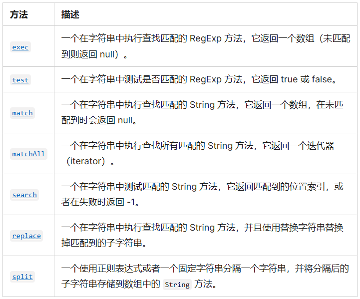

# JavaScript 常见内置类和对象

## Array

### 数组概念

- 数组用于存储有序的集合，里面的元素是按照某一顺序来排列的

- 数组常用于一系列的元素

- 可以通过元素的索引（Index）获取数组中的元素

  JS 不支持负数索引

  从 0 到 length-1 

- JS 中数组的特点

  - 数组的每一项可以保存任何类型的数据
  - 数组的大小是可以动态调整的

- 数组也是一种特殊的对象类型

- length 属性

  - 修改数组时，length 属性会自动更新

  - length 属性也是可修改的

    设置一个更大的值会增加数组的长度

    设置一个更小的值会截断数组

    设置为 0 可以直接清空数组

### 创建数组

1. 通过数组字面量创建数组

   ```js
   var colors = []
   var colors = ["Red", "Blue", "Green"]
   ```

2. 通过构造函数创建数组

   ```js
   var colors = new Array()
   var colors = new Array(20) // 很少设置长度，每一项都是 undefined
   var colors = new Array("Red", "Blue", "Green")
   ```

   new 关键字可省略

### 基本操作

- 访问元素：一般通过括号 `arr[i]` 访问元素，等同于 `arr.at(i)`（ES13）

- 修改元素：`arr[i] = "something"`

- 新增元素

  - `arr[i] = "something"` 直接用赋值的方式，一般不使用这种方法

    如果 i >= arr.length，数组会自动扩容，并将中间值置为空

  - `arr.push("something")` 尾部添加
  - `arr.unshift("something")` 头部添加（较慢）

- 删除元素
  - `delete arr[i]` 使用 delete 关键字，一般不使用这种方法
  - `arr.pop()` 尾部删除
  - `arr.shift("something")` 头部删除（较慢）

- `arr.splice(start, deleteCount, item1, item2, ...)`

  splice 方法可以同时用于添加、删除和替换元素

  splice 方法会修改原数组

  - start：处理元素的起始位置
  - deleteCount：要删除元素的个数，如果 <=0 则不删除
  - item1, item2, ...

  ```js
  arr = ["0", "1", "5", "6"]
  // 删除元素，从第一个元素起删除一个元素
  arr.splice(1, 1) // 0 5 6
  // 新增两个元素
  arr.splice(1, 0, "1", "2") // 0 1 2 5 6
  // 替换两个元素（可以看成先删除后增加）
  arr.splice(3, 2, "3", "4") // 0 1 2 3 4
  ```

### 遍历数组

1. for 循环

   ```js
   for (var i = 0; i < arr.length; i++) {
     const item = arr[i]
     console.log(item)
   }
   ```

2. for in

   ```js
   for (var i in arr) {
     const item = arr[i]
     console.log(item)
   }
   ```

3. for of（取不到索引）

   ```js
   for (var item of arr) {
     console.log(item)
   }
   ```

### 常用方法

**截取拼接**

- `arr.slice(begin, end)`：用于对数组进行截取

  包含 begin 不包含 end，不会修改原数组

- `arr.concat(value1, ... , valueN)`：创建一个新数组，其中包含来自于其他数组或其他项的值

- `arr.join(separator)`：将一个数组的所有元素连接成一个字符串并返回这个字符串

**查找元素**

- `arr.indexOf(searchElement, fromIndex)`：查找某个元素的索引

  - 从 fromIndex 开始查找，找到返回对应索引，没有找到返回 -1
  - `lastIndexOf()` 是从最后开始查找

- `arr.includes(valueToFind, fromIndex)`：判断是否包含某个元素（ES7 新增）

  - 从 fromIndex 开始查找，找到返回 true，否则返回 false

- `arr.find()` 和 `arr.findIndex()` 直接查找元素或者元素的索引（ES6之后新增）

  ```js
  var stu = students.find(function(item, index, arr) {
    return item.id === 100
  })
  
  var stuIndex = students.findIndex(function(item, index, arr) {
    return item.id === 100
  })
  ```

**数组排序**

- `arr.sort()`

  - 默认按升序排列数组项

  - 也可以接受一个比较函数 `compare(value1, value2)`

    - 如果比较函数返回值小于0，value1 排在 value2 前面
    - 如果比较函数返回值等于0，value1 和 value2 的相对位置不变
    - 如果比较函数返回值大于0，value2 排在 value1 前面

    ```js
    // 升序
    arr.sort(function(value1, value2) {
      return value1 - value2
    })
    
    // 降序
    arr.sort(function(value1, value2) {
      return value2 - value1
    })
    ```

- `arr.reverse()`

  - 反转数组项的顺序

**迭代方法**

以下迭代方法都会在数组的每一项上运行给定函数

该函数会接受三个参数：数组项的值、数组项对应索引和数组对象本身

- `every()`：如果该函数对每一项都返回 true，则返回 true（返回一个布尔值）
- `filter()`：将运行该函数返回 true 的项组成的数组返回（返回符合条件的子数组）
- `forEach()`：运行给定函数（没有返回值）
- `map()`：返回每次函数调用的结果组成的数组（返回每一项的运行结果组成的数组）
- `some()`：如果该函数对任一项返回 true，则返回 true（返回一个布尔值）

**归并方法**

- `reduce()` 和 `reduceRight()` 方法都会迭代数组的所有项，并构建一个最终的返回值

- `reduce()` 从前向后遍历、 `reduceRight()` 从后向前遍历

- 接收的参数包括一个用于归并的回调函数和归并初始值

  归并函数的参数包含：前一个值、当前值、项的索引和数组对象

  归并函数的返回值会作为下一次迭代的第一个参数自动传给下一项

  如果指定初始值从 `accumulator=指定值, currentValue=arr[0], currentIndex=0, array=arr` 开始
  
  否则从`accumulator=arr[0], currentValue=arr[1], currentIndex=1, array=arr` 开始
  
  ```js
  var values = [1, 2, 3, 4, 5]
  var sum = values.reduce(function(accumulator, currentValue, currentIndex, array) {
    return prev + cur
  })
  console.log(sum) // 15
  ```

**其他方法**

- `flat()` 方法会按照一个可指定的深度递归遍历数组，并将所有元素与遍历到的子数组中的元素合并为一个新数组返回

- `flatMap()` 方法首先使用映射函数映射每个元素，然后将结果压缩成一个新数组

  相当于先进行 map 操作，再做 flat(1) 的操作

## Date

Date 类型使用自 UTC 1970 年 1 月 1 日零时开始经过的毫秒数来表示日期

自 UTC 1970 年 1 月 1 日零时开始经过的毫秒数即为 Unix 时间戳

获取 Unix 时间戳的方法

`var date = new Date()`

1. `date.getTime()`
2. `date.valueOf()`
3. `Date.now()`
4. `+date` 

### 创建日期对象

通常使用 `new Date()` 来创建日期对象

1. 不传入任何参数时自动获得当前日期和时间

   ```js
   var now = new Date()
   ```

2. 传入表示日期的字符串 dateString

   dateString 时间的表示方式

   - 默认打印的时间格式是 RFC 2822 标准的

   - 也可以通过 `toISOString()` 将其转化为 ISO 8601 标准的扩展格式

     `YYYY-MM-DDTHH:mm:ss.sssZ`

   ```js
   var date1 = new Date("2022-09-09")
   // 等同于
   var date1 = new Date(Date.parse("2022-09-09"))
   ```

   构造函数会调用 `Date.parse()` 将传入的 dateString 转换为 Unix 时间戳

   如果传入 `Date.parse()` 的字符串不能表示日期，那么它会返回 false

   最好使用符合 RFC 2822 和 ISO 8601 的时间格式，其他格式结果不一定正常

3. 传入年份、月份（0-11）、天数（1-31）、小时（0-23）、分钟、秒及毫秒

   年份和月份是必需的，天数默认为1，其他参数默认为0

   ```js
   var date2 = new Date(2023, 8, 12, 20, 45, 30, 0)
   ```

   构造函数会调用 `Date.UTC()` 将其转换为 Unix 时间戳

4. 直接传入一个 Unix 时间戳

   ```js
   var date3 = new Date(1000)
   ```

### 获取日期信息

我们可以从 Date 对象中获取各种详细的日期信息

- `getFullYear()`：获取年份（4 位数）
- `getMonth()`：获取月份，从 0 到 11
- `getDate()`：获取当月的具体日期，从 1 到 31
- `getHours()`：获取小时
- `getMinutes()`：获取分钟
- `getSeconds()`：获取秒钟
- `getMilliseconds()`：获取毫秒
- `getTime()`：获取 Unix 时间戳
- `getDay()`：获取一周中的第几天，从 0（星期日）到 6（星期六）

### 设置日期信息

Date 对象也有对应的设置方法

- `setFullYear(year, [month], [date])`
- `setMonth(month, [date])`
- `setDate(date)`
- `setHours(hour, [min], [sec], [ms])`
- `setMinutes(min, [sec], [ms])`
- `setSeconds(sec, [ms])`
- `setMilliseconds(ms)`
- `setTime(milliseconds)`

## RegExp

### 正则表达式

正则表达式 （Regular Expression）使用单个字符串来描述、匹配一系列匹配某个句法规则的字符串

正则表达式是一种字符串匹配工具，可以帮助我们搜索、获取、替代字符串

JS 中的正则表达式使用 RegExp 类来创建，也可以使用正则表达式对应的字面量来创建

正则表达式主要由模式（pattern）和修饰符（flags）组成

```js
const re1 = new RegExp("hello", "i")
const re2 = /hello/i
```

模式代表正则表达式的匹配规则

修饰符代表正则表达式的匹配模式

- `g`：表示全局（global）模式，即模式将被应用于所有字符串，而非在发现第一个匹配项时立即停止
- `i`：表示不区分大小写（case-insensitive）模式，即在确定匹配项时忽略模式与字符串的大小写
- `m`：表示多行（multiline）模式，即在到达一行文本末尾时还会继续查找下一行中是否存在与模式匹配的项

[常用正则表达式](https://c.runoob.com/front-end/854/)

### 常用方法

正则表达式的两种使用方法

1. 使用正则表达式对象上的实例方法

   比如 `exec` 和 `test`

2. 使用字符串的方法，传入一个正则表达式

   比如 `match` 、`matchAll`、`search`、`replace`、`replaceAll`、`split`

   `matchAll` 必须传入一个全局正则表达式



### 常用的匹配规则

1. 字符类
   - `\d`：匹配一个数字，等价于 `[0-9]`
   - `\s`：匹配一个空白字符，包括空格、制表符 \t、换页符 \f 和换行符 \n 等
   - `\w`：匹配一个单字字符（字母、数字或者下划线），等价于`[A-Za-z0-9_]`
   - `.`：默认匹配除换行符之外的任何单个字符
2.  反向类
   - `\D`：匹配一个非数字字符，等价于`[^0-9]`
   - `\S`：匹配一个非空白字符
   - `\W`：匹配一个非单字字符，等价于`[^A-Za-z0-9_]`

3. 锚点

   - `^`：匹配文本开头

   - `$`：匹配文本末尾

   - `\b`：匹配一个词的边界

     词边界的一侧匹配 \w 而另一侧不匹配 \w

4. 转义字符串

   如果要把特殊字符作为常规字符来使用，需要对其进行转义，即在前面加上一个反斜杠

   常见的需要转义的字符：`[] \ ^ $ . | ? * + ( )`

   ```js
   const fileNames = ["abc.html", "home.jsx", "index.js", "index.html", "utils.js"]
   const jsfileRe = /\.jsx?$/ // 匹配 .js 或 .jsx
   
   const jsfileNames = fileNames.filter(filename => jsfileRe.test(filename))
   ```

5. 集合和范围

   - 集合：在方括号 […] 中的几个字符或者字符类意味着 “搜索给定的字符中的任意一个”

   - 范围：集合内也可以包含字符范围，比如 [a-z] 会匹配 a-z 范围内的字母
   - 排除范围：`[^...]` 会匹配不在范围内的字符，比如 `[^a-z]`

6. 量词

   用来形容我们所需要的数量的词被称为量词

   - `{n}`：确切的位数
   - `{n,m}`：某个范围的位数
   - `+`：等价于 `{1,}`，代表一个或多个，意味着必须出现
   - `?`：等价于 `{0,1}`，代表零个或一个，意味着可有可无
   - `*`：等价于 `{0,}`，代表零个或多个，意味着可以多次出现或不出现

### 贪婪模式和惰性模式

默认情况下的匹配规则是查找到匹配的内容后，会继续向后查找，一直找到最后一个匹配的内容

这种匹配的模式就叫做**贪婪模式**

```js
const message = "我最喜欢的两本书：《黄金时代》和《沉默的大多数》"
const results = message.match(/《.+》/g)
```

惰性模式中的量词与贪婪模式中的是相反的

- 只要获取到对应的内容后，就不再继续向后匹配
- 我们可以在量词后面再加一个问号来启用它
- 所以匹配模式变为了 `*?`、`+?` 或 `??`

```js
const message = "我最喜欢的两本书：《黄金时代》和《沉默的大多数》"
const results = message.match(/《.+?》/g)
```

### 捕获组

模式的一部分可以用括号括起来 `(...)`，这称为捕获组（capturing group）

- 捕获组允许将匹配的一部分作为结果数组中的单独项
- 捕获组将括号视为一个整体，可以对一个整体应用量词

方法 `str.match(regexp)`，如果 regexp 没有 g 标志，将查找第一个匹配并将它作为一个数组返回

- 索引 0 处：完全匹配
- 索引 1 处：第一个括号的内容
- 索引 2 处：第二个括号的内容
- 等等

```js
const str = "<h1>title</h1>"
const result = str.match(/<(.+?)>/)
console.log(result[0]) // <h1>
console.log(result[1]) // h1

const results = str.matchAll(/<(.+?)>/g)
```

命名组：在开始括号之后立即放置 `?<name>` 来对一个组进行命名，捕获的命名组也会放在结果的 groups 对象中

非捕获组：当需要使用括号对一个整体应用量词时，我们可能不希望捕获它们的内容，在开始括号之后添加 `?:` 可以排除组

组内使用或：`|` 在正则表达式中表示或，通常会和捕获组一起使用，在其中表示多个值

## 包装类型

### 包装类型概念

JS 中的**原始类型**并非对象类型，所以它们是没有办法获取属性或者调用方法的

因为原始类型是简单的值，默认并不能调用属性和方法

所以 JS 为原始类型封装了对应的**包装类型**，使其可以获取属性和调用方法

常见的包装类型有：String、Number、Boolean、Symbol、Bigint 类型

默认情况，当我们调用一个原始类型的属性或者方法时，会进行如下操作

- 根据原始值，创建一个原始类型对应的包装类型对象

- 调用对应的属性或者方法，返回一个新的值

- 创建的包装类对象被销毁

- 通常 JavaScript 引擎会进行很多的优化

  它可以跳过创建包装类型对象的过程在内部直接完成属性的获取或者方法的调用

包装类型的对象也可以通过构造函数手动创建

注意：null 和 undefined 没有任何的方法和属性，也没有对应的包装类

### Number

数字对应的包装类型是 Number

**常见属性**

- `Number.MAX_VALUE`
- `Number.MIN_VALUE`
- `Number.MAX_SAFE_INTEGER`
- `Number.MIN_SAFE_INTEGER`

**常见实例方法**

- `toString(base)`：将数字转成字符串，并且按照 base 进制进行转化
  - base 的范围为 2~36，默认为 10
  - 直接对数字操作可以`123..toString()`

- `toFixed(digits)`：格式化一个数字，保留 digits 位小数
  - digits 的范围为0~20
  - 保留规则是四舍五入

**常见类方法**

- `Number.parseInt(string)`：将字符串解析成整数，也有对应的全局方法 `parseInt`
- `Number.parseFloat(string)`：将字符串解析成浮点数，也有对应的全局方法 `parseFloat`

### String

字符串对应的包装类型是 String

字符串具有不可变性：即在定义后是不可以修改的

**常见属性**

- `str.length`

**常见方法**

- `at(index)`：获取字符串某个位置的字符

  index 可以是整数，并允许为负值，负整数从最后一个字符开始倒数

- `charAt(index)`：获取字符串某个位置的字符等同于 `str[index]`

  `str[index]` 没有找到会返回 undefined

  而 `charAt(index)` 没有找到会返回空字符串

  因为 `charAt(index)` 在 `0~str.length-1` 范围外的时候会返回空字符串

  字符串的遍历

  ```js
  for (var i = 0; i < message.length; i++) {
    console.log(message[i])
  }
  // 字符串和数组都是可迭代对象，可以用 for of 迭代
  for (var char of message) {
    console.log(char)
  }
  ```

- `toLowerCase()`：将所有的字符转为小写
- `toUpperCase()`：将所有的字符转为大写

**查找替换**

- `indexOf(searchValue, fromIndex)`：在一个字符串中查找另一个字符串
  - 从 fromIndex 开始查找 searchValue 的索引
  - 没有找到返回 -1
  - 找到就返回字符串所在的索引
  - `lastIndexOf` 是从最后开始查找
- `includes(searchString, position)`（ES6新增）
  - 从 position 位置开始查找 searchString， 根据情况返回 true 或 false
- `startsWith(searchString, position)`（ES6新增）
  - 从 position 位置开始，判断字符串是否以 searchString 开头
- `endsWith(searchString, length)`（ES6新增）
  - 在 length 长度内，判断字符串是否以 searchString 结尾
- `replace(regexp|substr, newSubStr|function)`
  - 查找到对应的字符串，并且使用新的字符串代替
  - 可以传入一个正则表达式来查找，也可以传入一个函数来替换

**截取拼接**

- `slice(start, end)`：获取从 start 到 end（不含end）的子字符串，允许参数为负值（常用）
- `substring(start, end)`：获取从 start 到 end（不含end）的子字符串，参数为负值会转换为 0
- `substr(start, length)`：获取从 start 开始长度为 length 的子字符串，start 允许为负值，length 为负值会转换为0
- `str.split(separator, limit)`：字符串分割
  - separator 分割符，也可以是正则表达式
  - limit 限制返回片段的数量
  - 分割以后可以用数组的 join 方法再次拼接
- `str.concat(str2, ... , strN)`：拼接字符串

**其他方法**

- `str.trim()`：删除首尾空格

  `trimStart` 和 `trimEnd` 可以单独去除首部和尾部的空格

- `padStart` 和 `padEnd` 方法，分别用于对字符串的首尾进行填充

## 内置对象

### Math 对象

Math是一个内置对象（不是一个构造函数），它拥有一些数学常数属性和数学函数方法

常见属性

- `Math.PI`：圆周率

常见方法

- `Math.floor`：向下舍入取整

- `Math.ceil`：向上舍入取整

- `Math.round`：四舍五入取整

- `Math.random`：生成 0-1 的随机数（包含0，不包含1）

  ```js
  // 从某个整数范围内随机选择一个值
  值 = Math.floor(Math.random() * 可能值的总数 + 第一个可能值)
  // 从一个数组中随机取值
  randomIndex = Math.floor(Math.random() * arr.length)
  值 = arr[randomIndex]
  ```

- `Math.pow(x, y)`：返回 x 的 y 次幂

  Math.pow(3, 3) 等同于 `3 ** 3` （ES7 新增指数运算符）

