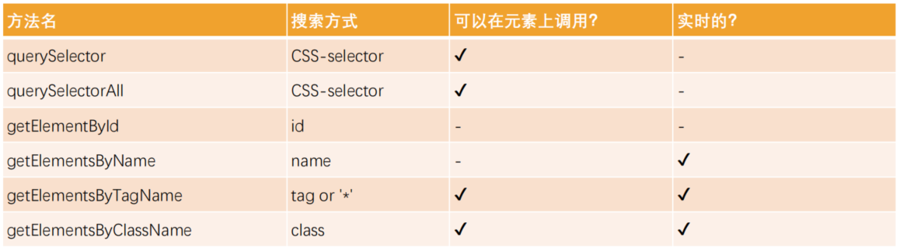

# 认识 DOM 和 BOM


window 对象中除了 JS 的一些内置类和对象以外，还包含一些浏览器提供的 DOM、BOM 相关的 API，这些 API 用于对页面和浏览器进行操作。

- DOM：文档对象模型（Document Object Model）

  将页面所有的内容表示为可以修改的对象

- BOM：浏览器对象模型（Browser Object Model）

  由浏览器提供的用于处理文档之外的所有内容的其他对象

  比如：navigator、location、history 等对象

通俗的讲 

- DOM 就是 JS 和 HTML 文档之间的桥梁
- BOM 就是 JS 和浏览器之间的桥梁

# DOM

## 理解 DOM

**DOM 文档对象模型**

- 浏览器会将我们编写在 HTML 中的每一个元素抽象成一个个对象
- 这些对象都可以通过 JS 进行访问和修改
- 这个将元素抽象成对象的过程就叫做 DOM

**document 对象**

Document 节点表示整个载入的网页，它的实例是全局的 document 对象

- 整个 HTML 文档都会被抽象到 document 对象中
- 对 DOM 的所有操作都是从 document 对象开始的
- document 对象是 DOM 的入口点，可以从 document 开始去访问任何节点元素 

对于最顶层的 html、head、body 元素，我们可以直接在 document 对象中获取到

- document.documentElement -> html 元素
- document.body -> body 元素
- document.head -> head 元素
- document.doctype -> 文档声明

**DOM Tree**

- 页面中所有的元素最终会形成一个树结构
- 在抽象成 DOM 对象时，这些元素对应的对象也会形成一个树结构，称之为 DOM Tree

**DOM 的继承关系**


## navigator 导航

### 节点导航

如果我们获取到一个节点（Node）后，可以根据这个节点去获取其他的节点，我们称之为节点之间的导航

节点之间存在如下的关系：

- 父节点：parentNode
- 前兄弟节点：previousSibling
- 后兄弟节点：nextSibling
- 子节点：childNodes
- 第一个子节点：firstChild
- 最后一个子节点：lastChild


### 元素导航

如果我们获取到一个元素（Element）后，可以根据这个元素去获取其他的元素，我们称之为元素之间的导航

元素之间存在如下的关系

- 父元素：parentElement
- 前兄弟元素：previousElementSibling
- 后兄弟元素：nextElementSibling
- 子元素：children
- 第一个子元素：firstElementChild
- 第二个子元素：lastElementChild


### 表格导航

`<table>` 元素支持以下属性获取其他元素

- `table.rows`：`<tr>` 元素的集合
- `table.caption/tHead/tFoot`：引用元素 `<caption>/<thead>/<tfoot>`
- `table.tBodies`：`<tbody>` 元素的集合

`<thead>/<tfoot>/<tdody>` 元素提供了 rows 属性获取其内部 `<tr>` 元素的集合

`<tr>` 

- `tr.cells`：`<tr>` 中 `<td>` 和 `<th>` 的集合
- `tr.sectionRowIndex`：`<tr>` 在 `<thead>/<tfoot>/<tdody>` 中的索引
- `tr.rowIndex`：`<tr>` 在整个表格中的索引

`<td>` 和 `<th>` 

- `td.cellIndex`：在 `<tr>` 中单元格的编号

### 表单导航

- `doucment.forms`：获取所有表单的集合

- `form.elements`：获取 form 的所有子元素

  设置表单子元素的 name 属性之后可以直接通过 `form.elements.name` 获取对应的子元素

  然后通过 value 属性就可以获得对应的值
  
  ```js
  var formEl = document.forms[0]
  var elements = formEl.elements
  console.log(elements.username.value)
  ```

## 获取元素

导航属性在元素彼此靠近或者相邻时可以通过元素之间的关系获取元素

但导航属性并不能任意地获取到某一个元素

DOM 提供了获取元素和元素集合的一系列方法



目前开发中最常用的是 `querySelector` 和 `querySelectorAll`

`getElementById` 偶尔也会使用或者用于适配低版本浏览器

`querySelectorAll` 或者其他方法获取到的对象节点也是可迭代对象，可以用 `for of` 遍历

## 节点属性

- `nodeType`：获取节点的类型

  - nodeType 属性可用于区分不同类型的节点，比如 元素, 文本 和 注释。
  - nodeType 是一个代表节点类型的整数

  

- `nodeName`：获取节点的名字

  nodeName 适用于任意节点

- `tagName`：获取元素的标签名称

  tagName 仅适用于 Element 节点

  元素节点的 nodeName 和 tagName 相同

- `innerHTML`
  - 将元素中的 HTML 获取为字符串形式
  - 设置元素中的内容
- `outerHTML`
  - 包含了元素的完整 HTML
  - 即 `innerHTML` 加上元素本身
- `textContent`：获取元素中的文本内容
- `nodeValue/data`：获取非元素节点的文本内容

> 设置 innerHTML 和 textContent 的区别
>
> - 使用 innerHTML 会将其作为 HTML 插入，其中的元素内容会被浏览器解析
> - 使用 textContent  会将其作为文本插入，其中的元素内容会被当成文本的一部分

## 元素属性

一个元素除了有开始标签、结束标签、内容之外，还有很多的属性（attribute）

浏览器在解析 HTML 元素时，会将对应的 attribute 也创建出来放到对应的元素对象上

元素的全局属性

- `hidden` ：设置元素隐藏
- `id`
- `class`
- `title`
- `style`

元素的特殊属性

- `type`：input 的类型

- `value`：表单元素的值
- `href`：a 元素的 href

### attribute

attribute 分类

- 标准 attribute：某些 attribute 是标准的
- 非标准 attribute：还有一些 attribute 是自定义的

attribute 操作

- `elem.hasAttribute(name)`：检查是否存在
- `elem.getAttribute(name)`：获取
- `elem.setAttribute(name, value)`：设置
- `elem.removeAttribute(name)`：移除
- `elem.attributes`：包含所有 attr 对象的集合，具有 name、value属性

attribute 的特征

- 它们的名字是大小写不敏感的（id 与 ID 相同）
- 它们的值总是字符串类型的

### property

对于标准的 attribute，会在 DOM 对象上创建与其对应的 property

`elem.id`

`elem.className`

`elem.abc(undefined)`

在大多数情况下，它们是相互作用的

- 改变 property，通过 attribute 获取的值，会随着改变

- 通过 attribute 操作修改，property 的值会随着改变

  但是部分浏览器中 input 的 value 修改只能通过 attribute 的方法

除非特别情况，大多数情况下，设置、获取 attribute，推荐使用 property 的方式

因为 property 在默认情况下是有类型的

比如 `inputEl.getAttribute("checked")` 返回的是字符串，而 `inputEl.checked` 返回的是布尔值

### dataset

dataset 属性中可以获取到用 `data-*` 自定义的属性

```js
<div class="box" title="abc" data-name="why" data-age="18">
    box
</div>
<script>
    const box = document.querySelector(".box")
   	console.log(box.dataset.name)
   	console.log(box.dataset.age)
</script>
```

### 类和样式

动态修改样式的两种方法

1. 动态的添加和移除 class
2. 动态的修改元素的 style 属性

**className 和 classList**

元素的 class attribute 对应的 property 叫做 className

className 可以用于获取和修改元素的 class 属性

className 对应的所有 class 保存在 classList 里

classList 是可迭代对象，可以通过 `for of` 遍历

classList 对象提供了一些方法对类进行操作

- `elem.classList.add(class)`：添加类
- `elem.classList.remove(class)`：移除类
- `elem.classList.toggle(class)`：如果类不存在就添加类，存在就移除类
- `elem.classList.contains(class)`：检查给定类是否存在

**style**

- style 可以用于单独修改某一个 CSS 属性

  `elem.style.width`

- 多词属性（multi-word）使用驼峰式 camelCase

  `elem.style.backgroundColor`

- 将 CSS 属性设置为空字符串会使用 CSS 默认样式

  `elem.style.display = ""`

- 同时设置多个样式

  `elem.style.cssText = "font-size: 30px; color: red;"`

  cssText 会覆盖元素的 style 属性，因此不推荐使用

- 读取样式

  内联样式可以直接通过 `elem.style` 对象读取其中的 CSS 属性

  但对于 `<style></style>` 和 CSS 文件中的样式并不生效

  全局函数 `getComputedStyle(elem)` 可以获取到元素的样式

  ```js
  getComputedStyle(elem).width
  getComputedStyle(elem).height
  getComputedStyle(elem).backgroundColor
  ```

## 元素操作

### 创建元素

早期没有 DOM 时一般使用 `document.wirte()` 写入一个元素

目前创建元素的常用步骤

1. 创建一个元素

   `document.createElement(tag)`

   不推荐直接用 `innerHTML`，因为后续操作还需要再找到新的元素

   ```js
   var boxEl = document.querySelector(".box")
   var h2El = document.createElement("h2")
   h2El.innerHTML = "我是标题"
   h2El.classList.add("title")
   boxEl.append(h2El)

2. 插入元素到 DOM 的某一个位置

   - `node.append(...nodes or strings)` —— 在 node 末尾插入节点或字符串

   - `node.prepend(...nodes or strings)` —— 在 node 开头插入节点或字符串

   - `node.before(...nodes or strings)` —— 在 node 前面插入节点或字符串

   - `node.after(...nodes or strings)` —— 在 node 后面插入节点或字符串

   - `node.replaceWith(...nodes or strings)` —— 将 node 替换为给定的节点或字符串

   

### 移除元素

移除元素我们可以调用元素本身的 `remove()`

`elem.remove()`

### 克隆元素

`cloneNode(deep)` 可以复制一个现有的元素

- 可以传入一个 Boolean 类型的值 deep，来决定是否深度克隆
- 深度克隆会克隆对应元素的子元素，否则不会

### 旧操作

- `parentElem.appendChild(node)`：在 parentElem 即父元素最后位置添加一个子元素
- `parentElem.insertBefore(node, nextSibling)`：在 parentElem 的 nextSibling 前面插入一个子元素
- `parentElem.replaceChild(node, oldChild)`：在 parentElem 中，用新元素替换之前的 oldChild 元素
- ` parentElem.removeChild(node)`：在 parentElem 中，移除某一个元素

### 大小和滚动

**元素的大小和滚动**

client

- clientWidth：contentWidth + padding（不含滚动条）
- clientHeight：contentHeight + padding
- clientLeft：border-left 的宽度
- clientTop：border-top 的宽度

>box-sizing: content-box; 里 contentWith = width - scrollbar
>
>box-sizing: border-box; 里 contentWith = width - padding - border - scrollbar

offset

- offsetWidth：元素完整的宽度
- offsetHeight：元素完整的高度
- offsetLeft：距离父元素的 x
- offsetTop：距离父元素的 y

scroll

- scrollHeight：整个可滚动的区域高度
- scrollTop：滚动部分的高度


**window 的大小和滚动**

获取宽高

- `innerWidth、innerHeight`：获取 window 窗口的宽度和高度（包含滚动条）
- `outerWidth、outerHeight`：获取 window 窗口的整个宽度和高度（包括调试工具、工具栏）
- `documentElement.clientHeight、documentElement.clientWidth`：获取 html 的宽度和高度（不包含滚动条）

滚动位置

- `scrollX`：X 轴滚动的位置（别名 pageXOffset）
- `scrollY`：Y 轴滚动的位置（别名 pageYOffset）

滚动方法

- `scrollBy(x, y)`：将页面滚动至相对于当前位置的 (x, y) 位置
- `scrollTo(pageX, pageY)`：将页面滚动至绝对坐标  (pageX, pageY)

# BOM

