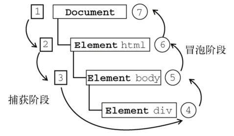
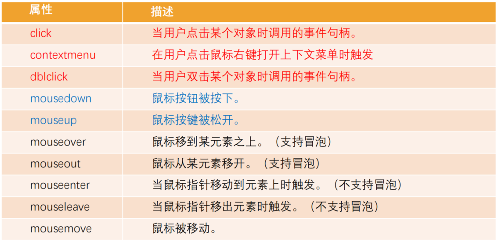
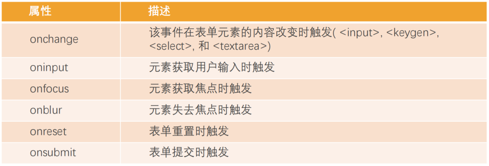
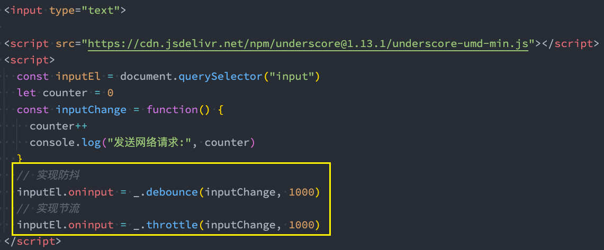

# JavaScript 事件处理

## 事件的概念

### 认识事件

**事件**指的是 Web 页面和用户之间的交互过程

- 事件就是 JS 和 HTML 之间的桥梁

- 比如点击按钮、输入文本、鼠标经过

**事件处理**就是捕捉事件并在事件发生时执行对应的处理程序（handler）

- 事件处理就是 JS 和事件之间的桥梁
- 当某个事件发生时，JS 可以执行针对该事件编写的处理程序

==如何监听事件==

1. 在 HTML 的元素属性中直接监听（很少使用）
2. 通过 DOM 属性中元素的 `on+event` 属性来监听事件
3. 通过 EventTarget 中的 `addEventListener` 来监听

```js
<div id="box1" onclick="alert("box1点击")">box1</div>
<div id="box2">box2</div>
<div id="box3">box3</div>
<script>
  box2 = document.querySelector("#box2")
  box2.onclick = function() {
    alert("box2点击")
  }
  box3 = document.querySelector("#box3")
  box3.addEventListener("click", function() {
    alert("box3点击")
  })
</script>
```

### 常见事件

- 鼠标事件
  - `click`：当鼠标点击一个元素时（触摸屏设备会在点击时生成）
  - `mouseover / mouseout`：当鼠标指针移入/离开一个元素时
  - `mousedown / mouseup`：当在元素上按下/释放鼠标按钮时
  - `mousemove`：当鼠标移动时
- 键盘事件
  - ` keydown 和 keyup`：当按下和松开一个按键时
- 表单元素事件
  - `submit`：当访问者提交了一个 `<form>` 时
  - `focus`：当访问者聚焦于一个元素时，例如聚焦于一个 `<input>`
- Document 事件
  - `DOMContentLoaded `：当 HTML 的加载和处理均完成，DOM 树被完全构建完成时
- CSS事件
  - ` transitionend`：当一个 CSS 动画完成时

### 事件流

在点击一个元素时，点击的不仅仅是元素本身

也点击了元素的父元素和整个页面

这种情况下就需要事件流来确认事件的处理顺序

**事件流**描述的是从页面中接收事件的顺序

事件流有两种传播方式

- 从内向外传播的事件流叫做**事件冒泡**

  ```js
  spanEl.addEventListener("click", function(event) {
    console.log("span被点击~")
  })
  divEl.addEventListener("click", function(event) {
    console.log("div被点击~")
  })
  bodyEl.addEventListener("click", function() {
    console.log("body被点击~")
  })
  ```

- 从外向内传播的事件流叫做**事件捕获**

  ```js
  spanEl.addEventListener("click", function(event) {
    console.log("span被点击~")
  }, true)
  divEl.addEventListener("click", function(event) {
    console.log("div被点击~")
  }, true)
  bodyEl.addEventListener("click", function(event) {
    console.log("body被点击~")
  }, true)
  ```

**DOM 事件流**

- 事件捕获阶段

  首先发生事件捕获，可在这个阶段截获事件

- 目标阶段

  实际的目标接受到事件

- 冒泡阶段

  从目标元素开始冒泡，可在这个阶段对事件做出响应



当前阶段可以通过 `event.eventPhase` 获取

- 捕获阶段为 1
- 目标阶段为 2
- 冒泡阶段为 3

开发中通常只使用事件冒泡

## 事件对象

在触发 DOM 的某个事件时，会产生一个事件对象 event（由浏览器创建）

这个对象中包含着所有与事件有关的信息，包括导致事件的元素、事件的类型以及其他与特定事件相关的信息

event 对象会作为参数传入事件对应的事件处理程序（event handler）

### 常见属性

- `type`：事件的类
- `target`：当前事件发生的元素
- `currentTarget`：当前处理事件的元素
- `eventPhase`：事件所处的阶段
- `offsetX / offsetY`：事件发生在元素内的位置
- `clientX / clientY`：事件发生在客户端内的位置
- `pageX / pageY`：事件发生在客户端相对于 document 的位置（页面中位置）
- `screenX / screenY`：事件发生相对于屏幕的位置

### 常见方法

- `preventDefault`：取消事件的默认行为

  ```js
  // 阻止 a 链接的跳转
  link.onclick = function(event) {
    console.log("a元素被点击")
    event.preventDefault()
  }
  ```

- `stopPropagation`：阻止事件的进一步传递（冒泡或者捕获都可以阻止）

### this 对象

在事件处理程序中，this 对象指向当前事件发生的元素

因为在浏览器内部，调用 event handler 是绑定到当前的 target 上的

```js
box.addEventListener("click", function(event) {
  console.log(this === event.target) // true
})
```

## EventTarget 类

EventTarget 是一个 DOM 接口，主要用于添加、删除、派发 Event 事件

- 所有的节点和元素都继承自 EventTarget

- Window 也继承自 EventTarget

- EventTarget常见的方法

  - `addEventListener`：注册某个事件类型以及事件处理函数

  - `removeEventListener`：移除某个事件类型以及事件处理函数

    移除的函数和注册的函数必须是同一个对象才能移除掉

  - `dispatchEvent`：派发某个事件类型到 EventTarget 上

    ```js
    box.addEventListener("click", function() {
      window.dispatchEvent(new Event("myevent"))
    })
    window.addEventListener("myevent", function(event) {
      console.log("监听到我的事件:", event)
    })
    ```

## 事件委托

事件委托（event delegation）是一种事件处理模式

- 当子元素被点击的时候，父元素可以通过冒泡监听到子元素的点击
- 并且可以通过 event.target 获取到当前被点击的子元素

事件委托可以避免给多个子元素重复添加事件监听，提高代码效率

本质上是将子元素的事件监听委托给父元素处理

```js
var listEl = document.querySelector(".list")
var currentActive = null
listEl.addEventListener("click", function() {
  if (event.target === listEl) return // edge case
  if (currentActive) currentActive.classList.remove("active")
  event.target.classList.add("active")
  currentActive = event.target
})
```

某些事件委托可能需要对具体的子元素进行区分

这个时候我们可以使用 `data-*` 对其进行标记

通过 `event.target.dataset.*` 对不同子元素的事件委托进行区分

## 常见事件

[MDN 事件参考](https://developer.mozilla.org/zh-CN/docs/Web/Events)

### 鼠标事件

常见的鼠标事件



`mouseover` 和 `mouseenter` 的区别

- `mouseenter / mouseleave`

  - 不支持冒泡

  - 进入子元素时依然属于在该元素内

    不会触发父元素的 mouseleave

    会触发子元素的 mouseenter

- `mouseover / mouseout`

  - 支持冒泡

  - 进入元素的子元素时

    先调用父元素的 mouseout

    再调用子元素的 mouseover

    因为支持冒泡所以 mouseover 会传递到父元素中

    会再次调用父元素的 mouseover

  - 在事件委托中主要使用 `mouseover / mouseout`

    因为允许冒泡才能触发父元素的事件监听

### 键盘事件

常见的键盘事件

- `onkeydown`：某个键盘按键被按下

- `onkeypress`：某个键盘按键被输入
- `onkeyup`：某个键盘按键被松开

键盘事件的执行顺序

1. down 事件先发生
2. press 发生在文本被输入时
3. up 发生在文本输入完成时

键盘按键的区分方式

- `event.code`：按键代码（”KeyA“， "ArrowLeft"），特定于键盘上按键的物理位置
- `event.key`：字符（”A“，”a“）区分大小写，对于非字符按键，通常具有与 code 相同的值

- `event.keyCode` 已废弃，不建议使用

 常见应用

1. 在搜索框按下 Enter 直接搜索 `event.code === "Enter"`
2. 按下 s 使搜索框自动获取焦点 `event.code === "KeyS" && input.focus()`

### 表单事件

常见的表单事件



`oninput` 和 `onchange` 的区别

- 每次输入的时候 `oninput` 都会触发
- 输入完成失去焦点，内容确定发生改变的时候 `onchange` 才会触发

### 文档加载事件

- `DOMContentLoaded`：浏览器已完全加载 HTML，并构建了 DOM 树，但像图片，样式之类的外部资源可能尚未加载完成

- `load`：浏览器不仅加载完成了 HTML，还加载完成了所有外部资源：图片，样式等

  ```js
  window.onload = function() {
    console.log("文档加载完成")
  }
  ```

### 其他事件

- `resize` 事件：监听文档视图（窗口大小）的变化

- `ontransitionend`：监听 transition 动画的结束

# 防抖和节流

JavaScript 是事件驱动的，大量的操作会触发事件，加入到事件队列中处理

某些频繁的事件处理可能会造成性能的损耗，我们就可以通过防抖和节流来限制事件频繁的发生

实现防抖和节流的第三方库

- [Underscore.js](https://underscorejs.org/)

- [Lodash](https://lodash.com/)



## 防抖函数

**防抖（debounce）函数的过程**

- 当事件触发时，相应的函数并不会立即触发，而是会等待一定的时间
- 当事件密集触发时，函数的触发会被频繁的推迟
- 只有等待了一段时间也没有事件触发，才会真正的执行响应函数

**防抖的应用场景**

- 输入框中频繁的输入内容，搜索或者提交信息
- 频繁的点击按钮，触发某个事件
- 监听浏览器滚动事件，完成某些特定操作
- 用户缩放时监听浏览器的 resize 事件

**防抖函数的应用案例**

搜索框的联想提示会在用户输入关键词时联想相应的关键词

比如输入 mac 联想 macbook

如果用户输入 mac 的不同的字符的间隔很快时

假如每输入一个字符都发送网络请求获取联想关键词是很消耗系统性能的

所以应该在用户输入停止一段时间没有新的输入时再发送网络请求

这就是防抖操作：只有在某个时间内，没有再次触发某个事件时，才对这个事件进行相应的处理

## 节流函数

**节流（throttle）函数的过程**

- 当事件触发时，会执行这个事件的响应函数
- 如果这个事件会被频繁触发，那么节流函数会按照一定的频率来执行函数
- 不管在这个中间有多少次触发这个事件，执行函数的频率总是固定的

**节流的应用场景**

- 监听页面的滚动事件
- 鼠标移动事件
- 用户频繁点击按钮操作
- 游戏中的一些设计

**节流函数的应用案例**

在类似飞机大战的游戏中，按下空格会发射一个子弹

很多类似游戏都有一个相同设定就是，即使按下空格的频率非常快，子弹也会保持一定的频率来发射

比如 1秒钟只能发射一次，即使用户在这 1秒钟按下了10次，子弹也指挥发射一颗

这种情况下发射事件是触发了 10次的，但是只有一次得到了响应

# 事件总线

事件总线属于一种观察者模式的代码实现，事件总线中有三个角色

- 发布者 Publisher：负责发出事件 Event
- 订阅者 Subscriber：订阅事件 Event，并且会进行响应 Handler
- 事件总线 EventBus：作为发布者和订阅者的中台

事件总线一般用于跨文件或跨组件的通信

- Vue2 中默认带有事件总线
- Vue3 中推荐一些第三方库，如 mitt

事件总线一般包含以下方法

- 事件的监听方法 on
- 事件的发射方法 emit
- 事件的取消监听方法 off