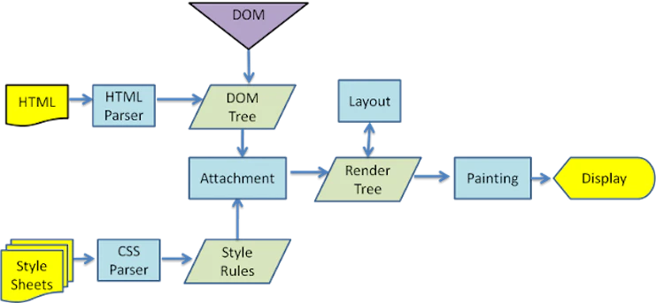
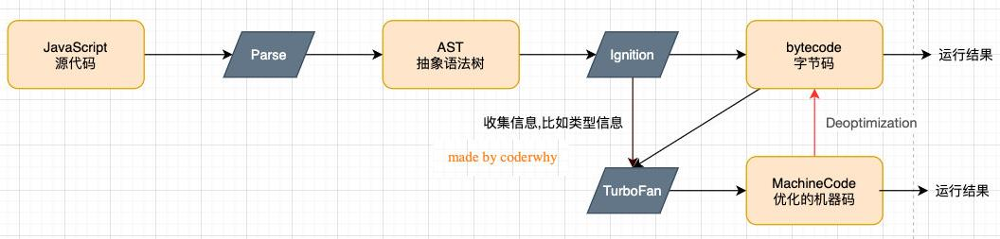
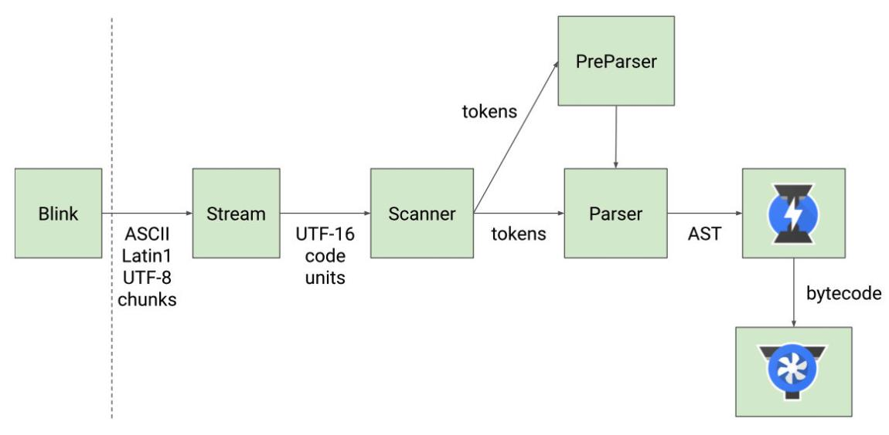
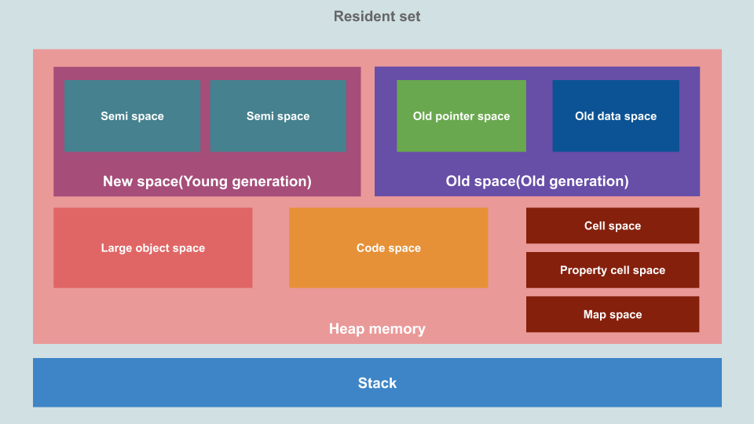

# 深入浏览器渲染原理

## 网页解析流程

1. 在浏览器输入网页的 URL

2. 浏览器通过 DNS 将 URL 解析为服务器的 IP 地址

3. 然后向服务器请求静态资源

   一般情况下是先请求 html 文件

   遇到 link 元素再请求 css 文件

   遇到 script 元素再请求 js 文件

4. 服务器返回静态资源给浏览器

5. 浏览器对静态资源进行解析和展示

## 浏览器渲染流程

### 浏览器内核

浏览器内核指的是浏览器的排版引擎（浏览器引擎、页面渲染引擎或样板引擎）

浏览器内核负责解析网页语法，并渲染网页，常见的浏览器内核有

- Trident：IE、360安全、搜狗、百度、UC；
- Gecko：Firefox
- Presto → Blink：Opera
- Webkit：Safari、360极速、搜狗、移动端浏览器
- Webkit → Blink：Google Chrome、Edge

浏览器内核由两部分组成，以 Webkit 为例

- WebCore：负责 HTML 解析、布局、渲染等等相关的工作
- JavaScriptCore：解析、执行JavaScript代码

### 一般流程


### 详细流程

[How browsers work (web.dev)](https://web.dev/howbrowserswork/)



1. HTML 解析是整个流程的开始，即根据 HTML 文档构建 DOM Tree

2. 生成 CSS 规则

   - 在 HTML 解析的过程中，如果遇到 CSS 的 link 元素，浏览器就会下载对应的 CSS 文件

   - 下载 CSS 文件不会影响 DOM 的解析
   - 浏览器下载完 CSS 文件后，就会对 CSS文件 进行解析，解析出对应的规则树（CSSOM Tree）

3. 构建 Render Tree

   当有了 DOM Tree 和 CSSOM Tree 后，就可以结合起来构建 Render Tree 了

   - link 元素不会阻塞 DOM Tree 的构建过程，但是会阻塞 Render Tree 的构建过程

     因为 Render Tree 在构建时，需要对应的 CSSOM Tree

   - Render Tree 和 DOM Tree 并不是一一对应的关系

     比如对于 display 为 none 的元素，并不会出现在 Render Tree 中

4. 布局

   布局就是在 Render Tree 上运行 Layout 以计算每个节点的几何体

   可以理解为确定节点的大小和位置

   - Render Tree 会表示显示哪些节点以及节点的其他样式，但是不表示每个节点的尺寸、位置等信息
   - 布局是确定呈现树中所有节点的宽度、高度和位置信息

5. 绘制

   将每个节点绘制（Paint）到屏幕上

   - 在绘制阶段，浏览器将布局阶段计算的每个 frame 转为屏幕上实际的像素点
   - 绘制的内容包含元素的可见部分，比如文本、颜色、边框、阴影、替换元素

### 回流和重绘

**回流 reflow**

- 第一次确定节点的大小和位置叫做布局
- 之后对节点的大小、位置的修改和重新计算叫做回流

- 回流的触发情况

  - DOM 结构发生改变（添加或移除节点）

  - 改变了元素布局（修改了 width、height、padding、font-size）

  - 窗口的 resize （修改了窗口的尺寸）

  - 调用 getComputedStyle 获取尺寸和位置

**重绘 repaint**

- 第一次渲染内容叫做绘制 paint
- 之后的重新绘制叫做重绘

- 重绘的触发情况
  - 修改背景色
  - 修改文字颜色
  - 修改边框颜色或样式
  - 等等

**回流一定会引起重绘**，所以回流非常消耗性能，在开发中要尽量避免发生回流

**避免发生回流的注意事项**

1. 修改样式时尽量一次性修改

   比如通过 cssText 修改，比如通过添加 class 修改

2. 尽量避免频繁的操作 DOM

   我们可以在一个 DocumentFragment 或者父元素中将要操作的 DOM 操作完成，

   再一次性地操作

3. 尽量避免通过 getComputedStyle 获取尺寸、位置等信息

4. 对某些元素使用 position 的 absolute 或者 fixed

   并不是不会引起回流，而是开销相对较小，不会对其他元素造成影响

### 合成

绘制的过程中可以将布局后的元素绘制到多个合成图层中

- 默认情况下，标准流中的内容都是被绘制在同一个图层（Layer）中的

- 一些特殊的属性，会创建一个新的合成层（ Compositing Layer ）

  并且新的图层可以利用GPU来加速绘制

- 每个合成层都是单独渲染的

- 合成是浏览器优化渲染的一种手段

可以形成新的合成层的常见属性

- 3D transforms
- video、canvas、iframe 元素
- `opacity` 动画转换时
- `position: fixed`
- `will-change` 一个实验性属性，提前告诉浏览器元素可能发生哪些变化 
-  animation 或 transition 设置了opacity、transform

分层确实可以提高性能，但是它以内存管理为代价，因此不应作为 web 性能优化策略的一部分过度使用 

## script 元素

### 与页面解析的关系

1. 浏览器在解析 HTML 的过程中，遇到了 script 元素或者外联 js 文件是不能继续构建 DOM 树的
2. 它会停止继续构建，首先下载 JavaScript 代码，并且执行 JavaScript 的脚本
3. 只有等到 JavaScript 脚本执行结束后，才会继续解析 HTML，构建 DOM 树

为什么要这样做

- 这是因为 JavaScript 的作用之一就是操作 DOM，并且可以修改 DOM
- 如果我们等到 DOM 树构建完成并且渲染再执行 JavaScript，会造成严重的回流和重绘，影响页面的性能
- 所以会在遇到 script 元素时，优先下载和执行 JavaScript 代码，再继续构建 DOM 树

但是现代开发模式中 JS 代码的处理时间往往很长，有可能会造成页面的解析阻塞，即在脚本下载和执行完成之前，用户在界面上什么都看不到

script 的 defer 和 async 可以用于解决这个问题

> 对于这种被阻塞的情况，浏览器可能会通过优化将 DOM Tree 中已经构建的部分提前渲染出来以提升用户体验
>

### defer

 defer 属性告诉浏览器不要等待脚本下载，而继续解析 HTML，构建 DOM Tree

- 脚本会由浏览器来进行下载，但是不会阻塞 DOM Tree 的构建过程

- 如果脚本提前下载好了，它会等待 DOM Tree 构建完成，在 DOMContentLoaded 事件之前先执行 defer 中的代码

  所以 DOMContentLoaded 是会等待 defer 中的代码执行完成后再执行

- 多个带 defer 的脚本是可以保持正确的顺序执行的
- 从某种角度来说，defer 可以提高页面的性能，并且推荐放到 head 元素中
- defer 仅适用于外部脚本，对于 script 默认内容会被忽略

### async

async 与 defer 类似也可以让脚本不阻塞页面

async 可以让脚本完全独立地下载并执行

- 浏览器不会因 async 脚本而阻塞
- async 脚本不能保证顺序，它是独立下载、独立运行的，不会等待其他脚本
- async 不会能保证在 DOMContentLoaded 之前或者之后执行

> defer 通常用于需要在文档解析后操作 DOM 的 JavaScript 代码，适用于对多个 script 文件有顺序要求的情况
>
> async 通常用于独立的脚本，适用于对其他脚本甚至 DOM 没有依赖的情况

### 对比

正常情况下遇到 JS 脚本

1. 停止构建 DOM Tree
2. 下载并执行 JS 脚本
3. 继续构建 DOM Tree
4. 构建完成触发 DOMContentLoaded 事件

defer 情况下

1. 下载 JS 脚本但不停止构建 DOM Tree
2. 构建完成执行 JS 脚本
3. 多个 defer 脚本会顺序执行
4. 执行完毕后触发 DOMContentLoaded 事件

async 情况下

1. 独立下载和执行 JS 脚本
2. 不阻塞 DOM Tree 的构建
3. 构建完成触发 DOMContentLoaded 事件

# 深入 JS 运行原理

## V8 引擎介绍

V8 引擎是一个强大 JavaScript 引擎

- V8 是用 C++ 编写的 Google 开源高性能 JavaScript 和 WebAssembly 引擎，它用于 Chrome 和 Node.js 等
- V8 实现了 ECMAScript 和 WebAssembly，并可以在多个平台运行
- V8 可以独立运行，也可以嵌入到任何 C++ 应用程序中

## V8 引擎的执行原理



 V8  引擎的架构

- [Parse 模块](https://v8.dev/blog/scanner)：用于将 JavaScript 代码转换成 AST（抽象语法树）
  - 因为解释器并不直接认识 JavaScript 代码
  - 如果函数没有被调用，那么是不会被转换成 AST 的

- [Ignition 解释器](https://v8.dev/blog/ignition-interpreter)：将 AST 转换成 ByteCode（字节码）
  - 同时会收集 TurboFan 优化所需要的信息（比如函数参数的类型信息，有了类型才能进行真实的运算）
  - 如果函数只调用一次，Ignition 会解释执行 ByteCode

- [Turbofan 编译器](https://v8.dev/blog/turbofan-jit)：将字节码编译为 CPU 可以直接执行的机器码
  - 如果一个函数被多次调用，那么就会被标记为热点函数，那么就会经过 TurboFan 转换成**优化的机器码**，提高代码的执行性能
  - 但是，机器码实际上也会被还原为 ByteCode，这是因为如果后续执行函数的过程中，类型发生了变化（比如 sum 函数原来执行的是 number 类型，后来执行变成了 string 类型），之前优化的机器码并不能正确的处理运算，就会逆向的转换成字节码

V8 引擎的执行流程图



Scanner 扫描器即为词法分析器 lexical analyzer

- 词法分析 lexical analysis 就是将字符序列转换成 token 序列的过程
- token 就是记号化 tokenization

Parser 即为语法分析器 syntactic analyzer

- 语法分析 syntactic analysis 也叫 Parsing
- 语法分析就是将对应的 tokens 分析成 AST 的过程

> V8引擎执行原理总结
>
> 1. Scanner -> 词法分析：字符序列转换成 token 序列
>
> 2. Parser -> 语法分析：将对应的 token 序列分析成抽象语法树 AST
>
> 3. Ignition -> 代码解释：将抽象语法树 AST 转换成字节码 ByteCode
>
> 4. Turbofan -> 代码编译：将字节码编译为 CPU 可以直接执行的机器码
>
>    热点函数会被 Turbofan 转换为优化的机器码
>
>    如果热点函数在执行过程中发生变化导致优化的机器码不可用，优化的机器码也会逆向转换为字节码

## JS 代码执行原理

版本说明

- 大部分流行说法或者面试内容都是 ECMAScript3 的版本内容
- 但 ECMAScript5 和 ECMAScript6 以及更好的版本内容也有理解的必要

学习顺序

- 通过 ECMAScript3 中的概念学习 JS 执行原理、作用域、作用域链、闭包等概念
- 通过 ECMAScript6 中的概念学习块级作用域、let、const 等概念

> **JS 代码的执行流程**
>
> 1. 在堆内存中创建全局对象 GO
>
> 2. 创建全局执行上下文 GEC（关联 GO）并放入执行上下文栈 ECS
>
> 3. 将全局定义的函数声明和变量添加到 GO 中，变量不会赋值，函数会赋值
>
> 4. 执行代码，对变量赋值或者执行其他函数
>
> 5. 每执行到一个新的作用域就创建一个执行上下文 EC 放入 ECS
>
>    EC 中包含对应的 VO、作用域链和 this 对象
>
>    执行EC 时也会先在 VO 中添加函数声明和变量，如果是函数执行上下文 FEC 还会添加arguments 对象（默认有值）和函数的参数
>
>    然后执行代码，对变量赋值或执行其他函数
>
> 6. 栈顶的 EC 执行完就会出栈，然后继续执行栈顶的 EC

### 全局对象 GO

JS 引擎会在执行代码（进入执行上下文）之前，在堆内存中创建一个全局对象 Global Object（GO）

- GO 在所有作用域中都可以访问
- GO 中包含 Date、Array、String、Number、setTimeout、setInterval 等等
- GO 中还有一个 window 属性指向自己

### 执行上下文

**执行上下文**

代码在执行的时候会创建一个执行上下文

- JS 引擎内部有一个执行上下文栈 Execution Context Stack（ECS），它是用于执行代码的调用栈

- 活跃的执行上下文逻辑上会形成一个栈
- 栈顶的执行上下文就是正在运行的执行上下文

- 每一个执行上下文会关联一个变量对象 Variable Object（VO），函数声明和变量会被添加到 VO 中，对于函数代码来说，函数的参数也会被添加到 VO 中

**全局执行上下文**

全局代码块在执行的时候创建的执行上下文叫做全局执行上下文 Globla Execution Context（GEC），GEC 也会被放入到 ECS 中执行，GEC 的 VO 就是全局对象 GO

GEC 在 ECS 中的执行包含两部分

- 第一部分：在代码执行前，在 Parser 将 JS 代码转换为 AST 的过程中，会将全局定义的函数声明和变量添加到 GO 中，但变量并不会赋值，这个过程就叫做变量的作用域提升
- 第二部分：执行代码，对变量赋值或者执行其他的函数

**函数执行上下文**

在执行的过程中执行到一个函数时，就会根据函数体创建一个函数执行上下文 Functional Execution Context（FEC），FEC 也会被放入到 ECS 中执行

函数执行上下文关联的 VO

- 当进入一个函数执行上下文时，会创建一个 Activation Object（AO）
- AO 在初始化时会包含 arguments 对象，并且初始值是传入的参数
- AO 会作为 FEC 的 VO 用于变量的初始化，即在执行前将传入参数、函数声明和变量添加到 AO 中
- 执行的过程中会先对传入的参数进行赋值，然后执行代码并对变量进行赋值
- 重复执行函数的时候，每次都会创建新的 AO 放入 ECS，执行后再出栈
- 当函数中调用了另一个函数的时候，执行到调用的代码时会进入一个新的 FEC，执行结束将新的 FEC 出栈，然后继续执行调用这个函数的 FEC

### 作用域链

**作用域**表示变量标识符的有效作用范围

**作用域链**是一个对象列表，用于变量标识符的求值

- 当进入到一个执行上下文时，执行上下文会创建并关联一个作用域链 Scope Chain并且根据代码类型，添加一系列的对象

- 全局执行上下文的作用域链里只有一个 GO

- 在查找变量的值时，执行上下文会首先在自身的 VO 中查找，如果没有则沿着作用域链去上层作用域的 VO 中查找，直到查找到全局执行上下文中的 GO
- 函数在定义的时候就确定了自己的作用域链，所以函数中变量的取值与函数的调用没有关系，而与函数的定义位置有关

## JS 内存管理

### 内存管理概念

任何编程语言都需要对内存进行管理，有些语言是手动的，有些语言是自动的

内存管理的一般生命周期

1. 分配内存：分配申请需要的内存
2. 使用内存：使用分配的内存
3. 释放内存：不需要使用时对分配的内存进行释放

内存的分配和释放有两种实现方式

- 手动管理内存：比如 C 和 C++
- 自动管理内存：Java、JavaScript、Python、Swift、Dart

 ### JS 的内存分配

JS 会在定义数据时为其分配内存

- 对于原始数据类型，内存的分配会在执行时，直接在栈空间中进行分配
- 对于复杂数据类型，内存的分配会在堆空间中开辟一块空间，并且将这块空间的指针（内存地址）返回给变量引用

### JS 的垃圾回收

因为内存的大小是有限的，所以当内存不再需要的时候，我们需要对其进行释放，以便腾出更多的内存空间

在手动管理内存的语言中，我们需要通过一些方式自己来释放不再需要的内存，比如 free 函数

但是手动管理内存有一定的缺陷

1. 手动管理的效率较低，也会影响我们编写代码的效率
2. 对开发者的要求也很高，并且一不小心就会产生内存泄露

所以大部分现代编程语言都有自己的垃圾回收机制

**垃圾回收机制**

垃圾回收机制 Garbage Collection 简称 GC

- 对于那些不再使用的对象，我们都称之为是垃圾，它需要被回收，以释放更多的内存空间
- 而我们的语言运行环境，比如 Java 的运行环境 JVM，JavaScript的运行环境 JS 引擎中都包含内存的垃圾回收器 GC
- GC 是通过垃圾回收算法确定哪些对象是需要回收的

**垃圾回收算法**

1. 引用计数（Reference counting）

   - 当一个对象有一个引用指向它时，那么这个对象的引用就 +1

   - 当一个对象的引用为 0 时，这个对象就可以被销毁掉

   - 弊端是会产生循环引用

2. 标记清除（Mark sweep）

   - 标记清除的核心思路是可达性（Reachability）
   - 标记清除就是设置一个根对象（root object），垃圾回收器会定期从这个根开始，找所有从根开始有引用到的对象，对于那些没有引用到的对象，就认为是不可用的对象
   - 标记清楚可以解决循环引用问题          

3. JS 引擎采用比较广泛的就是标记清楚算法，V8 引擎在实现时为了优化也会结合一些其他算法  

   - 标记整理（Mark Compact）

     与标记清楚相似，但在回收的同时会将保留的对象汇集到连续的内存空间

     从而整合空闲空间，避免内存碎片化

     标记整理 = 标记清除 + 空闲空间整理

   - 分代收集（Generational collection）

     将对象分成新旧两组，新的对象检查的频次比旧的对象的检查频次更高

     新创建的对象可能很快被清理，而长期存活的对象被清理的概率比新对象小，检查频次就可以相应的减少

   - 增量收集（Incremental collection）

     如果有许多对象，并且我们试图一次遍历并标记整个对象集，则可能需要一些时间，并在执行过程中带来明显的延迟。所以引擎试图将垃圾收集工作分成几部分来做，然后将这几部分会逐一进行处理，这样会有许多微小的延迟而不是一个大的延迟；

   - 闲时收集（Idle-time collection）
   
     垃圾收集器只会在 CPU 空闲时尝试运行，以减少可能对代码执行的影响

### V8 的内存划分



## 闭包

### 闭包的定义

闭包在计算机科学中的定义

- 闭包（Closure），又称词法闭包（Lexical Closure）或函数闭包（Function Closure）
- 闭包是在支持**头等函数**的编程语言中，实现词法绑定的一种技术
- 闭包在实现上是一个**结构体**，它存储了**一个函数**和**一个关联的环境**（相当于一个符号查找表）
- 闭包跟函数最大的区别在于，当捕捉闭包的时候，它的自由变量会在捕捉时被确定，这样即使脱离了捕捉时的上下文，它也能照常运行

闭包在 JS 中的定义

- 一个函数和对其周围状态（lexical environment，词法环境）的引用捆绑在一起（或者说函数被引用包围），这样的组合就是闭包（closure）
- 也就是说，闭包让你可以在一个内层函数中访问到其外层函数的作用域
- 在 JavaScript 中，每当创建一个函数，闭包就会在函数创建的同时被创建出来

总结： 如果一个普通的函数可以访问外层作用域的自由变量，那么这个函数和其周围环境就组成了一个闭包

- 从广义的角度来说：JavaScript 中的函数都是闭包
- 从狭义的角度来说：JavaScript 中一个函数，如果访问了外层作用域的自由变量，那么它是一个闭包

### 闭包的内存泄露

```js
function createAdder(count) {
    function adder(num) {
        return count + num
    }
    return adder
}

var adder5 = createAdder(5)
adder5(10)
adder5(20)
```

正常情况下 createAdder 函数执行完毕它对应的 AO 会被释放

但是因为 adder5 引用的函数中的作用域链引用了这个 AO

所以 createAdder 执行时创建的 AO 并不会被释放

并且由于 全局变量 adder5 引用了 createAdder(5) 创建的函数对象

当这个函数对象不再被使用时，这个函数对象和它的作用域链中引用的 AO 也不会被释放

这种情况下就出现了内存泄漏，其实 adder5 的作用域链中引用的所有对象都是无法释放的

简单的讲就是 adder5 一直可达，导致 adder5 作用域链上的对象也一直可达，adder5 不再使用之后，这些对象的内存就发生了泄漏

如何解决这个问题

1. `adder5 = null` 先释放不再使用的函数对象的引用，那么对应的作用域链中的对象就会不再可达
2. 在 GC  的下一次检测中，它们就会被垃圾回收器销毁

其次，浏览器会对内存泄漏的情况进行优化，将 AO 中其他没有被使用的变量释放掉

比如 createAdder 的 AO 中有一些没有被 adder 用到的变量，浏览器会将它们释放掉，只保留 count

> **闭包**：如果一个函数访问了其外层作用域的自由变量，它就是一个闭包，这个闭包由这个函数和其环境组成
>
> **闭包的内存泄露**：如果闭包内的函数的引用始终存在，则这个函数对象和其作用域链中引用的对象就无法释放，始终在堆内存中存在
>
> **内存泄漏的解决办法**：将闭包内函数的引用在使用后置为 null，这个函数对象和其作用域链中引用的对象就会被 GC 自动回收

# JS 函数的增强知识

## 函数的属性

在 JS 中函数也是一个对象，对象中也可以有属性和方法

- `name`：函数的名字

  函数声明和函数表达式创建的函数都可以获取函数的名字

- `length`：函数参数（形参）的个数

  - rest 参数不参与 length 的计算
  
  - 有默认值的参数也不参与 length 的计算

## arguments

arguments 是一个对应于 "传递给函数的参数"的类数组（array-like）对象

- 它拥有一些数组的特性

  比如有 length 属性 `arguments.length`，并且可以像数组一样通过索引访问 `arguments[0]`

- 但它没有数组的一些方法，比如 filter、map 等

将 arguments 转化成数组的方法

```js
// 1. 遍历放入新数组
var length = arguments.length
var argArr = []
for (var i = 0; i < length; i++) {
    arr.push(arguments[i])
}

// 2. 调用数组 slice 函数的 call 方法
var argArr1 = Array.prototype.slice.call(arguments)
var argArr2 = [].slice.call(arguments)

// 3. 用 ES6 中的方法
const argArr3 = Array.from(arguments)
const argArr4 = [...arguments]
```

箭头函数中没有 arguments 对象

所以在箭头函数中使用 arguments 会去上层作用域查找

## rest 参数

ES6 中引用了 rest parameter，可以将不定数量的参数放入到一个数组中

如果最后一个参数是 `...` 为前缀的，那么它会将剩余的参数放到该参数中，作为一个数组 

```js
function foo(num1, num2, ...otherNums) {
    console.log(otherNums) // [3, 4, 5]
}
foo(1, 2, 3, 4, 5)

function bar(...args) {
    console.log(args) // [a, b, c]
}
bar("a", "b", "c")
```

剩余参数和 arguments 的区别

- 剩余参数只包含那些没有对应形参的实参，而 arguments 包含了传给函数的所有实参
- arguments 是类数组对象，而 rest 参数是一个数组，可以进行数组的所有操作
- arguments 是早期 ECMAScript 为了方便获取所有的参数提取的一个数据结构，而 rest 参数是 ES6 中提供并且希望替代 arguments 的
- 剩余参数必须放到其他参数的最后

> fn.length：形参个数
>
> arguments.length：实参个数
>
> rest.length：非形参个数

## 纯函数

函数式编程中有一个非常重要的概念叫纯函数

JavaScript 符合函数式编程的范式，所以也有纯函数的概念

纯函数的定义：如果一个函数符合以下条件，这个函数就是纯函数

- 函数在相同的输入值下，需要产生相同的输出
- **函数的输出**和输入值以外的其他隐藏信息或状态无关，也和由 I/O 设备产生的外部输出无关
- 函数不能有语义上可观察的函数副作用，诸如触发事件，使输出设备输出，或更改输出值以外物件的内容等

纯函数总结

- 对于确定的输入一定会产生确定的输出（输出只取决于函数的输入）

- 函数在执行过程中不能产生副作用

  副作用指的是，在执行一个函数时，除了返回函数值之外，还对调用函数产生了附加的影响

  比如修改了全局变量，修改了外部参数

纯函数的例子

`arr.slice()`：slice 在截取时会产生一个新的数组，不会修改原数组 

`arr.splice()`：splice 在截取时会返回一个新的数组，也会对原数组进行修改

slice 是纯函数，而 splice 不是纯函数

纯函数的作用和优势

- 纯函数在编写的时候只需要关注函数的逻辑，不需要关注传入参数是怎么获得的，或者传入参数依赖的外部变量是否已经发生了修改
- 纯函数在使用的时候，只需要确定传入的内容不会被篡改，对于确定的输入，就一定会有确定的输出

## 柯里化

**柯里化**（Currying），又译为卡瑞化或加里化

- 柯里化是把接收多个参数的函数，变成接受一个单一参数（最初函数的第一个参数）的函数，并且返回接受余下的参数而且返回结果的新函数的技术
- 简单的讲，只传递给函数一部分参数来调用它，让它返回一个函数去处理剩余参数的过程就叫做柯里化
- 柯里化是一种函数的转换，将一个函数从可调用的 `f(a, b, c)` 转换为 `f(a)(b)(c)`

```js
// 非柯里化写法
function add1(a, b, c) {
    return a + b + c
}

// 柯里化写法
function add2(a) {
    return function(b) {
        return function(c) {
            return a + b + c
        }
    }
}

// 箭头函数的写法
function adder3 = a => b => c => {
    return a + b + c
}
```

**柯里化的优势**

1. 函数的职责单一

   柯里化可以将一个函数中的一系列复杂操作转化成一系列函数的连续操作

   可以将每次传入的参数在单一的函数中进行处理，处理后在下一个函数中使用处理后的结果

   ```js
   function add2(a) {
       a = a + 2
       return function(b) {
           b = b + 2
           return function(c) {
               c = c + 2
               return a + b + c
           }
       }
   }
   ```

2. 有利于函数的逻辑复用

   ```js
   function createAdder(count) {
       return function(num) {
           return count + num
       }
   }
   
   var add5 = makeAdder(5)
   add5(10)
   add5(20)
   
   var add10 = makeAdder(10)
   add10(10)
   add10(20)
   ```

**柯里化案例**：打印日志函数

```js
var log = date => type => message => {
    console.log(`[${date.getHours()}:${date.getMinutes()}] [${type}] [${message}]`)
}

var logNow = log(new Date())
logNow("DEBUG")("Some issues went wrong")

var logNowDebug = log(new Date())("DEBUG")
logNowDebug("Some issues went wrong")
```

**自动柯里化函数**

```js
function add(a, b, c) {
    return a + b + c
}

function autoCurrying(fn) {
    function curryFn(...args) {
        if (args.length >= fn.length) {
            // return fn(...args)
            return fn.apply(this, args)
        } else {
            return function(...newArgs) {
                // return curryFn.apply(...args.concat(newArgs))
                return curryFn.apply(this, args.concat(newArgs))
            }
        }
    }
    return curryFn
}

var addCurry = autoCurrying(add)
addCurry(10)(20)(30)
```

分析：

addCurry(10) 执行 curryFn(10) 得到

```js
// args = [10]
function(...newArgs) {
    return curryFn.apply(this, args.concat(newArgs))
}
```

addCurry(10)(20) 会执行上面函数最终执行 curryFn(10, 20) 得到

```js
// args = [10, 20]
function(...newArgs) {
    return curryFn.apply(this, args.concat(newArgs))
}
```

addCurry(10)(20)(30) 会执行上面函数最终执行 curryFn(10, 20, 30) 继而执行 fn(10, 20, 30)

自动柯里化函数的弊端

- 只是调用方式变得柯里化了。前期利用闭包收集参数，在最后一步执行原函数。
- 真正的柯里化函数，是可以逻辑复用的。即逻辑复用那部分可以不需要重复调用，直接使用第一次调用的结果即可。
- 自动柯里化函数只是形式上的柯里化

## 组合函数

组合（Compose）函数是在 JavaScript 开发过程中一种对函数的使用技巧、模式

- 组合函数就是将函数组合在一起，自动依次调用
- 适用于多个函数的组合重复调用

两个函数的组合

```js
function double(num) {
    return num * 2
}

function pow(num) {
    return num ** 2
}

function composeFn(num) {
    return pow(double(num))
}
```

自动组合多个函数

```js
function compose(...fns) {
    if (fns.length <=0) return
    for (var fn of fns) {
        if (typeof fn !== "function") {
            throw new TypeError(`index position ${i} must be function`)
        }
    }
    
    return function(...args) {
        var result = fns[0].apply(this, args)
        for (var i = 1; i < fns.length; i++) {
            result = fns[i].apply(this, [result])
        }
        return result
    }
}

var newFn = compose(double, pow)
var result = newFn(100)
```

# JS 对象的增强知识

## 属性描述符

**属性描述符**用于对一个属性的精准操作控制

- 属性描述符可以精准的添加或修改对象的属性

- 属性描述符需要使用 `Object.defineProperty()` 来对属性进行添加或者修改

  `Object.defineProperty(obj, prop, descriptor)`

  这个方法会直接在一个对象上定义一个新属性，或者修改一个对象的现有属性，并返回此对象

  - obj：要定义属性的对象
  - prop：要定义或修改的属性的名称或 Symbol
  - descriptor：要定义或修改的属性描述符

**属性描述符的分类**

1. 数据属性描述符（Data Properties Descriptor）

   - `[[Configurable]]`：表示属性是否可以通过 delete 删除属性，是否可以修改它的特性（属性miao'shu），或者是否可以将它修改为存取属性描述符
     - 当我们直接在一个对象上定义某个属性时，这个属性的 `[[Configurable]]` 为 true
     - 当我们通过属性描述符定义一个属性时，这个属性的 `[[Configurable]]` 默认为 false
   - `[[Enumerable]]`：表示属性是否可以通过 `for-in` 或者 `Object.keys()` 返回该属性
     - 当我们直接在一个对象上定义某个属性时，这个属性的 `[[Enumerable]]` 为 true
     - 当我们通过属性描述符定义一个属性时，这个属性的 `[[Enumerable]]` 默认为 false
   - `[[Writable]]`：表示是否可以修改属性的值
     - 当我们直接在一个对象上定义某个属性时，这个属性的 `[[Writable]]` 为 true
     - 当我们通过属性描述符定义一个属性时，这个属性的 `[[Writable]]` 默认为 false
   - `[[value]]`：属性的value值，读取属性时会返回该值，修改属性时，会对其进行修改
     - 默认情况下这个值是 undefined

2. 存取属性描述符（Accessor Properties Descriptor）

   - `[[Configurable]]`：和数据属性描述符一致
   - `[[Enumerable]]`：和数据属性描述符一致
   - `[[get]]`：获取属性时会执行的函数，默认为 undefined
   - `[[set]]`：设置属性时会执行的函数，默认为 undefined

   ```js
   var obj = {
       name: "you",
       age: 18
   }
   
   var _name = "me"
   Object.defineProperty(obj, "name", {
       configurable: true,
       enumerable: false,
       set: function(value) {
           _name = value
       },
       get: function() {
           return _name
       }
   })
   
   ```

`Object.defineProperties()` 方法会直接在一个对象上定义多个新的属性或修改现有属性，并且返回该对象

```js
var obj = {
    _age: 18
}

Object.defineProperties(obj, {
    name: {
        writable: true,
        value: "me"
    },
    age: {
        get: function() {
            return this._age
        }
    }
})
```

## 对象方法

### 常见实例方法

- 判断对象是否有某一个属于自己的属性：`obj.hasOwnProperty(prop)`

- `in` 

  - `prop in obj`：判断对象或者其原型上是否有某一个属性

  - `for (var key in obj) {}`：遍历对象或者其原型上的所有可枚举属性

- `instanceof`：判断对象和类之间的关系

  用于检测构造函数的原型对象是否出现在某个实例对象的原型链上

  ```js
  var stu = new Student()
  stu instanceof Student // true
  stu instanceof Person // true
  stu instanceof Teacher // false
  ```

- `obj1.isPrototypeOf(obj2)`：判断两个对象之间的继承关系

  用于检测某个对象是否出现在某个实例对象的原型链上

  ```js
  Student.prototype.isPrototypeOf(stu) // true
  Person.prototype.isPrototypeOf(stu) // true
  Teacher.prototype.isPrototypeOf(stu) // false
  
  var obj = {}
  var info = Object.create(obj)
  obj.isPrototypeOf(info) // true
  ```


### 常见类方法

- 返回指定对象的原型：`Object.getPrototypeOf(obj)`
- 将一个指定对象的原型（即内部的 `[[Prototype]]` 属性）设置为另一个对象或者 null：`Object.setPrototypeOf(obj, prototype)`

- 以一个现有对象作为原型，创建一个新对象：`Object.create(obj)`

- 获取对象的属性描述符：`Object.getOwnPropertyDescriptor(obj, prop)`

- 获取对象的多个属性的属性描述符：`Object.getOwnPropertyDescriptors(obj)`

- 禁止对象扩展新属性：`Object.preventExtensions(obj)`

- 密封对象，不允许扩展、配置和删除属性：`Object.seal(obj)`
  - 实际是调用 `preventExtensions`
  - 并且将现有属性的 configurable 设置为 false

- 冻结对象，不允许修改现有属性：`Object.freeze(obj)`
  - 实际上是调用 seal
  - 并且将现有属性的 writable 设置为 false

## 增强对象字面量

ES6 中对对象字面量进行了增强，称之为 Enhanced object literals 增强对象字面量

- 属性的简写：Property Shorthand

  ```js
  var name = "me"
  var age = 18
  var obj = {
      name, // 简写前：name: name
      age // 简写前：age: age
  }
  ```

- 方法的简写：Method Shorthand

  ```js
  var obj = {
      name, // 简写前：name: name
      age // 简写前：age: age
      running: function() {
          
      },
      // 简写方法
      sleeping() {
          
      }
      eating: () => {
          
      }  
  }
  ```

- 计算属性名：Computed Property Names

  ```js
  var key = "address"
  var obj = {
      key: "hangzhou",
      [key]: "zhengzhou"
  }
  obj.key // hangzhou
  obj.address // zhengzhou
  ```

## 解构

ES6 中新增了一个从数组或对象中方便获取数据的方法，称之为解构 Destructuring

解构是一种特殊的赋值语法，它使我们可以将数组或对象 “拆包” 至一系列变量中

解构常用于函数的参数和fan'hui'zh

### 数组的解构

```js
var names = ["name1", "name2", "name3", "name4", undefined]

// 基本使用
var [name1, name2, name3, name4] = names
// 数组的解构有严格的顺序要求
var [name1, , name3] = names
// 解构成数组
var [name1, name2, ...otherNames] = names
// 解构的默认值
var [name1, name2, name3, name4, name5 = "default"] = names
```

### 对象的解构

```js
var obj = {
    name: "me",
    age: 18,
    height: 1.88,
    address: "zhengzhou"
}

// 基本使用
var { name, age, height } = obj
// 对象的解构没有顺序，是根据属性的 key 解构的
var { height, name, age } = obj
// 变量重命名
var { name, age, height, address: schoolAddress } = obj
// 解构的默认值
var { name, age, height, address: schoolAddress = "china", sex = "male" } = obj
// 剩余变量可以解构在一个对象里
var { name, age, ...rest } = obj
```

# 额外知识

## with 语句

with语句可以扩展一个语句的作用域链

不建议使用with语句，因为它可能是混淆错误和兼容性问题的根源

```js
var obj = {
    message: "Hello"
}
with (obj) {
    console.log(message) // 先在 obj 中查找，找不到再去全局作用域中找
}
```

## eval 函数

内置函数 eval 允许执行一个代码字符串

- eval 是一个特殊的函数，它可以将传入的字符串当做 JavaScript 代码来运行
- eval 会将最后一句执行语句的结果，作为返回值\
- eval 函数的字符串中可以获取全局变量

```js
var evalString = `var message = "Hello"; console.log(message);`
eval(evalString)
```

但并不建议使用 eval 函数执行代码

- eval 代码的可读性非常的差（代码的可读性是高质量代码的重要原则）
- eval 是一个字符串，那么有可能在执行的过程中被刻意篡改，那么可能会造成被攻击的风险
- eval 的执行必须经过 JavaScript 解释器，不能被 JavaScript 引擎优化

## 严格模式

JS 的历史局限性

- 长久以来，JavaScript 不断向前发展且并未带来任何兼容性问题
- 新的特性被加入，旧的功能也没有改变，这么做有利于兼容旧代码
- 但缺点是 JavaScript 创造者的任何错误或不完善的决定也将永远被保留在 JavaScript 语言中

ECMAScript5 中 JS 提出了严格模式（Strict Mode）的概念

- 严格模式是一种具有限制性的 JavaScript 模式，使代码隐式的脱离了懒散模式（Sloppy Mode）

- 支持严格模式的浏览器在检测到代码中有严格模式时，会以更加严格的方式对代码进行检测和执行
- 严格模式对正常的 JavaScript 语义进行了一些限制
  1. 严格模式通过抛出错误来消除一些原有的静默（silent）错误
  2. 严格模式让 JS 引擎在执行代码时可以进行更多的优化（不需要对一些特殊的语法进行处理）
  3. 严格模式禁用了在 ECMAScript 未来版本中可能会定义的一些语法

- 严格模式通过在文件或者函数开头使用 `"use strict"` 来开启
- 现代 JavaScript 支持 class 和 module，它们会自动启用严格模式

严格模式的常见限制

- 不会意外地创建全局变量

- 严格模式会使引起静默失败（silently fail 即不报错也没有任何效果）的赋值操作抛出异常

  比如严格模式下试图删除不可删除的属性

- 严格模式不允许函数参数有相同的名称

- 不允许 0 的八进制语法，可以使用 `0o`

- 在严格模式下，不允许使用 with 语句

- 在严格模式下，eval 不能为上层作用域创建变量

- 严格模式下，this绑定不会默认转成对象类型

- 独立函数执行默认模式下，this 会绑定 window 对象，而严格模式下是 undefined
