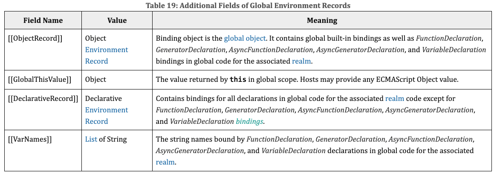

# ES6

## 词法环境

ES6 之前的相关术语

- 执行上下文栈：Execution Context Stack，用于执行上下文的栈结构；
- 执行上下文：Execution Context，代码在执行之前会先创建对应的执行上下文；
- 变量对象：Variable Object，上下文关联的VO对象，用于记录函数和变量声明；
- 全局对象：Global Object，全局执行上下文关联的VO对象；
- 激活对象：Activation Object，函数执行上下文关联的VO对象；
- 作用域链：Scope Chain，作用域链，用于关联指向上下文的变量查找；

**词法环境**

词法环境是一种特定类型，用于在代码的词法嵌套结构中定义变量、函数等特定标识符的关联

- 一个词法环境是由环境记录（Environment Record）和一个外部词法环境（Outer Lexical Environment）组成

- 一个词法环境经常用于关联特定的语法结构，比如函数声明、代码块、try-catch 语句

  一个新的词法环境会在这些语法结构的代码被执行时创建

- 在 ES5 之后，执行代码时执行上下文通常会关联对应的词法环境
  - LexicalEnvironment 用于处理 let、const 声明的标识符
  - VariableEnvironment 用于处理 var、function 声明的标识符
  
- 环境记录主要分为两种
  - 声明式环境记录：声明环境记录用于定义 ECMAScript 语言语法元素的效果
  
    比如函数声明、变量声明和直接将标识符绑定与 ECMAScript 语言值关联起来的 Catch 子句
  
  - 对象式环境记录：对象环境记录用于定义 ECMAScript 元素的效果
  
    比如将标识符绑定与某些对象的属性关联起来的 With 语句
  
  - 还有一些特殊的环境记录
  
    全局环境记录是一个声明环境记录和对象环境记录的组合环境记录
  
    

## let 和 const

ES6 开始新增了两个关键字可以声明变量：let 和 const

- let 用于声明变量，const 用于声明常量

  const 保存的数据一旦被赋值，就不能被修改

  但是如果赋值的是引用类型，那么可以通过引用找到对应的对象，修改对象的内容

  ```
  const message = "Hello" // 不允许修改
  const info = {
  	message: "World"
  }
  info.message = "There" // 可以修改
  ```

- let 和 const 不允许重复声明变量（同一个作用域中）

**作用域提升**

var 声明的变量是会进行作用域提升的，在声明之前访问的结果是 undefined

但是对于 let 或 const 声明的变量，在声明之前访问会报错

实际上 let 和 const 声明的变量会在包含它们的词法环境被实例化时被创建

但是直到它们的词法绑定求值以后才能被访问

总结：let 和 const 声明的变量没有进行作用域提升，但是会在解析阶段被创建出来

**暂时性死区**

在 let 和 const 定义的标识符真正执行到声明的代码之前，是不能被访问的

从块作用域的顶部一直到变量声明完成之前，这个变量处在暂时性死区（TDZ，temporal dead zone）

暂时性死区取决于代码的执行顺序，而不是代码的编写位置

```js
function foo() {
  console.log(message)
}
foo() // 访问不到 message
let message = "Hello World"
foo() // 可以访问 message
```

暂时性死区形成之后，在该区域内这个标识符不能被访问

```js
let message = "Hello World"
function foo() {
  console.log(message) // 访问不到
  let message = "hhhhh"
}
foo()
```

在全局作用域中，let 和 const 声明的变量不会像 var 一样在 window 上添加属性

- var 声明的变量在全局环境记录的对象环境记录（也就是全局对象 window）中
- 而 let、const 声明的变量在全局环境记录的声明环境记录中


## 块级作用域

ES6 之前只有全局作用域和函数作用域

ES6 中新增了块级作用域

通过 let、const、function、class 声明的标识符是具备块级作用域的限制的

在块级作用域中用 let、const、class 声明的标识符在外部都是不可以访问的

函数虽然具备块级作用域的限制，但是外部依然是可以访问的

因为引擎会对函数的声明进行特殊的处理，允许像 var 那样在外界访问

但是只能在函数声明后面访问

```js
// foo();
{
  function foo() {
    console.log("foo");
  }
}
foo()
```

块级作用域的应用案例

```js
var btns = document.querySelectorAll("button")
for (let i = 0; i < btns.length; i++) {
  btns[i].onclick = function() {
    console.log("第" + i + "个按钮被点击")
  }
}
```

> **var、let 和 const 如何选择**
>
> var 的大部分特性都是 JS 的设计缺陷导致的历史遗留问题
>
> 在开发过程中推荐使用 let 或 const
>
> - 优先推荐使用 const，这样可以保证数据的安全性不会被随意的篡改
> - 只有当我们明确知道一个变量后续会需要被重新赋值时，这个时候再使用 let

## 模板字符串

ES6 允许我们使用字符串模板来嵌入 JS 的变量或者表达式来进行拼接

- 使用 `` 符号编写的字符串叫做模板字符串
- 在模板字符串中，我们可以通过 ${expression} 来嵌入动态的内容

标签模板字符串

- 模板字符串可以用于函数调用，此时模板字符串会被拆分为参数传入函数
- 第一个参数是数组，包含模板字符串中表达式拆分的多个字符串
- 后面的参数是模板字符串中的多个动态内容

```js
const name = "me"
const age = 20

function foo(...args) {
  console.log(args)
}

foo`Hello${name}World${age}`

// args: [["Hello", "World"], "me", 20]
```

## 函数的默认参数

ES6 中，我们允许给函数的参数设置一个默认值

- 传入参数时，使用传入的参数
- 没有传入参数时，使用默认值

```js
function foo(arg1, arg2) {
  // 函数内设置默认值
  arg1 = arg1 ? arg1 : "default"
  arg2 = arg2 || "default"
  // 严谨的写法
  arg1 = (arg1 === undefined || arg1 === null) ? arg1 : "default"
  // 新增语法
  arg2 = arg2 ?? "default"
}

// 默认参数
function bar(arg1 = "default", arg2 = "default") {

}
```

注意事项

1. 传入参数为 null 时不会使用默认参数，undefined 会使用默认值

2. 一般把默认参数放到函数参数的最后

3. 有默认参数的形参包括其后面的参数，是不会计算到函数的 length 属性之内的
4. 有剩余参数的时候，剩余参数放到默认参数后面

默认值和解构一起使用

```js
// 写法一
function foo({ name, age } = { name: "me", age: 20 }) {
  console.log(name, age)    
}
// 写法二
function foo({ name = "why", age = "20" } = {}) {
  console.log(name, age)
}
```

## 展开语法

展开语法（Spread syntax）

- 可以在**函数调用**或**数组构造**时，将数组表达式或者字符串在语法层面展开（ES6）

  只能传入可迭代对象

- 还可以在**构造字面量对象**时, 将对象表达式按 key-value 的方式展开（ES9）

```js
const arr = ["a", "b", "c", "d"]
const str = "Hello"

function foo(...args) {
  console.log(args)
}

foo(...arr) // ["a", "b", "c", "d"]
foo(...str) // ["H", "e", "l", "l", "o"]

const obj = {
  name: "me",
  age: 20
}

const info = {
  ...obj, // 将 obj 中的属性浅拷贝到 info 里
  height: 1.88,
  address: "china"
}
```

展开运算符实际上是一种浅拷贝

引用类型数据在浅拷贝时只会拷贝其引用地址

## 数值的表示

ES6 中规范了二进制和八进制的写法

- 二进制数值：`0b` 开头
- 八进制数值：`0o` 开头
- 十六进制数值：`0x` 开头

ES 2021 新增特性：数字过长时，可以使用 `_` 作为连接符

`const num = 100_000_000`

## Symbol

Symbol 是 ES6 中新增的一个基本数据类型，翻译为符号

- Symbol 出现的意义是解决对象属性名可能冲突的问题

- Symbol 值是通过 Symbol 函数来生成的，生成后可以作为属性名

  在 ES6 以后，对象的属性名可以使用字符串，也可以使用 Symbol 值

- Symbol 即使多次创建值，它们也是不同的

  因为 Symbol 函数执行后每次创建出来的值都是独一无二的

Symbol 的使用

```js
const s1 = Symbol()
const s2 = Symbol()
const obj = {
  [s1]: "cba"
}
obj[s2] = "nba"
```

Symbol 函数也可以传入一个描述 description（ES10 特性）

```js
const s1 = Symbol("aaa")
console.log(s1.description) // aaa
const s2 = Symbol(s1.description)
s1 === s2 // false
```

`Object.keys(obj)` 只能获取非 Symbol 属性名对应的 keys

`Object.getOwnPropertySymbols(obj)` 可以获取 Symbol 属性名对应的 keys

```js
consy symbolKeys = Object.getOwnPropertySymbols(obj)
for (const key of symbolKeys) {
    console.log(obj[key])
}
```

`Symbol.for()` 可以传入 key 创建相同的 symbol 值

`Symbol.keyFor()` 可以获取 symbol 对应的 key

```js
const s1 = Symbol.for("abc")
const s2 = Symbol.for("abc")

s1 === s2 // true
const key = Symbol.keyFor(s1) // abc
const s3 = Symbol.for(key)
s1 === s3 // true
```

## Set 和 Map

ES6 之前存储多项数据元素的数据解构主要使用数组和对象

ES6 新增了 Set、Map，以及它们的另外形式 WeakSet、WeakMap

### Set

Set 是一个新增的数据结构，可以用来保存数据

类似于数组，但是和数组的区别是元素不能重复

创建 Set

```js
const set1 = new Set()
set1.add(10)
set1.add(12)
set1.add(14)
console.log(set1) // { 10, 12, 14 }
```

创建 Set 的时候传入数组可以给数组去重

```js
arr = [10, 20, 30, 10, 30]
const set2 = new Set(arr)
console.log(set2) // { 10, 20, 30 }
```

Set 转换成数组

```js
const newArr1 = [...set2]
const newArr2 = Array.from(set2)
```

Set 也是支持 `for of` 的遍历的

常见属性

- `size`：返回 Set 中元素的个数

常见方法

- `add(value)`：添加某个元素，返回 Set 对象本身

- `delete(value)`：从 set 中删除和这个值相等的元素，返回 boolean 类型

- `has(value)`：判断 set 中是否存在某个元素，返回 boolean 类型

- `clear()`：清空 set 中所有的元素，没有返回值

- `forEach(callback, thisArg)`

  回调函数的参数包含元素的值、元素的键以及被遍历的 set

  因为 set 中没有键所以前两个参数都是元素的值

### WeakSet

>Weak Reference 弱引用：GC 在检查可达性的时候会忽略弱引用，如果对象只有弱引用，则会因不可达被 GC 回收掉
>
>Strong Reference 强引用

WeakSet 的基本使用和 Set 相同，区别在于

- WeakSet 中只能存放对象类型，不能存放基本数据类型

- WeakSet 对元素的引用是弱引用，如果没有其他引用对 WeakSet 中的某个对象进行引用

  那么 GC 可以对该对象进行回收

- WeakSet 是不能遍历的，因为 WeakSet 只是对对象的弱引用，如果我们遍历获取到其中的元素，那么有可能造成对象不能正常的销毁，所以存储到 WeakSet 中的对象是没办法获取的

常见方法

- `add(value)`：添加某个元素，返回 WeakSet 对象本身

- `delete(value)`：从 WeakSet 中删除和这个值相等的元素，返回 boolean 类型

- `has(value)`：判断 WeakSet 中是否存在某个元素，返回 boolean 类型

### Map

另外一个新增的数据结构是 Map，用于存储映射关系

Map 和对象的区别

- 对象只能使用字符串或者 Symbol 作为 key
- Map 可以使用其他类型作为 key

创建 Map

```js
const obj1 = { name: "me" }
const obj2 = { age: 20 }

const map = new Map()
map.set(obj1, "aaa")
map.set(obj2, "bbb")
console.log(map.get(obj1))
console.log(map.get(obj2))

const map1 = new Map([
    [obj1, "aaa"],
    [obj2, "bbb"]
])
```

常见属性：

- `size`：返回 Map 中元素的个数

常见方法：

- `set(key, value)`：在 Map 中添加 key、value，并且返回整个 Map 对象

- `get(key)`：根据 key 获取 Map 中的 value

- `has(key)`：判断是否包括某一个 key，返回 Boolean 类型

- `delete(key)`：根据 key 删除一个键值对，返回 Boolean 类型

- `clear`：清空所有的元素

- `forEach(callback, thisArg)`：通过 forEach 遍历 Map

  回调函数的参数包含元素的值、元素的键以及被遍历的 map

Map 也可以通过 `for of` 进行遍历

```js
for (const item of map) {
    const [key, value] = item
    console.log(key, value)
}
```

### WeakMap

WeakMap 的基本使用和 Map 相同，区别在于

- WeakMap 的 key 只能使用对象，不接受其他的类型作为 key
- WeakMap 的 key 对对象的引用是弱引用，如果没有其他引用引用这个对象，那么 GC 可以回收该对象
- WeakMap 也是不能遍历的，没有 forEach 方法，也不支持 for of

常见方法：

- `set(key, value)`：在 WeakMap 中添加 key、value，并且返回整个 WeakMap 对象

- `get(key)`：根据 key 获取 WeakMap 中的 value

- `has(key)`：判断 WeakMap 是否包括某一个 key，返回 Boolean 类型

- `delete(key)`：根据 key 删除一个键值对，返回 Boolean 类型

# ES7

- `arr.includes(valueToFind, fromIndex)`
- 指数运算符：`**`

# ES8

- Async Function：async、await

## 对象新增方法

- `Object.getOwnPropertyDescriptors()`：获取对象的多个属性的属性描述符

- `Object.values(obj)`：获取所有的 value 值

  传入字符串可以获得包含每个字符的数组

- `Object.entries(obj)`：获取存放可枚举属性的键值对数组

  可以用于对象、数组、字符串

  ```js
  const obj = {
      name: "me",
      age: 20,
      height: 1.88
  }
  const arr = ["a", "b", "c"]
  const str = "you"
  
  console.log(Object.entries(obj)) // [["name", "me"], ["age", 20], ["height", 1.88]]
  console.log(Object.entries(arr)) // [["0", "a"], ["1", "b"], ["2", "c"]]
  console.log(Object.entries(str)) // [["0", "y"], ["1", "o"], ["2", "u"]]
  ```

## 字符串填充

有时候我们需要对某些字符串进行前后的填充，来实现某种格式化效果

ES8 中增加了 `padStart` 和 `padEnd` 方法，分别用于对字符串的首尾进行填充

```js
const minute = "15".padStart(2, "0")
const second = "2".padStart(2, "0")
console.log(`${minute}:${second}`) // 15:02
```

常用于对时间和一些固定格式数据的格式化（比如对身份证、银行卡的前面位数进行隐藏）

## Trailing Commas

在 ES8 中，我们允许在函数定义和调用时多加一个逗号

``` js
function foo(a, b,) {
    
}

foo(10, 20,)
```

# ES9

- Async iterators
- Object spread operators
- Promise finally

# ES10

- Symbol description
- Optional catch binding

## flat 和 flatMap

`flat()` 方法会按照一个可指定的深度递归遍历数组，并将所有元素与遍历到的子数组中的元素合并为一个新数组返回

主要用于数组降维

```js
const nums = [10, 20, [5, 8], [[2, 3], [8, 9]]]

const newNums1 = nums.flat(1) // [10, 20, 5, 8, [2, 3], [8, 9]]
const newNums2 = nums.flat(2) // [10, 20, 5, 8, 2, 3, 8, 9]
```

`flatMap()` 方法首先使用映射函数映射每个元素，然后将结果压缩成一个新数组

- flatMap 是先进行 map 操作，再做 flat 的操作
- flatMap 中的 flat 相当于深度为 1

```js
const arr = [
    "a b",
    "c d",
    "e f"
]

const newArr1 = arr.map(item => item.split(" "))
console.log(newArr1) // [["a", "b"], ["c", "d"], ["e", "f"]]

const newArr2 = arr.flatMap(item => {
    return item.split(" ")
})
console.log(newArr2) // ["a", "b", "c", "d", "e", "f"]
```

## entries 转换对象

`Object.fromEntries()` 可以将 entries 转换成对象

```js
const obj = {
    name: "me",
    age: 20,
    height: 1.88
}

const entries = Object.entries(obj)
console.log(entries) // [["name", "me"], ["age", 20], ["height", 1.88]]

const info = Object.fromEntries(entries)
```

应用场景

```js
const paramsStr = "?name=me&age=20&height=1.88"
const params = new URLSearchParams(paramsStr)
const paramsObj = Object.fromEntries(params)
```

## 去除首尾空格

我们可以通过 `trim` 方法，去除一个字符串首尾的空格

ES10 中的 `trimStart` 和 `trimEnd` 可以单独去除首部和尾部的空格

```js
const message = "   Hello World   "
console.log(message.trim())
console.log(message.trimStart())
console.log(message.trimEnd())
```

# ES11

- ES11 中对获取全局对象进行了统一的规范：`globalThis`
  - 以前浏览器中可以通过 `this / window` 获取
  - Node 中可以通过 `global` 获取
- ES11 中对 `for in` 进行了标准化，用于遍历对象的 key
- Dynamic Import
- Promise.allSettled
- import meta

## BigInt

在早期的JavaScript中，我们不能正确的表示过大的数字

大于 MAX_SAFE_INTEGER的数值，表示的可能是不正确的

ES11 中，引入了新的数据类型 BigInt，用于表示大的整数

BitInt 的表示方法是在数值的后面加上 n

## 空值合并运算符

空值合并运算符 Nullish Coalescing Operator `??`

当左侧的操作数为 null 或者 undefined 时，返回其右侧操作数，否则返回左侧操作数。

与逻辑或运算符（||）不同，逻辑或运算符会在左侧操作数为假值时返回右侧操作数

```js
const foo = ""

const result1 = foo || "r1"
const result2 = foo ?? "r2"

console.log(result1) // r1
console.log(result2) // ""
```

## 可选链

可选链 `?.` 也是 ES11 中新增一个特性

主要作用是让我们的代码在进行 null 和 undefined 判断时更加清晰和简洁

```js
const info = {
    friend: {
        running: function() {
            console.log("running")
        }
    }
}

// 直接调用
info.friend.running()

// 判断是否为空
if (info.friend && info.friend.running) {
    info.friend.running()
}

// 可选链的写法
info?.friend?.name
info?.friend?.running?.()
```

# ES12

- Numeric Seperator：数字分割符

- `str.replaceAll()`：字符串替换

  `replace()` 的扩展

## FinalizationRegistry

FinalizationRegistry 对象可以让你在对象被垃圾回收时请求一个回调

当一个在注册表中注册的对象被回收时，请求在某个时间点上调用一个清理回调（finalizer）

FinalizationRegistry 对象可以通过调用register方法，注册任何你想要清理回调的对象，传入该对象和所含的值

```js
let obj = { name: "me" }

const registry = new FinalizationRegistry(value => {
    console.log("对象被销毁了", value) // obj value
})

registry.register(obj, "obj value")

obj = null
```

## WeakRef

如果我们默认将一个对象赋值给另外一个引用，那么这个引用是一个强引用

如果我们希望是一个弱引用的话，可以使用 WeakRef

```js
let obj = { msg: "Hello" } // 强引用
const info1 = obj // 强引用赋值

const info2 = new WeakRef(obj) // 弱引用赋值
console.log(info2.deref().msg) // "Hello"

obj = null 
// obj 的引用清除以后 info1 引用的对象不会被销毁
// obj 的引用清除以后 info2 引用的对象会被销毁，因为 info2 是弱引用赋值
```

## 逻辑赋值运算符

```js
let message = ""
// 逻辑或赋值
message ||= "Hello" // 等价于 message =  message || "Hello"
// 逻辑空赋值
message ??= "Hello" // 等价于 message =  message ?? "Hello"
// 逻辑与赋值
const info = {
    name: "me"
}
info &&= info.name // 等价于 info = info && info.name
```

# ES13

## at

`at(index)`

可以用于字符串或数组

接收一个整数值并返回该索引对应的元素或字符，允许正数和负数

负整数从数组中的最后一个元素或字符串的最后一个字符开始倒数

## hasOwn

Object 中新增了一个静态方法（类方法）

`Object.hasOwn(obj, propKey)`

该方法用于判断一个对象中是否有某个自己的属性

和 `Object.prototype.hasOwnProperty` 的区别

- 防止对象内部有重写 hasOwnProperty

  ```js
  var obj = {
      name: "me",
      hasOwnProperty() {
          return false
      }
  }
  ```

- 对于隐式原型指向 null 的对象，hasOwnProperty 无法进行判断

  ```js
  var info = Object.create(null)
  info.name = "me"
  console.log(info.hasOwnProperty("name")) // 报错
  console.log(Object.hasOwn(info, "name")) // 可以判断
  ```

## class 新成员

在 ES13 中，新增了定义 class 类中成员字段（field）的其他方式

公共类字段

```js
class Person {
  // Instance public field 公共实例属性
  address = "china"

  // Static public field 公共类属性（静态属性）
  static population = "70亿"

  // Instance public method 公共实例方法
  publicMethod() {
    return "public method has been called"
  }

  // Static public method 公共类方法（静态方法）
  static publicStaticMethod() {
    return "public static method has been called"
  }
}
```

私有类字段

```js
class Person {
  // Instance private field 私有实例属性
  #sex = "male"

  // Static private field 私有类属性（静态属性）
  static #malePopulation = "20亿"

  // Instance private method 私有实例方法
  #privateMethod() {
    return "private method has been called"
  }

  // Static private method 私有类方法（静态方法）
  static #privateStaticMethod() {
    return "private static method has been called"
  }
}
```

static：类通过 static 关键字定义静态属性、静态方法和静态代码块

不能在类的实例上调用静态方法，而应该通过类本身调用

```js
class Person {
    // 静态属性
    static population = "70亿"
    // 静态方法
    static staticMethod() {
    	return "static method has been called"
  	}
    // 静态代码块
    static {
    	console.log('Class static initialization block called');
  	}
}
```

静态代码块会在类被声明的时候调用
