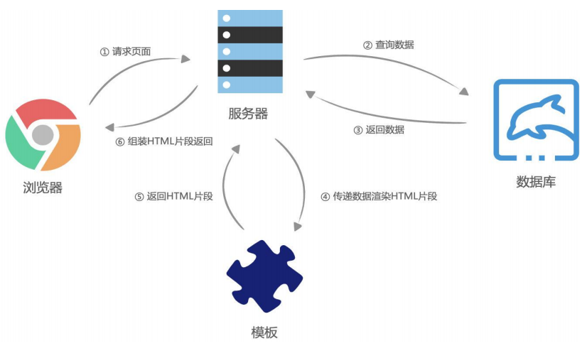
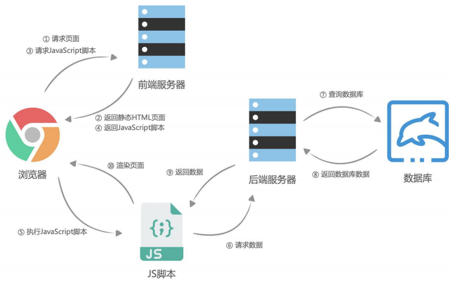
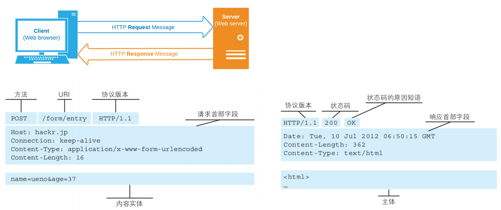
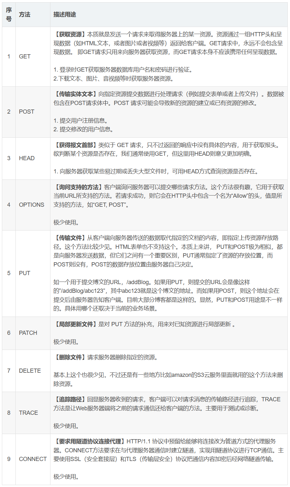
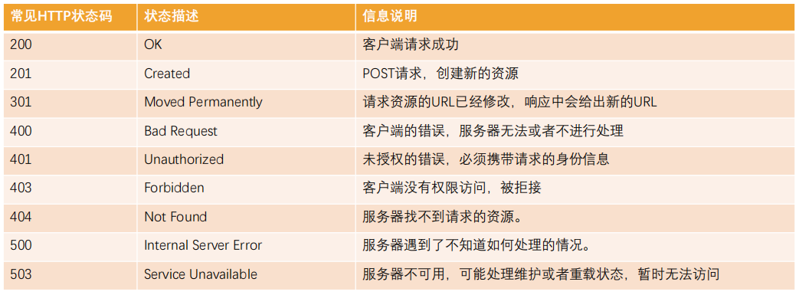
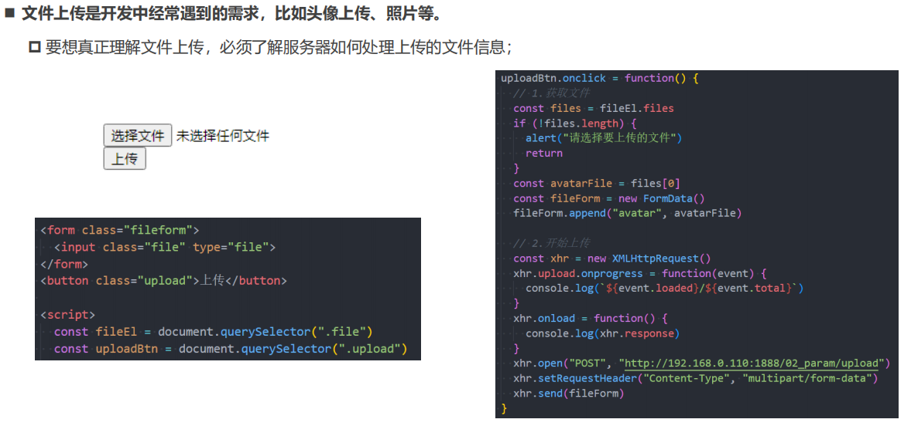
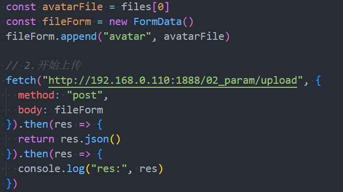

# JS 网络编程

## 前后端分离

### SSR

服务器端渲染 SSR server side render

1. 客户端发出请求
2. 服务端接收请求并返回相应 HTML 文档
3. 页面刷新，客户端加载新的 HTML 文档

SSR 的缺点

- 页面的一部分数据变化却需要重绘整个页面再返回给浏览器加载，重复性极高
- 每次都需要返回整个 HTML 文档，会给网络带宽带来不必要的开销



### AJAX

AJAX：Asynchronous JavaScript And XML

- AJAX 是一种无页面刷新的服务器数据获取技术
- AJAX 的异步特性可以让它在不重新刷新页面的情况下与服务器通信，交换数据或更新页面
- AJAX 是前后端分离的核心



## HTTP

###  概念

HTTP 即超文本传输协议（HyperText Transfer Protocol）是一种用于分布式、协作式和超媒体信息系统的应用层协议

- HTTP 是万维网的数据通信的基础，设计 HTTP 最初的目的是为了提供一种发布和接收 HTML 页面的方法
- 通过 HTTP 或者 HTTPS 协议请求的资源由统一资源标识符（Uniform Resource Identifiers，URI）来标识

HTTP 本质上是一个客户端（用户）和服务端（网站）之间请求和响应的标准

- 客户端（用户代理程序）通过使用网页浏览器、网络爬虫或者其它的工具发起一个HTTP请求到服务器上指定端口（默认端口为80）
- 服务端（响应服务器，源服务器）上存储着一些资源，比如HTML文件和图像，接收到请求后将相应的资源返回给客户端

HTTP 的应用

- 网页中的资源通常是被放在 Web 资源服务器中，由浏览器自动发送 HTTP 请求来获取、解析、展示的
- 网页中的动态数据也是通过在 JavaScript 中发送 HTTP 请求获取的

### HTTP 请求

一次HTTP请求主要包括：请求（Request）和响应（Response）



[HTTP 请求方法](https://developer.mozilla.org/zh-CN/docs/web/http/methods)



[HTTP 响应状态码](https://developer.mozilla.org/zh-CN/docs/Web/HTTP/Status)



### 常见标头

- **content-type**：请求携带的数据类型
  - application/x-www-form-urlencoded：表示数据被编码成以 '&' 分隔的键值对，同时以 '=' 分隔键和值
  - application/json：表示是一个 json 类型
  - text/plain：表示是文本类型
  - application/xml：表示是 xml 类型
  - multipart/form-data：表示是上传文件

- content-length：文件的大小长度（自动计算）

- keep-alive

  http 是基于 TCP 协议的，但是通常在进行一次请求和响应结束后会立刻中断

  - 在 http1.0 中，如果想要继续保持连接：
    - 浏览器需要在请求头中添加 connection: keep-alive
    - 服务器需要在响应头中添加 connection: keey-alive
    - 当客户端再次放请求时，就会使用同一个连接，直至一方中断连接

  - 在 http1.1 中，所有连接默认添加 connection: keep-alive

    - 不同的 Web 服务器会有不同的保持 keep-alive 的时间

    - Node 中默认是 5s

- accept-encoding：告知服务器，客户端支持的文件压缩格式

  比如 js 文件可以使用gzip编码，对应 .gz文件

- accept：告知服务器，客户端可接受文件的格式类型
- user-agent：客户端相关的信息

## XHR

### 发送请求

AJAX 可以使用 JSON、XML、HTML 和 text 文本等格式发送和接收数据

使用 XHR 发送网络请求的步骤

1. 创建 xhr 实例对象用于网络请求：使用 XMLHttpRequest 类

2. 监听 xhr 对象状态的变化：

   监听 onreadystatechange（状态改变时触发） 或者 onload 事件（请求完成时触发）

3. 配置网络请求：通过 `open(method, url)` 方法
4. 发送网络请求：通过 `send()` 方法

```js
// 1.创建 xhr 实例对象
const xhr = new XMLHttpRequest()
// 2.监听 xhr 对象状态的变化
xhr.onreadystatechange = function() {
    if (xhr.readyState !== XMLHttpRequest.DONE) return
    console.log(xhr.response)
    
    const resJSON = JSON.parse(xhr.response)
    console.log(resJSON)
}
// 3.配置网络请求
xhr.open("get", "http://dataurl")
// 4.发送网络请求
xhr.send()
```

异步请求和同步请求

- 异步请求不会阻塞后续代码的执行

- open 的第三个参数设置为 false 时会发送同步请求

- 同步请求必须等到请求有结果才会执行后续代码
- 实际开发中一般使用异步请求

### xhr 的状态

一次请求中状态会发生多次改变

不同状态对应的 readyState 属性不同

- 0：UNSENT

  代理被创建，但尚未调用 open() 方法

- 1：OPENED 

  open() 方法已经被调用

- 2：HEADERS_RECEIVED

  send() 方法已经被调用，并且头部和状态已经可获得

- 3：LOADING 

  下载中，responseText 属性已经包含部分数据

- 4：DONE 

  下载操作已完成

readyState 是 xhr 对象的状态而不是 HTTP 的响应状态

### xhr 的事件

- onreadystatechange：xhr 状态改变
- loadstart：请求开始
- progress：一个响应数据包到达，此时整个 response body 都在 response 中

- abort：调用 xhr.abort() 取消了请求

- error：发生连接错误，域错误或资源错误

- load：请求成功完成
- timeout：由于请求超时而取消了该请求（仅发生在设置了 timeout 的情况下）
- loadend：在 load、error、timeout 或 abort 之后触发

### xhr 的响应数据和类型

`xhr.response` 可以获取响应的正文内容，返回的类型取决于 xhr.responseType

`xhr.responseType` 可以设置或获取响应数据的类型

- 设置为空字符串时，会使用 text 作为默认值
- 可以设置为 json，获取到的 response 不需要解析可以直接使用

当返回的数据是普通文本时，也可以通过 responseText 获取响应结果

当返回的数据是 XML 时，也可以通过 responseXML 来获取响应结果

### HTTP 响应状态

`xhr.status` 用于获取 HTTP 的响应状态码

`xhr.statusText` 用于获取 HTTP 的响应状态描述

```js
xhr.onload = function() {
    if (xhr.status >= 200 && xhr.status < 300) {
        console.log(xhr.response)
    } else {
        console.log(xhr.status, xhr.statusText)
    }
}
```

### xhr 传递参数

在发送请求中，我们也可以传递给服务器数据

常见的传递方式

1. GET 请求：query 参数

   ```js
   xhr.open("get", "http://xxx.xxx.xx.xx/api/getquery?name=me&age=18")
   xhr.send()
   ```

2. POST 请求：x-www-form-urlencoded 格式

   ```js
   xhr.open("post", "http://xxx.xxx.xx.xx/api/posturl")
   const urlParam = "name=me&age=18"
   xhr.setRequestHeader('Content-type', 'application/x-www-form-urlencoded')
   xhr.send(urlParam)
   ```

3. POST 请求：FormDara 格式

   ```js
   xhr.open("post", "http://xxx.xxx.xx.xx/api/postform")
   const infoEl = document.querySelector(".info")
   const formData = new FormData(infoEl)
   formData.append("height", 1.8)
   xhr.send(formData)
   ```

4. POST 请求：JSON 格式

   ```js
   xhr.open("post", "http://xxx.xxx.xx.xx/api/postjson")
   const jsonParam = JSON.stringfy({ name: "me", age: 22 })
   xhr.setRequestHeader('Content-type', 'application/json; charset=utf-8')
   xhr.send(jsonParam)
   ```


### 超时和取消

`xhr.timeout` 属性可以设置请求的超时时间

- 当超时事件后依然没有获取到数据，那么这个请求会自动被取消掉
- 默认值为 0，表示没有设置超时时间

```js
const xhr = new XMLHttpRequest()

xhr.onload = function() {
    console.log(xhr.response)
}

xhr.ontimeout = function() {
    console.log("xhr timeout")
}

xhr.responseType = "json"
xhr.timeout = 3000
xhr.open("get", "http://xxx.xxx.xx.xx/api/get")
xhr.send()
```

`xhr.abort()` 方法可以强制取消请求

```js
xhr.onabort = function() {
    console.log("abort xhr")
}

xhr.abort()
```

## Fetch

Fetch 是早期的 XHR 的替代方案，提供了一种更加现代的处理方案

Fetch 的返回值是一个 Promise

- 在请求发送成功时，调用 resolve 回调 then
- 在请求发送失败时，调用 reject 回调 catch

### fetch 方法

`Promise<Response> fetch(input[, init]);`

- input：定义要获取的资源地址
  - URL 字符串
  - Request 对象
- init：一个配置项对象，包含所有对请求的设置
  - method：请求的方法
  - headers：请求的头信息
  - body：请求的 body 信息

### fetch 数据响应

fetch 的数据响应的两个阶段

**阶段一：服务器返回 response**

- fetch 返回的 promise 就使用内建的 Response class 对象来对响应头进行解析
- 在这个阶段，我们可以通过检查响应头，来检查 HTTP 状态以确定请求是否成功
- 如果 fetch 无法建立一个 HTTP 请求，例如网络问题，亦或是请求的网址不存在，那么 promise 就会 reject

- 异常的 HTTP 状态，例如 404 或 500，不会导致出现 error

```js
fetch(url).then(response => {

}).catch(error => {
    
})
```

response 的属性中可以看到 HTTP 状态

- response.status：HTTP 响应状态码
- response.statusText：HTTP 响应状态描述

- response.ok：布尔值，如果 HTTP 状态码为 200-299，则为 true

**阶段二：获取 response body**

获取数据需要调用再调用一个方法读取 response

- response.text()：读取 response，并以文本形式返回 response
- response.json()：将 response 解析为 JSON

```js
fetch(url).then(response => {
    response.json().then(res => {
        console.log(res)
    })
}).catch(error => {
    
})

// 优化一
fetch(url).then(response => {
    return response.json()
}).then(res => {
    console.log(res)
})catch(error => {
    
})

// 优化二
async function getData(url) {
    const response = await fetch(url)
    const res = await response.json()
    return res
}

getData(url).then(res => {
    
}).catch(err => {
    
})
```

### fetch 传递参数

1. GET 请求：query 参数

   ```js
   async function getData() {
       const response = await fetch("http://xxx.xxx.xx.xx/api/getquery?name=me&age=18")
       const res = await response.json()
       return res
   }
   ```

2. POST 请求：x-www-form-urlencoded 格式

   ```js
   async function getData() {
       const response = await fetch("http://xxx.xxx.xx.xx/api/posturl", {
           method: "post",
           headers: {
               'Content-type': 'application/x-www-form-urlencoded'
           },
           body: "name=me&age=18"
       })
       const res = await response.json()
       return res
   }
   ```

3. POST 请求：FormDara 格式

   ```js
   async function getData() {
       const formData = new FormData()
       formData.append("name", "me")
       formData.append("age", 18)
       const response = await fetch("http://xxx.xxx.xx.xx/api/postform", {
           method: "post",
           body: formData
       })
       const res = await response.json()
       return res
   }
   ```

4. POST 请求：JSON 格式

   ```js
   async function getData() {
       const response = await fetch("http://xxx.xxx.xx.xx/api/postjson", {
           method: "post",
           headers: {
               'Content-type': 'application/json'
           },
           body: JSON.stringify({
               name: "me",
               age: 18
           })
       })
       const res = await response.json()
       return res
   }
   ```

## 文件上传

XHR 实现文件上传



Fetch 也支持文件上传，但是没办法监听进度

