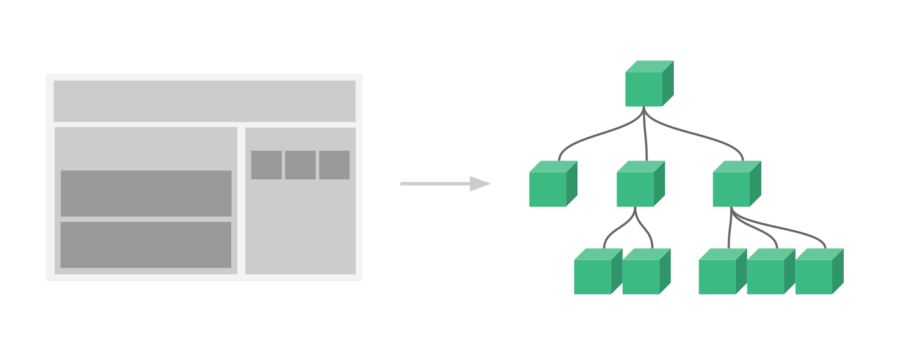

# 组件化

组件化开发的思想

- 将一个完整的页面拆分成很多个组件
- 每个组件用于实现页面的一个功能
- 每一个组件又可以继续拆分成更小的组件
- 组件本身可以在多个地方复用

Vue 的组件化

- createApp 函数传入的对象本质上是一个组件，也是应用程序的根组件
- 组件化提供了一种抽象，让我们可以开发出一个个独立可复用的小组件来构造我们的应用
- 任何的应用都会被抽象成一颗组件树



# 组件注册

## 全局组件

组件模板

```html
<template id="MyComponent">
	<h1>{{ title }}</h1>
  <button @click="btnClick">按钮</button>
</template>
```

用 `component()` 方法传入组件名字和组件对象以注册全局组件

```js
import { createApp } from 'vue'

const app = createApp({})

app.component(
  // 组件名字
  'MyComponent',
  // 组件对象
  {
    // 组件对应的模板，可以写模板字符串，也可以写模板对应的 template 元素的 id
    template: "#MyComponent",
    data() {
      return {
        title: "组件标题"
      }
    }，
    methods: {
      btnClick() {
        console.log('click btn')
      }
  	}
	}
)
```

如果使用单文件组件，可以注册导入的 `.vue` 文件

```js
import MyComponent from './App.vue'

app.component('MyComponent', MyComponent)
```

> 组件名称的命名格式有两种
>
> 1. component-name 在使用时也需要使用 component-name
> 2. ComponentName 在使用时可以使用 ComponentName 或 component-name

## 局部组件

局部注册需要使用 `components` 选项

```vue
<template>
  <ComponentA />
</template>

<script>
import ComponentA from './ComponentA.vue'

export default {
  components: {
  	ComponentA,
    "component-name": ComponentFile
  }
}
</script>
```

局部注册的组件在后代组件中并不可用

`components` 选项中注册的组件仅在当前组件可用

而在任何的子组件或更深层的子组件中都不可用

> 全局注册和局部注册的比较
>
> 1. 全局注册的组件没有被使用时也会被打包（即无法 tree-shaking）
>
>    全局注册会使项目的依赖关系变得不那么明确
>
>    即不容易定位子组件的实现，影响应用的长期可维护性
>
> 2. 局部注册需要在父组件中显式导入，并且只能在该父组件中使用
>
>    优点是使组件之间的依赖关系更加明确，并且对 tree-shaking 更加友好

# 单文件组件

Vue 的单文件组件 (即 `.vue` 文件，英文 Single-File Component，简称 SFC ) 是一种特殊的文件格式

使我们能够将一个 Vue 组件的模板、逻辑与样式封装在单个文件中

```vue
<script>
export default {
  data() {
    return {
      greeting: 'Hello World!'
    }
  }
}
</script>

<template>
  <p class="greeting">{{ greeting }}</p>
</template>

<!-- Add "scoped" attribute to limit CSS to this component only -->
<style scoped>
.greeting {
  color: red;
  font-weight: bold;
}
</style>
```

使用 SFC 必须使用构建工具，但带来了以下优点

- 组件模块化
- 让组件的代码关注点更加内聚
- 预编译模板，避免运行时的编译开销
- 组件作用域的 CSS
- 模块热更新

# 生命周期

每个组件都可能会经历从创建、挂载、更新、卸载等一系列的过程

在这个过程中的某一个阶段，我们可能会想要添加一些属于自己的代码逻辑

Vue 中提供了特定的生命周期函数

- 本质上是钩子函数，在某个时间会被 Vue 源码内部进行回调
- 可以让我们确定目前组件处于什么阶段
- 在生命周期函数中可以编写相应阶段需要处理的逻辑代码


常见的生命周期函数使用场景

1. created
   - 发送网络请求
   - 事件监听
   - `this.$watch()`
2. mounted
   - 获取 DOM
   - 使用 DOM
3. unmounted
   - 回收操作
   - 取消事件监听

# 组件通信

## 父传子

### props 通信

**父组件传递给子组件**：通过 `props` 属性

1. 在组件的 `props` 中注册自定义的 prop
2. 父组件给这些 prop 赋值
3. 子组件通过 prop 的名称获取到对应的值

### props 的两种用法

1. 字符串数组，数组中的字符串就是 prop 的名称

   ```js
   export default {
     props: ["title", "content"]
   }
   ```

2. 对象类型，对象类型可以在指定 prop 名称的同时

   - 指定需要传入的类型

     type 支持的类型包含：`String | Number | Boolean | Array | Object | Date | Function | Symbol`

     type 也可以是自定义的类或构造函数，Vue 会通过 instanceof 检查类型是否匹配

   - 指定是否必传

   - 指定没有传入时的默认值

   ```js
   export default {
     props: {
       id：{
       	type: Number,
       	required: true
     	},
       title: {
         type: String,
         default: "default title"
       },
       content: {
         type: String,
         default: "default content"
       }
     }
   }
   ```

### props 单向数据流

props 遵循单向绑定原则，子组件应该避免修改 props

父组件更新 props 后，所有的子组件中的 props 都会被更新到最新值

对象和数组虽然因为引用传递可以对内部值进行修改

但是会使数据流难以理解，应该尽量避免这种操作

需要更改 props 的两种场景

1. 将 prop 作为子组件中数据的初始值

   ```js
   export default {
     props: ['initialCounter'],
     data() {
       return {
         // 计数器只是将 this.initialCounter 作为初始值
         // 像下面这样做就使 prop 和后续更新无关了
         counter: this.initialCounter
       }
     }
   }
   ```

2. 通过 computed 计算属性对传入的 prop 值进行转换

   ```js
   export default {
     props: ['size'],
     computed: {
       // 该 prop 变更时计算属性也会自动更新
       normalizedSize() {
         return this.size.trim().toLowerCase()
       }
     }
   }
   ```

### props 的校验

要声明对 props 的校验，你可以向 `props` 选项提供一个带有 props 校验选项的对象

- required 默认为 false
- 除布尔类型以外的未传递 prop 默认值为 undefined
- 布尔类型的未传递 prop 默认值为 false
- 如果声明了 default 值，未传递 prop 或传递值为 undefined 时，会改为 default 值

```js
export default {
  props: {
    // 基础类型检查
    //（给出 `null` 和 `undefined` 值则会跳过任何类型检查）
    propA: Number,
    // 多种可能的类型
    propB: [String, Number],
    // 必传，且为 String 类型
    propC: {
      type: String,
      required: true
    },
    // Number 类型的默认值
    propD: {
      type: Number,
      default: 100
    },
    // 对象类型的默认值
    propE: {
      type: Object,
      // 对象或者数组应当用工厂函数返回。
      // 工厂函数会收到组件所接收的原始 props
      // 作为参数
      default(rawProps) {
        return { message: 'hello' }
      }
    },
    // 自定义类型校验函数
    propF: {
      validator(value) {
        // The value must match one of these strings
        return ['success', 'warning', 'danger'].includes(value)
      }
    },
    // 函数类型的默认值
    propG: {
      type: Function,
      // 不像对象或数组的默认，这不是一个
      // 工厂函数。这会是一个用来作为默认值的函数
      default() {
        return 'Default function'
      }
    }
  }
}
```

> 注意 prop 的校验是在组件实例被创建之前
>
> 所以实例的属性 (比如 data、computed 等) 将在 default 或 validator 函数中不可用

### props 的名字格式

推荐在注册 prop 时使用 camelCase

```js
export default {
  props: {
    greetingMessage: String
  }
}
```

在向子组件传递 prop 时使用 kebab-case

```js
<MyComponent greeting-message="hello" />
```

组件名推荐使用 PascalCase，以区分 Vue 组件和原生 HTML 元素

### 透传 Attributes

透传 attribute 指的是传递给一个组件

却没有被该组件声明为 props 或 emits 的 attribute 或者 v-on 事件监听器

最常见的是 class、style 和 id

当一个组件以单个元素为根作渲染时，透传的 attribute 会自动被添加到组件的根元素上

```vue
<!-- <MyButton> 的模板 -->
<button>click me</button>

<!-- 父组件 -->
<MyButton class="large" />

<!-- 最后渲染出的 DOM 结果 -->
<button class="large">click me</button>
```

如果子组件的根元素已经有了 class 或 style，会和透传的 class 和 style 合并

```js
<!-- <MyButton> 的模板 -->
<button class="btn">click me</button>

<!-- 父组件 -->
<MyButton class="large" />

<!-- 最后渲染出的 DOM 结果 -->
<button class="btn large">click me</button>
```

组件上添加的 v-on 事件监听器会被添加到根元素上

当原生的 `<button>` 被点击，会触发父组件的 `onClickParent` 方法

同样的，如果原生 `button` 元素自身也通过 `v-on` 绑定了一个事件监听器

则这个监听器和从父组件继承的监听器都会被触发

```js
<!-- <MyButton> 的模板 -->
<button @click="onClickChild">click me</button>

<!-- 父组件 -->
<MyButton @click="onClickParent" />
```

**禁用 Attributes 继承**

- 在组件选项中设置 `inheritAttrs: false` 可以阻止组件自动地继承 attribute

- 禁用的常见应用场景是通过 `$attrs` 对象手动控制透传的 attribute 如何使用

- `$attrs` 对象包含了除组件所声明的 `props` 和 `emits` 之外的所有其他 attribute

  例如 `class`，`style`，`v-on` 监听器等等

- 透传 attributes 在 JavaScript 中保留了它们原始的大小写

  `foo-bar` 需要通过 `$attrs['foo-bar']` 来访问

- `@click` 将在此对象下暴露为一个函数 `$attrs.onClick`

**多根节点的 Attributes 继承**

多个根节点的组件没有自动 attribute 透传行为

而是需要显式绑定透传 attributes

如果没有显示绑定 `$attrs`，会抛出一个运行时警告

```js
<header>...</header>
<main v-bind="$attrs">...</main>
<footer>...</footer>
```

**深层组件继承**

在组件根节点渲染另一个组件时，组件接收的透传 attributes 会继续传给下一层组件

但是传到下一层的 attribute 不包含当前层声明过的 props 和侦听函数

透传的 attribute 若符合声明，也可以作为 props 传入下一层

```js
<!-- <MyButton/> 的模板（渲染另一个组件）-->
<BaseButton /> 
```

## 子传父

### 事件通信

**子组件传递给父组件**：通过 `$emit` 触发事件

1. 在父组件中通过 `v-on` 监听事件

   ```vue
   <MyComponent @some-event="callback" />
   
   <!-- 支持修饰符 -->
   <MyComponent @some-event.once="callback" />
   ```

   推荐使用 kebab-case 形式来编写监听器

2. 在子组件中通过 `$emit` 触发事件

   ```vue
   <template>
     <!-- 在组件的模板表达式中触发 -->
     <button @click="$emit('someEvent')">click me</button>
   </template>
   
   <script>
     export default {
       methods: {
         submit() {
           // 在组件实例中触发
           this.$emit('someEvent')
         }
       }
     }
   </script>
   ```

   `$emit()` 中可以传递其他自定义参数

   所有传入的 `$emit()` 的额外参数都会直接传向监听器

> 和原生 DOM 事件不一样，组件触发的事件**没有冒泡机制**。你只能监听**直接子组件**触发的事件。
>
> 平级组件或是跨越多层嵌套的组件间通信，应使用一个外部的事件总线，或是使用一个[全局状态管理方案](https://cn.vuejs.org/guide/scaling-up/state-management.html)。

### 事件声明

组件可以显式地通过 emits 选项来声明它要触发的事件

```js
export default {
  emits: ['inFocus', 'submit']
}
```

emits 中可以对触发事件的参数进行校验

```js
export default {
  emits: {
    submit(payload) {
      // 通过返回值为 `true` 还是为 `false` 来判断
      // 验证是否通过
    }
  }
}
```

> 如果一个原生事件的名字 (例如 click ) 被定义在 emits 选项中
>
> 则监听器只会监听组件触发的 click 事件而不会再响应原生的 click 事件
>
> 即只可以通过子组件的 $emit 触发 click 事件
>
> 子组件本身通过鼠标点击触发的事件将被阻止

### 事件校验

emits 也支持对象语法，它允许我们对触发事件的参数进行验证

要为事件添加校验，那么事件可以被赋值为一个函数

- 接受的参数就是抛出事件时传入 `this.$emit` 的内容

- 返回一个布尔值来表明事件是否合法

```js
export default {
  emits: {
    // 没有校验
    click: null,
    // 校验 submit 事件
    submit: ({ email, password }) => {
      if (email && password) {
        return true
      } else {
        console.warn('Invalid submit event payload!')
        return false
      }
    }
  },
  methods: {
    submitForm(email, password) {
      this.$emit('submit', { email, password })
    }
  }
}
```

## 依赖注入

prop 逐级透传：使用 props 传递数据只能沿着组件链逐级传递数据

`provide` 和 `inject` 可以实现非父子组件之间的数据共享

### Provide (提供)

provide 可以为组件后代提供数据

```js
import { computed } from 'vue'

export default {
  data() {
    return {
      message: 'hello!'
    }
  },
  // 对象形式，不能访问 this
  provide: {
    message: 'hello!'
  },
  // 函数形式，可以访问 this
  provide() {
    return {
      message: this.message
    }
  },
  // 通过 computed 函数响应式访问 this
  // 显式提供一个计算属性，可以保证注入和提供之间的响应性
  provide() {
    return {
      message: computed(() => this.message)
    }
  }
}
```

this.message 并不是响应式的

为保证注入方和提供方之间的响应性链接

需要使用 `computed()` 函数提供一个计算属性

应用层提供的依赖可以在应用内的所有组件中注入

```js
import { createApp } from 'vue'

const app = createApp({})

app.provide(/* 注入名 */ 'message', /* 值 */ 'hello!')
```

### Inject (注入)

inject 选项可以用于声明要注入的上层组件提供的数据

注入会在组件自身的状态之前被解析，因此 data() 中可以访问到注入的属性

```js
export default {
  inject: ['message'],
  created() {
    console.log(this.message) // injected value
  },
  data() {
    return {
      // 基于注入值的初始数据
      fullMessage: this.message
    }
  }
}
```

注入别名：可以用一个不同的本地属性名注入该属性

```js
export default {
  inject: {
    /* 本地属性名 */
    localMessage: {
      /* 注入来源名 */
      from: 'message'
    }
  }
}
```

如果注入名没有任何组件提供，会抛出一个运行时警告

注入默认值：如果在注入一个值时不要求必须有提供者，应该声明一个默认值

```js
export default {
  // 当声明注入的默认值时
  // 必须使用对象形式
  inject: {
    message: {
      from: 'message', // 当与原注入名同名时，这个属性是可选的
      default: 'default value'
    },
    user: {
      // 对于非基础类型数据，如果创建开销比较大，或是需要确保每个组件实例
      // 需要独立数据的，请使用工厂函数
      default: () => ({ name: 'John' })
    }
  }
}
```

### Symbol 注入名

大型的应用可能包含非常多的依赖提供

使用 Symbol 作为注入名可以避免潜在的冲突

通常推荐在一个单独的文件中导出这些注入名 Symbol

```js
// keys.js
export const myInjectionKey = Symbol()

// 提供方组件
import { myInjectionKey } from './keys.js'

export default {
  provide() {
    return {
      [myInjectionKey]: {
        /* 要提供的数据 */
      }
    }
  }
}

// 注入方组件
import { myInjectionKey } from './keys.js'

export default {
  inject: {
    injected: { from: myInjectionKey }
  }
}
```

## 事件总线

Vue3 从实例中移除了 `$on`、`$off` 和 `$once` 方法

Vue3 推荐使用以下方式进行组件通信

- `props` 和 `emits`
- `provide` 和 `inject`
- `vuex` 和 `pinia` 状态管理工具

继续使用全局事件总线，推荐使用第三方库 [mitt](https://github.com/developit/mitt) 或 [tiny-emitter](https://github.com/scottcorgan/tiny-emitter)

- on 方法订阅事件
- emit 方法发布事件
- off 方法取消订阅事件

mitt 的基本使用

```js
import mitt from 'mitt'

const emitter = mitt()

// listen to an event
emitter.on('foo', e => console.log('foo', e) )

// listen to all events
emitter.on('*', (type, e) => console.log(type, e) )

// fire an event
emitter.emit('foo', { a: 'b' })

// clearing all events
emitter.all.clear()

// working with handler references:
function onFoo() {}
emitter.on('foo', onFoo)   // listen
emitter.off('foo', onFoo)  // unlisten
```

# 插槽

## 基本使用

插槽用于为子组件传递一些模板片段，让子组件在它们的组件中渲染这些片段

插槽的使用过程其实是抽取共性，预留不同

- 将共同的元素、内容封装在组件内部
- 将不同的元素使用插槽作为占位

```vue
<FancyButton>
  Click me! <!-- 插槽内容 -->
</FancyButton>

<!-- FancyButton 的模板 -->
<button class="fancy-btn">
  <slot></slot> <!-- 插槽出口 -->
</button>
```

`<slot>` 元素是一个插槽出口，标示了父元素提供的**插槽内容** (slot content) 将在哪里被渲染

插槽的内容可以是任意合法的模板内容（不局限于文本，可以传入多个元素，甚至是组件）

**渲染作用域**：插槽内容可以访问到父组件的数据作用域，但是无法访问子组件的数据

## 默认内容

在外部没有提供任何内容的情况下，可以为插槽指定默认内容

`<slot>` 元素中的内容即为插槽的默认内容

```vue
<button type="submit">
  <slot>
    <!-- 默认内容 -->
    Submit
  </slot>
</button>
```

## 具名插槽

具名插槽用于将多个插槽内容传入到各自目标插槽的出口

通过 `v-slot:name` 传入多个具名插槽内容，简写形式为 `#name`

也可以通过 `v-slot:[dynamicSlotName]` 定义动态插槽名，简写形式为 `#[dynamicSlotName]`

```vue
<BaseLayout>
  <template #header>
    <!-- header 插槽的内容放这里 -->
  </template>
  
  <template #default> 
    <!-- default 插槽的内容放这里 -->
  </template>
  <!-- 当一个组件同时接收默认插槽和具名插槽时，所有位于顶级的非 <template> 节点都被隐式地视为默认插槽的内容 -->
  
  <template #footer>
    <!-- footer 插槽的内容放这里 -->
  </template>
</BaseLayout>
```

在子组件中通过 `name` 使用具名插槽

没有提供 `name` 的 `<slot>` 出口会隐式地命名为 “default”

```vue
<div class="container">
  <header>
    <slot name="header"></slot>
  </header>
  <main>
    <slot></slot>
    <!-- 等价于 <slot name="default"></slot> -->
  </main>
  <footer>
    <slot name="footer"></slot>
  </footer>
</div>
```

## 作用域插槽

作用域插槽的核心是将子组件中的数据传递给父组件的插槽来使用

插槽的内容无法访问子组件中的数据

但是通过 slot props 可以向插槽的出口上传递 attributes

slot prop 的名称不能使用 `name`

```vue
<!-- <MyComponent> 的模板 -->
<div>
  <slot :text="greetingMessage" :count="1"></slot>
</div>
```

独占默认插槽接收 slot props 的方式

```vue
<MyComponent v-slot="slotProps">
  {{ slotProps.text }} {{ slotProps.count }}
</MyComponent>
```

具名插槽接收 slot props 的方式

```vue
<MyComponent>
  <template #header="headerProps">
    {{ headerProps }}
  </template>

  <template #default="defaultProps">
    {{ defaultProps }}
  </template>

  <template #footer="footerProps">
    {{ footerProps }}
  </template>
</MyComponent>
```

默认插槽接收的 slot props 只能在默认插槽的内容中使用

只有默认插槽时可以省略  `<template>` 标签

但在同时使用默认插槽和具名插槽时应该使用显式的 `<template>` 标签

可以避免因默认插槽的 slot props 的作用域问题导致的编译错误

```HTML
<template>
  <MyComponent>
    <!-- 最好使用显式的默认插槽 -->
    <template #default="{ message }">
      <p>{{ message }}</p>
    </template>

    <template #footer>
      <p>Here's some contact info</p>
    </template>
  </MyComponent>
</template>
```
